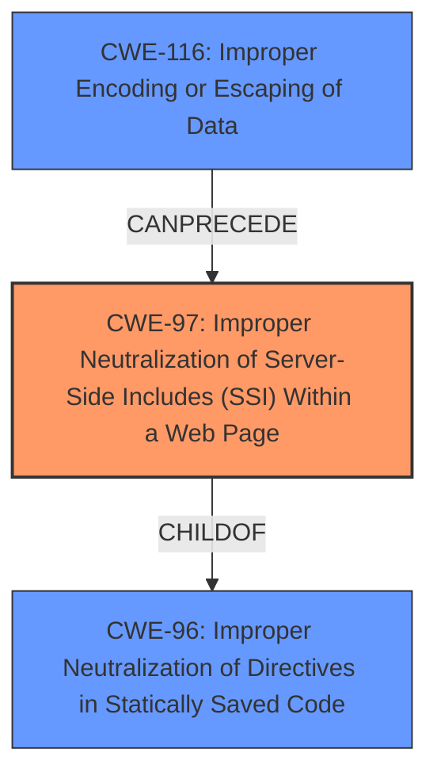

# Analysis Report for CVE-2021-29679

# Vulnerability Analysis Report: CVE-2021-29679

## Description

IBM Cognos Analytics 11.1.7 and 11.2.0 could allow an authenticated user to execute code remotely due to incorrectly neutralizaing user-contrlled input that could be interpreted a a server-side include (SSI) directive. IBM X-Force ID 199915.

## Vulnerability Description Key Phrases

**Rootcause:** incorrectly neutralizaing user-contrlled input
**Impact:** execute code remotely
**Vector:** server-side include (SSI) directive
**Attacker:** authenticated user
**Product:** IBM Cognos Analytics
**Version:** 11.1.7 and 11.2.0

## Analysis (with Relationship Data)

# Summary
| CWE ID | CWE Name | Confidence | CWE Abstraction Level | CWE Vulnerability Mapping Label | CWE-Vulnerability Mapping Notes |
|---|---|---|---|---|---|
| CWE-97 | Improper Neutralization of Server-Side Includes (SSI) Within a Web Page | 0.9 | Variant | Allowed | Primary CWE |
| CWE-116 | Improper Encoding or Escaping of Data | 0.7 | Class | Allowed-with-Review | Secondary Candidate |

## Evidence and Confidence

*   **Confidence Score:** 0.8
*   **Evidence Strength:** HIGH

- **Analysis and Justification:**
  - *Explanation:* The vulnerability description explicitly states that the IBM Cognos Analytics software **incorrectly neutralizes user-controlled input** that could be interpreted as a server-side include (SSI) directive. This directly aligns with the definition of CWE-97, which is "Improper Neutralization of Server-Side Includes (SSI) Within a Web Page". The vulnerability allows an authenticated user to execute code remotely. The **root cause** is the improper neutralization. This directly matches the weakness described by CWE-97.
  - *Explanation:* Although not explicitly stated, **improper encoding or escaping** is a plausible contributing factor to the improper neutralization mentioned in the vulnerability description. CWE-116 is "Improper Encoding or Escaping of Data". While the description doesn't directly confirm encoding issues, the nature of SSI injection often involves the lack of proper encoding.
  - *Relationship Analysis:* CWE-97 is a Variant of other higher level CWEs. CWE-116 is a Class and might have Base-level children that would be more appropriate.

- **Confidence Score:**
  - Confidence: 0.9 (High confidence because the vulnerability description explicitly mentions server-side includes and improper neutralization.)

---

## Criticism of Analysis

Okay, here's a detailed review of the analysis, incorporating the full CWE specifications you've provided, focusing on the mapping guidance and potential mitigations:

**Overall Assessment:**

The analysis is largely accurate and well-reasoned. The primary CWE selection of `CWE-97: Improper Neutralization of Server-Side Includes (SSI) Within a Web Page` is the best fit based on the provided vulnerability description. The reasoning for considering `CWE-116: Improper Encoding or Escaping of Output` as a secondary candidate is also sound, although as a Class-level CWE, it's less precise.

**Detailed Critique:**

**1. CWE-97: Improper Neutralization of Server-Side Includes (SSI) Within a Web Page**

*   **Selection Justification:**  The analysis correctly identifies the explicit mention of "server-side include (SSI) directive" and "incorrectly neutralizing user-controlled input" as strong indicators for CWE-97.  The fact that this leads to remote code execution further solidifies this choice.
*   **Confidence Level:** The assigned confidence level of 0.9 is appropriate given the explicit nature of the description.
*   **CWE Abstraction Level:** The analysis correctly notes that CWE-97 is a "Variant" and that this is a preferred level of abstraction.
*   **Mapping Guidance Adherence:** The analysis follows the mapping guidance by carefully reading the name and description and ensuring it's a proper fit.
*   **Mitigation Considerations (Based on CWE-97's Specifications):** While the analysis focuses on identification, it's worthwhile to consider the potential mitigations suggested by CWE-97's specification:
    *   Since CWE-97 is a child of CWE-96 (Improper Neutralization of Directives in Statically Saved Code), examining the mitigations for CWE-96 might be helpful.
    * CWE-96's specification offers these mitigations:
      * *Input Validation*: Assuming all input is malicious and use an "accept known good" input validation strategy.
      * *Output Encoding*: Performing proper output validation and escaping to neutralize all code syntax from data written to code files.
*   **Potential Improvements:** While the analysis is strong, it could benefit from a brief mention of potential mitigation strategies that could be derived from the CWE specification, even if it's just a high-level overview.

**2. CWE-116: Improper Encoding or Escaping of Output**

*   **Selection Justification:** The reasoning for including CWE-116 is valid. SSI injection often arises from a failure to properly encode or escape user input before it's interpreted by the SSI engine.
*   **Confidence Level:** The confidence level of 0.7 is reasonable, given that it's an inferred contributing factor rather than an explicitly stated one.
*   **CWE Abstraction Level:** The analysis correctly notes that CWE-116 is a "Class" and that there might be Base-level children that are more appropriate.
*   **Mapping Guidance Adherence:** The analysis follows the mapping guidance by acknowledging the abstraction level and suggesting a search for a better fit.
*   **Mitigation Considerations (Based on CWE-116's Specifications):**
    *   *Libraries or Frameworks:*  Using a vetted library or framework that handles encoding/escaping automatically (e.g., ESAPI Encoding control).
    *   *Parameterization:*  Using structured mechanisms (e.g., stored procedures) that enforce separation between data and code.
    *   *Understanding Context:*  Thorough understanding of the encoding expected by the downstream component (SSI engine).
*   **Potential Improvements:**
    *   **More Specific Child CWEs:** The analysis should consider whether there are more specific child CWEs of CWE-116 that might be a better fit.  For example, if the SSI engine expects HTML encoding but receives something else, `CWE-838: Inappropriate Encoding for Output Context` might be relevant. However, without more information about the specifics of the encoding failure, it's difficult to be more precise.
    *   **Relationship to CWE-97:** It would be helpful to explicitly state that CWE-116 can *lead* to CWE-97. Improper encoding allows the SSI directives to be interpreted, which then leads to the vulnerability.

**3. Top Combined Retriever Results Review**

*   **CWE-117:** Improper Output Neutralization for Logs. While logs could be involved, this CWE is less relevant than CWE-97 as the root cause is in the SSI processing itself, not primarily in the logging of data.
*   **CWE-20:** Improper Input Validation. This is too broad and the analysis is correct to go with the more specific CWE-97.
*   **CWE-94:** Improper Control of Generation of Code ('Code Injection'). This is also a good candidate, and could be considered a parent of CWE-97, however, CWE-97 is more precise.
*   **CWE-79:** Improper Neutralization of Input During Web Page Generation ('Cross-site Scripting'). This is for client-side code execution, while this issue is server-side.

**General Recommendations:**

*   **Mitigation Section:** Consider adding a small "Mitigation" section to each CWE analysis, even if it's just a brief summary of potential mitigation strategies derived from the CWE specifications. This would make the analysis more actionable.
*   **Chaining Relationships:** Explicitly state the relationships between CWEs where applicable (e.g., CWE-116 can lead to CWE-97).
*   **Specificity:** Always strive for the most specific CWE possible. If there's a Base CWE and a Variant CWE that both seem to fit, generally prefer the Variant. If there are multiple relevant Variant CWEs, consider including them all and explaining their relationships.

**Revised Summary Table (Example Incorporating Mitigation Notes):**

| CWE ID | CWE Name | Confidence | CWE Abstraction Level | CWE Vulnerability Mapping Label | CWE-Vulnerability Mapping Notes | Potential Mitigations |
|---|---|---|---|---|---|---|
| CWE-97 | Improper Neutralization of Server-Side Includes (SSI) Within a Web Page | 0.9 | Variant | Allowed | Primary CWE | Input Validation, Output Encoding and Escaping |
| CWE-116 | Improper Encoding or Escaping of Data | 0.7 | Class | Allowed-with-Review | Secondary Candidate | Libraries/Frameworks, Parameterization, Context-Aware Encoding |

By incorporating these suggestions, the analysis becomes even more comprehensive and useful for developers and security professionals.

## Final Resolution

# Summary
| CWE ID | CWE Name | Confidence | CWE Abstraction Level | CWE Vulnerability Mapping Label | CWE-Vulnerability Mapping Notes |
|---|---|---|---|---|---|
| **CWE-97** | **Improper Neutralization of Server-Side Includes (SSI) Within a Web Page** | 0.9 | Variant | Allowed | Primary **CWE** |
| **CWE-116** | **Improper Encoding or Escaping of Data** | 0.7 | Class | Allowed-with-Review | Secondary Candidate |

## Evidence and Confidence

*   **Confidence Score:** 0.9
*   **Evidence Strength:** HIGH

## Relationship Analysis
The primary **CWE**, **CWE-97 (Improper Neutralization of Server-Side Includes (SSI) Within a Web Page)**, is a variant. This indicates that it's a specific type of a more general weakness. While it doesn't have direct relationships specified in the provided data, it's a child of **CWE-96 (Improper Neutralization of Directives in Statically Saved Code ('Static Code Injection'))**. **CWE-116 (Improper Encoding or Escaping of Data)**, considered as a secondary candidate, is a Class. This means it's a higher-level abstraction and less specific than **CWE-97**. **CWE-116** can be a contributing factor to **CWE-97**, as improper encoding can allow SSI directives to be interpreted, leading to the vulnerability.

## Vulnerability Chain
The vulnerability chain starts with **user-controlled input** that contains SSI directives. The **root cause** is the **improper neutralization** (**CWE-97**) of these directives due to a potential lack of proper encoding and escaping (**CWE-116**). This allows the SSI engine to interpret the directives, leading to **remote code execution**.

## Summary of Analysis
The initial analysis correctly identified **CWE-97 (Improper Neutralization of Server-Side Includes (SSI) Within a Web Page)** as the primary **CWE**. The vulnerability description explicitly states, "incorrectly neutralizaing user-contrlled input that could be interpreted a a server-side include (SSI) directive," which directly aligns with **CWE-97's** definition. The confidence level of 0.9 is justified due to this direct match.

The inclusion of **CWE-116 (Improper Encoding or Escaping of Data)** as a secondary candidate is also reasonable, as improper encoding can contribute to the improper neutralization of SSI directives. However, as **CWE-116** is a Class, it is less specific than **CWE-97**. A more specific child **CWE** of **CWE-116**, such as **CWE-838 (Inappropriate Encoding for Output Context)**, might be a better fit if more information about the specific encoding failure was available.

The graph relationships confirm that **CWE-97** is at a more specific level of abstraction than **CWE-116**, making it the more appropriate primary **CWE**. The relationship between **CWE-116** and **CWE-97** is that **CWE-116** can precede **CWE-97**, as improper encoding can lead to the improper neutralization of SSI directives.

The selected **CWEs** are at the optimal level of specificity based on the available evidence. **CWE-97** directly addresses the improper neutralization of SSI directives, while **CWE-116** acknowledges the potential contributing factor of improper encoding.

*Report generated on 2025-03-17 01:44:12*
