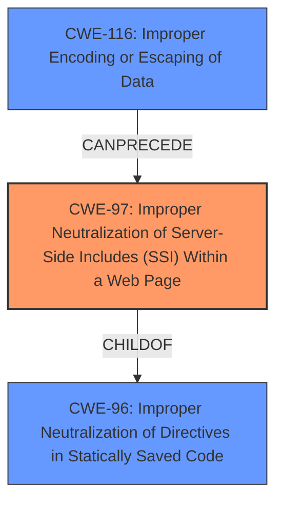

# Final Resolution for CVE-2021-29679

# Summary
| CWE ID | CWE Name | Confidence | CWE Abstraction Level | CWE Vulnerability Mapping Label | CWE-Vulnerability Mapping Notes |
|---|---|---|---|---|---|
| **CWE-97** | **Improper Neutralization of Server-Side Includes (SSI) Within a Web Page** | 0.9 | Variant | Allowed | Primary **CWE** |
| **CWE-116** | **Improper Encoding or Escaping of Data** | 0.7 | Class | Allowed-with-Review | Secondary Candidate |

## Evidence and Confidence

*   **Confidence Score:** 0.9
*   **Evidence Strength:** HIGH

## Relationship Analysis
The primary **CWE**, **CWE-97 (Improper Neutralization of Server-Side Includes (SSI) Within a Web Page)**, is a variant. This indicates that it's a specific type of a more general weakness. While it doesn't have direct relationships specified in the provided data, it's a child of **CWE-96 (Improper Neutralization of Directives in Statically Saved Code ('Static Code Injection'))**. **CWE-116 (Improper Encoding or Escaping of Data)**, considered as a secondary candidate, is a Class. This means it's a higher-level abstraction and less specific than **CWE-97**. **CWE-116** can be a contributing factor to **CWE-97**, as improper encoding can allow SSI directives to be interpreted, leading to the vulnerability.

## Vulnerability Chain
The vulnerability chain starts with **user-controlled input** that contains SSI directives. The **root cause** is the **improper neutralization** (**CWE-97**) of these directives due to a potential lack of proper encoding and escaping (**CWE-116**). This allows the SSI engine to interpret the directives, leading to **remote code execution**.

## Summary of Analysis
The initial analysis correctly identified **CWE-97 (Improper Neutralization of Server-Side Includes (SSI) Within a Web Page)** as the primary **CWE**. The vulnerability description explicitly states, "incorrectly neutralizaing user-contrlled input that could be interpreted a a server-side include (SSI) directive," which directly aligns with **CWE-97's** definition. The confidence level of 0.9 is justified due to this direct match.

The inclusion of **CWE-116 (Improper Encoding or Escaping of Data)** as a secondary candidate is also reasonable, as improper encoding can contribute to the improper neutralization of SSI directives. However, as **CWE-116** is a Class, it is less specific than **CWE-97**. A more specific child **CWE** of **CWE-116**, such as **CWE-838 (Inappropriate Encoding for Output Context)**, might be a better fit if more information about the specific encoding failure was available.

The graph relationships confirm that **CWE-97** is at a more specific level of abstraction than **CWE-116**, making it the more appropriate primary **CWE**. The relationship between **CWE-116** and **CWE-97** is that **CWE-116** can precede **CWE-97**, as improper encoding can lead to the improper neutralization of SSI directives.

The selected **CWEs** are at the optimal level of specificity based on the available evidence. **CWE-97** directly addresses the improper neutralization of SSI directives, while **CWE-116** acknowledges the potential contributing factor of improper encoding.