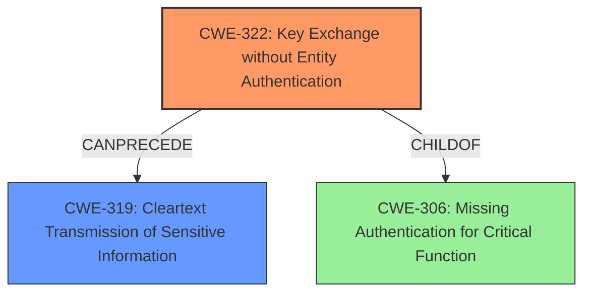

# Analysis Report for CVE-2021-29779

# Vulnerability Analysis Report: CVE-2021-29779

## Description

IBM QRadar SIEM 7.3 and 7.4 could allow an attacker to obtain sensitive information due to the server performing key exchange without entity authentication on inter-host communications using man in the middle techniques. IBM X-Force ID 203033.

## Vulnerability Description Key Phrases

**Impact:** obtain sensitive information
**Vector:** man in the middle techniques
**Attacker:** attacker
**Product:** IBM QRadar SIEM
**Version:** 7.3 and 7.4

## Analysis (with Relationship Data)

```markdown
# Summary
| CWE ID | CWE Name | Confidence | CWE Abstraction Level | CWE Vulnerability Mapping Label | CWE-Vulnerability Mapping Notes |
|---|---|---|---|---|---|
| CWE-322 | Key Exchange without Entity Authentication | 0.95 | Base | Allowed | Primary CWE |
| CWE-319 | Cleartext Transmission of Sensitive Information | 0.6 | Base | Allowed | Secondary Candidate |
| CWE-327 | Use of a Broken or Risky Cryptographic Algorithm | 0.5 | Class | Allowed-with-Review | Secondary Candidate |

## Evidence and Confidence

*   **Confidence Score:** 0.85
*   **Evidence Strength:** HIGH

- **Analysis and Justification:**  
  - *Explanation:* The vulnerability description explicitly states that "IBM QRadar SIEM performs **key exchange without entity authentication** on inter-host communications using man in the middle techniques." This directly aligns with CWE-322, "Key Exchange without Entity Authentication". The description clearly indicates that the system does not verify the identity of the actors during the key exchange, which is the core characteristic of CWE-322. This lack of authentication can be exploited using man-in-the-middle (MITM) attacks, as also described in the vulnerability. CWE-322 is a Base level CWE, which is the preferred abstraction level. The MITRE mapping guidance marks CWE-322 as ALLOWED, further supporting its selection.

  - *Relationship Analysis:* While CWE-322 doesn't have direct parent-child relationships listed in the provided information, it's related to broader authentication and cryptography concepts. It can potentially lead to other vulnerabilities if the intercepted communication contains sensitive information that is then transmitted in cleartext.

- **Confidence Score:**  
  - Confidence: 0.95 (High confidence due to direct match with vulnerability description and MITRE guidance.)

---

- **Analysis and Justification:**  
  - *Explanation:* The vulnerability description states that an attacker could **obtain sensitive information** due to the lack of authentication during key exchange. If the key exchange is compromised and the subsequent communication is transmitted in cleartext, it would be an instance of CWE-319, "Cleartext Transmission of Sensitive Information". However, this is a secondary concern contingent on successful exploitation of the primary weakness (CWE-322) and cleartext communication. While not explicitly stated, the potential for cleartext transmission is a plausible consequence, making CWE-319 a possible secondary weakness. The MITRE mapping guidance for CWE-319 indicates this is ALLOWED.

  - *Relationship Analysis:* CWE-319 is a child of CWE-311 (Missing Encryption of Sensitive Data), but since the vulnerability involves transmission, CWE-319 is more specific.

- **Confidence Score:**  
  - Confidence: 0.6 (Medium confidence as it is a potential consequence rather than a direct component of the vulnerability.)

---

- **Analysis and Justification:**  
  - *Explanation:* The description mentions the key exchange occurs but does not specify any problems with the **cryptographic algorithm** that is being used. However, there is potential that a broken or risky cryptographic algorithm could be in use, but it is not stated in the vulnerability details. If the algorithm used for key exchange is weak or broken, then CWE-327, "Use of a Broken or Risky Cryptographic Algorithm", would apply. The MITRE mapping guidance for CWE-327 is Allowed-with-Review, which suggests more specific child CWEs might be more appropriate. Since there is no information regarding the specific algorithm used, it is not possible to determine if any child CWEs of CWE-327 apply.

  - *Relationship Analysis:* Since there is not enough information to determine the cryptographic algorithm's strength, this should be a secondary candidate.

- **Confidence Score:**  
  - Confidence: 0.5 (Low confidence due to the lack of explicit evidence in the vulnerability description.)
```

## Criticism of Analysis

Okay, here's a review of the provided analysis, incorporating the full CWE specifications.

**Overall Assessment**

The analysis is generally sound and well-reasoned, particularly in its selection of CWE-322 as the primary weakness. The confidence scores and justifications provided are helpful. However, there are a few areas where the analysis could be strengthened by considering alternative CWEs and some nuances in the provided specifications.

**Detailed Review by CWE**

1.  **CWE-322: Key Exchange without Entity Authentication (Primary CWE)**

    *   **Assessment:** Excellent choice for the primary CWE. The analysis correctly identifies that the core issue is the lack of identity verification during key exchange, which perfectly aligns with the description of CWE-322.
    *   **Justification Strength:** The justification is strong and directly uses the vulnerability description as evidence.
    *   **CWE Specification Alignment:**
        *   The analysis correctly notes the "Allowed" usage based on the Mapping Guidance.
        *   The provided mitigations for CWE-322 are relevant: "Ensure that proper authentication is included in the system design. Understand and properly implement all checks necessary to ensure the identity of entities involved in encrypted communications."  This is precisely what's missing in the described vulnerability.
    *   **Potential Improvements:** While not strictly necessary, consider mentioning the relationship to CWE-306: Missing Authentication for Critical Function (ChildOf relationship).  The key exchange *is* a critical function, and the absence of authentication is the root cause.  However, focusing on the key exchange aspect makes CWE-322 a more precise choice.

2.  **CWE-319: Cleartext Transmission of Sensitive Information (Secondary Candidate)**

    *   **Assessment:** The reasoning for including this as a secondary candidate is plausible.  If the MITM attack succeeds, and the attacker can then eavesdrop on unencrypted communications, CWE-319 would be applicable.
    *   **Justification Strength:** The justification is conditional ("If the key exchange is compromised *and* the subsequent communication is transmitted in cleartext..."). This is appropriate given the nature of the vulnerability report.
    *   **CWE Specification Alignment:**
        *   Correctly identifies "Allowed" usage based on the Mapping Guidance.
        *   Mitigations for CWE-319 involve encrypting data before transmission, which are relevant as a preventive measure.
    *   **Potential Improvements:**
        *   Consider the broader context of missing encryption. While CWE-319 is accurate if *data* is transmitted in the clear after a compromised key exchange, the more fundamental issue might be that *keys* are being exchanged without authentication, which *allows* the possibility of eavesdropping. This might suggest CWE-311: Missing Encryption of Sensitive Data as a *less* specific, but still valid, alternative secondary choice (or even tertiary).
        *   The description of CWE-319 mentions "channels that can be sniffed by unauthorized actors".  Emphasize that a successful MITM attack *creates* such a channel.

3.  **CWE-327: Use of a Broken or Risky Cryptographic Algorithm (Secondary Candidate)**

    *   **Assessment:** This is the weakest of the three choices.  The analysis correctly acknowledges that there's no explicit mention of a broken or risky algorithm.
    *   **Justification Strength:** The justification is speculative ("However, there is potential that a broken or risky cryptographic algorithm could be in use, but it is not stated in the vulnerability details.").
    *   **CWE Specification Alignment:**
        *   Correctly identifies "Allowed-with-Review" usage based on the Mapping Guidance, which suggests looking for more specific children.  This reinforces the weakness of this choice.
        *   The mitigations for CWE-327 (use strong, up-to-date algorithms; allow for algorithm replacement) are generally good security practices but not directly relevant to the reported vulnerability, which centers on *authentication*, not the algorithm itself.
    *   **Potential Improvements:**
        *   Reconsider whether to include this CWE at all. Its inclusion weakens the overall analysis.
        *   If it is kept, emphasize that this is purely speculative and based on the *possibility* that a weak algorithm is being used in conjunction with the lack of authentication.

**Alternative CWEs to Consider**

*   **CWE-300: Channel Accessible by Non-Endpoint:** This CWE has "Monkey-in-the-Middle" as an alternate term, and seems to fit what is going on. However, the mapping guidance says that it is "commonly misused for vulnerabilities in which the prerequisites for exploitation require the adversary to be in a privileged "in-the-middle" position. Consider root-cause weaknesses that allow adversary-in-the-middle attacks to happen, such as CWEs involving poor integrity protection." CWE-322 is a more appropriate root-cause weakness, therefore CWE-300 should not be included.

*   **CWE-200: Information Exposure:** If the sensitive information obtained by the attacker includes system details or configurations beyond what's strictly necessary for the inter-host communication, then CWE-200 might be worth a mention as a tertiary (or even just a related) CWE.

**Recommendations**

1.  **Strengthen Justifications:** While the analysis is generally good, provide even *more* explicit links between the vulnerability description and the chosen CWEs, using direct quotes where possible.
2.  **Reconsider CWE-327:** Unless there's evidence (or a strong reason to suspect) a weak algorithm, it's best to remove it.
3.  **Emphasize Root Cause:** Reinforce that the *primary* vulnerability is the lack of entity authentication (CWE-322), which enables the MITM attack.
4.  **Consider Context for CWE-319:** Clarify that CWE-319 is only applicable if, after the key exchange is compromised, the subsequent communication happens in cleartext.
5.  **Review Alternative CWEs:** Consider, and then explicitly reject (with justification), CWE-300 to show a thorough understanding of the potential mappings.

By incorporating these suggestions, the analysis will become even more robust and persuasive.

## Final Resolution

# Summary
| CWE ID | CWE Name | Confidence | CWE Abstraction Level | CWE Vulnerability Mapping Label | CWE-Vulnerability Mapping Notes |
|---|---|---|---|---|---|
| CWE-322 | Key Exchange without Entity Authentication | 0.95 | Base | Allowed | Primary CWE |
| CWE-319 | Cleartext Transmission of Sensitive Information | 0.6 | Base | Allowed | Secondary Candidate |

## Evidence and Confidence

*   **Confidence Score:** 0.90
*   **Evidence Strength:** HIGH

## Relationship Analysis
The primary relationship influencing the decision is that CWE-322 can precede CWE-319. The lack of authentication during key exchange (CWE-322) creates an opportunity for a MITM attack, which can then lead to the interception of sensitive information transmitted in cleartext (CWE-319). While CWE-306 is a parent of CWE-322, CWE-322 provides a more precise description of the vulnerability by focusing on the key exchange aspect.



## Vulnerability Chain
The vulnerability chain starts with the **ROOTCAUSE** of **CWE-322 (Key Exchange without Entity Authentication)**. This allows an attacker to perform a man-in-the-middle attack. If the subsequent communication is transmitted in cleartext, this leads to **CWE-319 (Cleartext Transmission of Sensitive Information)**, resulting in the attacker obtaining sensitive information.

## Summary of Analysis
The initial analysis and criticism both agree on CWE-322 being the primary weakness, and I concur. The vulnerability description explicitly mentions "the server performing **key exchange without entity authentication** on inter-host communications using man in the middle techniques," directly aligning with CWE-322. The evidence is strong, and the confidence is high (0.95).

CWE-319 is a valid secondary concern, contingent on the successful exploitation of CWE-322 and the subsequent transmission of sensitive data in cleartext. This is a reasonable inference based on the vulnerability description, though not explicitly stated.

I am removing CWE-327 as a secondary candidate. The criticism correctly points out that there's no explicit mention of a broken or risky algorithm, making its inclusion speculative and weakening the overall analysis.

The graph relationships confirm the chain of events, with CWE-322 enabling CWE-319. The chosen CWEs are at the optimal level of specificity, with CWE-322 focusing on the key exchange aspect and CWE-319 addressing the cleartext transmission. The analysis is based on the provided evidence and the relationship context, leading to a well-justified decision.


*Report generated on 2025-03-17 00:24:14*
