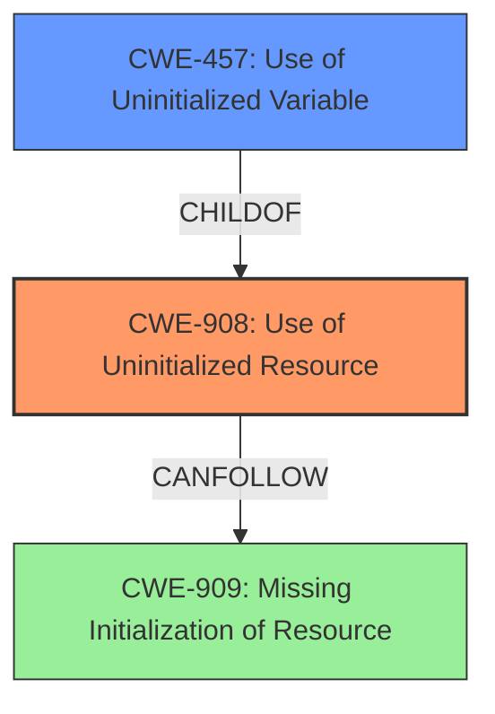

# Analysis Report for CVE-2021-29930

# Vulnerability Analysis Report: CVE-2021-29930

## Description

An issue was discovered in the arenavec crate through 2021-01-12 for Rust. A drop of uninitialized memory can sometimes occur upon a panic in Tdefault().

## Vulnerability Description Key Phrases

**Weakness:** uninitialized memory drop
**Product:** arenavec crate
**Version:** through 2021-01-12
**Component:** Tdefault()

## Analysis (with Relationship Data)

# Summary
| CWE ID | CWE Name | Confidence | CWE Abstraction Level | CWE Vulnerability Mapping Label | CWE-Vulnerability Mapping Notes |
|---|---|---|---|---|---|
| CWE-908 | Use of Uninitialized Resource | 0.95 | Base | Allowed | Primary CWE. Matches the **uninitialized memory drop** vulnerability. |
| CWE-457 | Use of Uninitialized Variable | 0.75 | Variant | Allowed | Secondary CWE. A more specific variant of CWE-908. |

## Evidence and Confidence

*   **Confidence Score:** 0.90
*   **Evidence Strength:** HIGH

- **Analysis and Justification:**  
  - *Explanation:* The vulnerability description and CVE reference links content summary clearly state that the issue is related to an **uninitialized memory drop**. Specifically, a panic in `T::default()` leads to dropping an uninitialized `T` object. This directly aligns with the description of CWE-908 (Use of Uninitialized Resource), which states that "The product uses or accesses a resource that has not been initialized." The retriever results also support this, with CWE-908 having the highest combined score. CWE-457 (Use of Uninitialized Variable) is a variant of CWE-908 and could also be considered as a secondary CWE since the root cause is the use of an uninitialized variable. The MITRE mapping guidance for CWE-908 indicates that its usage is ALLOWED.
  
  - *Relationship Analysis:* CWE-908 is a base level CWE, and CWE-457 is a variant of CWE-908.

- **Confidence Score:**  
  - Confidence: 0.95 (High confidence due to the clear description of the **uninitialized memory drop** and supporting evidence from the CVE reference links content summary and retriever results.)

---

## Criticism of Analysis

Okay, here's a detailed critique of the CWE analysis, incorporating the full CWE specifications provided:

**Overall Assessment:**

The analysis is generally very good. The primary CWE selection of CWE-908 (Use of Uninitialized Resource) is highly appropriate and well-justified. The secondary CWE selection of CWE-457 (Use of Uninitialized Variable) as a more specific variant is also reasonable.  The confidence level is justified. The analysis correctly identifies the core problem: the lack of initialization leading to a potential drop of uninitialized memory.

**Detailed Critique:**

*   **CWE-908: Use of Uninitialized Resource**

    *   **Correctness:** The mapping to CWE-908 is accurate and well-supported. The vulnerability description explicitly mentions the dropping of *uninitialized memory*, which aligns perfectly with the core concept of CWE-908. The fact that the `T::default()` function can panic further underscores the potential for leaving memory uninitialized.
    *   **Abstraction Level:** CWE-908 is a *Base* level CWE, which is preferred for vulnerability mapping.
    *   **Mapping Guidance:** The analysis correctly notes that *Usage: Allowed* for CWE-908.
    *   **Potential Mitigations:** The mitigations listed for CWE-908 (explicit initialization, handling complex conditionals, avoiding race conditions) are directly relevant to the vulnerability in question. While race conditions aren't the *primary* concern here, the potential for concurrent access to the `arenavec` data structure *could* exacerbate the problem if initialization isn't properly synchronized.
    *   **Observed Examples:** The observed examples provided in the CWE details (CVE-2019-9805, CVE-2008-4197, CVE-2008-2934) are relevant, as they showcase scenarios where uninitialized memory is used and can lead to code execution, memory corruption or crashes.

*   **CWE-457: Use of Uninitialized Variable**

    *   **Correctness:**  CWE-457 is a valid secondary CWE. The problem *does* stem from an uninitialized *variable* (the memory allocated for `T` that isn't properly populated by `T::default()` before being dropped).  It's a more specific case of using an uninitialized resource.
    *   **Abstraction Level:** CWE-457 is a *Variant* level CWE, which is also acceptable.
    *   **Mapping Guidance:** The analysis correctly notes that *Usage: Allowed* for CWE-457.
    *   **Potential Mitigations:**  The mitigations suggested for CWE-457 (assigning initial values, using compiler warnings, etc.) are directly applicable.
    *   **Observed Examples:** The provided CVE examples for CWE-457 (CVE-2019-15900, CVE-2008-3688, CVE-2008-0081) are also relevant, showing authorization bypass, denial of service, and code execution due to uninitialized variables.

*   **Retriever Results Analysis:**

    *   The retriever results are generally in alignment with the core vulnerability.
    *   **CWE-252 (Unchecked Return Value):** While not the primary cause, the presence of CWE-252 in the retriever results *could* indicate that return values from allocation or initialization functions aren't being properly checked, which *could* contribute to the vulnerability. However, the description focuses on panics, not necessarily failure of a return value.  So, it's not a strong fit, but it's understandable why it appears in the results.
    *   **CWE-789 (Memory Allocation with Excessive Size Value) & CWE-1284 (Improper Validation of Specified Quantity in Input):** These seem less relevant based on the provided vulnerability description. While memory allocation is involved, the issue isn't about *excessive* size, but rather the failure to initialize the allocated memory. The uninitialized drop is not intrinsically linked to the amount of memory allocated, meaning these issues are less directly relevant to the core vulnerability.
    *   **CWE-909 (Missing Initialization of Resource):** This is *very* closely related to CWE-908. One could argue that CWE-909 is the initial cause, and CWE-908 is the consequence.  The `arenavec` code *misses* proper initialization in the event of a panic, which *leads to* the use of an uninitialized resource. The retriever results suggest that this would also have been a viable option.  One important distinction is that CWE-909 *allows-with-review* because it is a class-level CWE and might have Base-level children that would be more appropriate. It would probably be best to use CWE-908 in this instance.
    *   **CWE-366 (Race Condition within a Thread) & CWE-362 (Concurrent Execution using Shared Resource with Improper Synchronization ('Race Condition')):** As stated before, these are less relevant, but *possible*. If multiple threads are using the arena allocator and one thread triggers the panic during initialization, there *could* be a race condition that exacerbates the memory corruption. But without further details, it is difficult to determine if this is a primary concern.
    *   **CWE-665 (Improper Initialization):** This is a class-level CWE and should generally be avoided. It might be a precursor to CWE-908 and CWE-457, but these are more specific and therefore preferable.
    *   **CWE-476 (NULL Pointer Dereference):** Not directly relevant based on the description, but possible as a consequence of using uninitialized memory.

**Recommendations:**

1.  **Maintain Confidence Score:** The confidence score of 0.95 for CWE-908 is well-justified.
2.  **Consider CWE-909:** Though I agree with the choice of CWE-908 (Use of Uninitialized Resource), it's important to acknowledge the close relationship with CWE-909 (Missing Initialization of Resource). The analysis should explicitly mention this relationship. Consider adding a sentence such as: "While the primary issue is the *use* of the uninitialized resource (CWE-908), the root cause is the *missing* initialization during the panic scenario (CWE-909)." Then explain why you still chose CWE-908 as the primary issue.
3.  **Minor Adjustment to Mitigation Discussion:** In the analysis, when discussing mitigations, briefly mention the potential relevance of synchronization mechanisms to address the possibility of race conditions, even if it's a secondary concern.
4.  **Avoid Class CWEs:** Generally, avoid using CWE-665 for a specific instance of an improperly initialized resource. Instead, choose the more specific base or variant CWE if it better describes the root cause.
5.  **Refine relationships:** The `Relationships` section for each CWE is incomplete. For example, the relationship between CWE-908 and CWE-909 should be explored further.
6.  **Acknowledge limitations:** It's possible that the double-drop scenario might lead to another CWE. However, this analysis is primarily focused on uninitialized memory drops.

By addressing these points, the analysis can become even more comprehensive and nuanced, demonstrating a deeper understanding of the CWE specifications and their application to the specific vulnerability.

## Final Resolution

# Summary
| CWE ID | CWE Name | Confidence | CWE Abstraction Level | CWE Vulnerability Mapping Label | CWE-Vulnerability Mapping Notes |
|---|---|---|---|---|---|
| **CWE-908** | **Use of Uninitialized Resource** | 0.95 | Base | Allowed | Primary CWE. Matches the **uninitialized memory drop** vulnerability. |
| CWE-457 | Use of Uninitialized Variable | 0.75 | Variant | Allowed | Secondary CWE. A more specific variant of CWE-908. |

## Evidence and Confidence

*   **Confidence Score:** 0.95
*   **Evidence Strength:** HIGH

## Relationship Analysis
The primary relationship considered was the parent-child relationship between CWE-908 (Base) and CWE-457 (Variant). CWE-457 is a more specific instance of CWE-908, but both are relevant. The retriever results also pointed to CWE-909 (**Missing Initialization of Resource**), which is closely related.

## Vulnerability Chain
The vulnerability chain starts with a missing initialization of a resource, which can be represented by CWE-909 (**Missing Initialization of Resource**). This leads to the use of an uninitialized resource, represented by CWE-908 (**Use of Uninitialized Resource**). The **use of the uninitialized resource** can then result in a drop of uninitialized memory, which is the observed vulnerability. CWE-457 (**Use of Uninitialized Variable**) is a specific instance of CWE-908.

## Summary of Analysis
The initial analysis and criticism both correctly identified CWE-908 (**Use of Uninitialized Resource**) as the primary weakness. The vulnerability description explicitly states that the issue is an **uninitialized memory drop**, which directly corresponds to CWE-908. The criticism also correctly points out the relationship between CWE-908 and CWE-457 (**Use of Uninitialized Variable**), with CWE-457 being a more specific variant.

The relationship analysis highlighted the connection to CWE-909 (**Missing Initialization of Resource**), which represents the root cause of the problem (the missing initialization). However, the decision to keep CWE-908 as the primary weakness is based on the fact that the vulnerability is directly observable as the **use of the uninitialized resource/memory**.

The selected CWEs are at the optimal level of specificity. CWE-908 is a base-level CWE, which is preferred for vulnerability mapping. While CWE-457 is more specific, it is still a relevant secondary CWE. CWE-909 could be considered the root cause, but the actual observed vulnerability is the **use of the uninitialized memory**.

I am maintaining the confidence score of 0.95 for CWE-908.

*Report generated on 2025-03-16 16:30:57*
