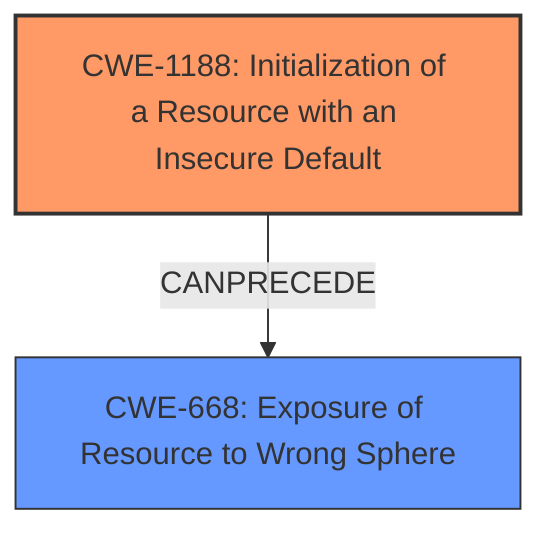

# Final Resolution for CVE-2021-30127

# Summary

| CWE ID | CWE Name | Confidence | CWE Abstraction Level | CWE Vulnerability Mapping Label | CWE-Vulnerability Mapping Notes |
|---|---|---|---|---|---|
| **CWE-1188** | **Initialization of a Resource with an Insecure Default** | 0.80 | Base | Allowed | Primary CWE: UPnP enabled by default, contrary to intended behavior and documentation. |
| **CWE-668** | **Exposure of Resource to Wrong Sphere** | 0.65 | Class | Allowed-with-Review | Secondary CWE: Insecure Default leads to exposing the admin web server to the internet, not just the local network. |

## Evidence and Confidence

*   **Confidence Score:** 0.78
*   **Evidence Strength:** MEDIUM

## Relationship Analysis
The primary relationship influencing the decision is the potential chain between **CWE-1188** (**Initialization of a Resource with an Insecure Default**) and **CWE-668** (**Exposure of Resource to Wrong Sphere**). The insecure default (UPnP enabled) directly leads to the exposure of the admin web server to the internet, which is the wrong sphere. While **CWE-668** is a more abstract Class-level CWE, it accurately describes the consequence of the insecure default. **CWE-1188** is at the Base level and specifies the root cause.

## Vulnerability Chain
The chain of root cause and weaknesses is as follows:
1.  **Root Cause:** **CWE-1188** - The device initializes with UPnP enabled by default.
2.  **Weakness:** UPnP automatically opens ports, exposing the web interface.
3.  **Consequence:** **CWE-668** - The admin web server is exposed to the internet (the wrong control sphere).
4.  **Impact:** Potential unauthorized access to the admin web server from the internet.

There are no missing links in the chain based on the available information.

## Summary of Analysis
The initial analysis correctly identified **CWE-1188** as a relevant **weakness**. The criticism suggested considering **CWE-668**, and I concur with this addition as a secondary **weakness**.

*Evidence:* "TerraMaster F2-210 devices through 2021-04-03 use UPnP to make the admin web server accessible over the Internet on TCP port 8181, which is arguably inconsistent with the It is only available on the local network documentation." This clearly points to an **insecure default** configuration (**CWE-1188**) that results in the **exposure** of a resource to the internet (**CWE-668**).

The graph relationships influenced the selection by highlighting the direct causal link between the **insecure default** and the **exposure** of the web server.

The selected CWEs are at the optimal level of specificity. **CWE-1188** pinpoints the precise **root cause**, while **CWE-668** describes the resulting **exposure** to the wrong control sphere. Using both provides a more comprehensive understanding of the vulnerability.