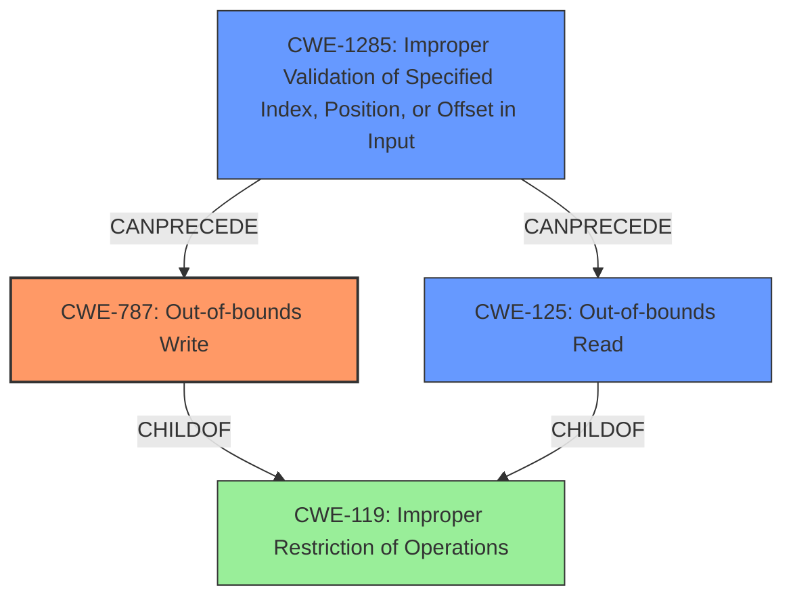

# Final Resolution for CVE-2021-30289

# Summary
| CWE ID | CWE Name | Confidence | CWE Abstraction Level | CWE Vulnerability Mapping Label | CWE-Vulnerability Mapping Notes |
|---|---|---|---|---|---|
| CWE-787 | Out-of-bounds Write | 0.80 | Base | Allowed | The vulnerability is likely due to writing outside the intended buffer because of a **lack of range check**. |
| CWE-1285 | Improper Validation of Specified Index, Position, or Offset in Input | 0.75 | Base | Allowed | This is a secondary candidate because the **lack of range check** on the index/offset allows for out-of-bounds access. |
| CWE-125 | Out-of-bounds Read | 0.70 | Base | Allowed | This is a secondary candidate because a read outside the intended buffer may be a possible consequence of an out-of-bounds write. |

## Evidence and Confidence

*   **Confidence Score:** 0.80
*   **Evidence Strength:** MEDIUM

## Relationship Analysis
The primary relationship that impacted the decision was the chain: **CWE-1285** (Improper Validation of Specified Index, Position, or Offset in Input) -> **CWE-787** (Out-of-bounds Write). The **lack of range check** (input validation) leads to a buffer overflow (out-of-bounds write). While **CWE-125** (Out-of-bounds Read) is possible, the description mentions "buffer overflow," which suggests a write issue more directly.

## Vulnerability Chain
The vulnerability chain starts with **CWE-1285**, the **lack of range check** on the input, followed by **CWE-787**, which manifests as an out-of-bounds write due to the unchecked input. **CWE-125** can then arise as a consequence if the incorrect write corrupts data that is later read.

## Summary of Analysis
Based on the vulnerability description indicating "possible **buffer overflow** due to **lack of range check**," I've determined that **CWE-787 (Out-of-bounds Write)** is the most appropriate primary CWE. The original analysis leaned toward **CWE-125 (Out-of-bounds Read)**, but the term "buffer overflow" strongly suggests a write operation. The **lack of range check** allows data to be written beyond the intended buffer boundary.

The criticism correctly pointed out that **CWE-787** should be given more serious consideration. Elevating **CWE-787** as the primary CWE aligns better with the "buffer overflow" terminology in the vulnerability description.

I have also added **CWE-1285 (Improper Validation of Specified Index, Position, or Offset in Input)** as a secondary CWE because the **lack of range check** is directly related to the validation of an index or offset within the buffer. This CWE helps to further refine the root cause.

The selection of **CWE-787** is based on the following evidence:
- Vulnerability Description: "Possible **buffer overflow** due to **lack of range check**."
- CWE-787 Description: *"The product writes data past the end, or before the beginning, of the intended buffer."*

The graph relationships influenced my decision by highlighting the chain of events: **CWE-1285** -> **CWE-787**. The abstraction levels were considered, and the selected CWEs are at the base level, which is the preferred level of abstraction.