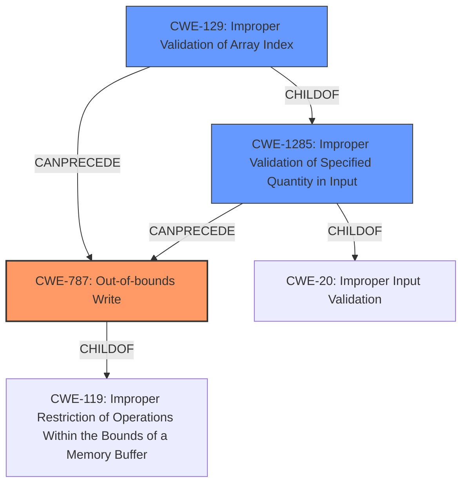

# Analysis Report for CVE-2021-30311

# Vulnerability Analysis Report: CVE-2021-30311

## Description

Possible heap overflow due to lack of index validation before allocating and writing to heap buffer in Snapdragon Auto, Snapdragon Compute, Snapdragon Connectivity, Snapdragon Industrial IOT, Snapdragon Mobile

## Vulnerability Description Key Phrases

**Rootcause:** lack of index validation before allocating and writing to heap buffer
**Weakness:** heap overflow
**Product:** Snapdragon Auto, Snapdragon Compute, Snapdragon Connectivity, Snapdragon Industrial IOT, Snapdragon Mobile

## Analysis (with Relationship Data)

# Summary
| CWE ID | CWE Name | Confidence | CWE Abstraction Level | CWE Vulnerability Mapping Label | CWE-Vulnerability Mapping Notes |
|---|---|---|---|---|---|
| CWE-131 | Incorrect Calculation of Buffer Size | 0.85 | Base | Allowed | The vulnerability description indicates a **heap overflow** due to **lack of index validation before allocating and writing to heap buffer**. This aligns with CWE-131 because the buffer size is not correctly calculated prior to allocation.|
| CWE-129 | Improper Validation of Array Index | 0.65 | Variant | Allowed | The vulnerability involves writing to a buffer without proper index validation which relates to using untrusted input when calculating or using an array index. |

## Evidence and Confidence

*   **Confidence Score:** 0.75
*   **Evidence Strength:** MEDIUM

- **Analysis and Justification:**  
  - *Explanation:* "The vulnerability description indicates a **heap overflow** due to **lack of index validation before allocating and writing to heap buffer**. This aligns with CWE-131 (Incorrect Calculation of Buffer Size) because the buffer size is not correctly calculated prior to allocation. The **lack of index validation before allocating** suggests that the size calculation is either missing or flawed, which leads to the **heap overflow**. The fact that it is a heap overflow specifies where the buffer is allocated."
  
  - *Relationship Analysis:* "CWE-131 is a base level weakness and doesn't have any direct relationships. CWE-129 (Improper Validation of Array Index) is a variant weakness and is related because the root cause mentions **lack of index validation**."

- **Confidence Score:**  
  - *Example:* Confidence: 0.85 (Moderate evidence from technical description and key vulnerability phrases)
---

## Criticism of Analysis

Okay, let's break down this CWE analysis and see how well it aligns with the provided CWE specifications.

**Overall Assessment:**

The analysis provides a reasonable starting point for identifying the CWEs associated with the vulnerability description. The choices of CWE-131 and CWE-129 are logical given the information provided. However, the confidence levels could be improved by considering the nuances of the CWE specifications, particularly with respect to chaining, alternative causes, and levels of abstraction. Furthermore, considering the other retriever results might expose a more appropriate assignment.

**Detailed Review:**

*   **CWE-131: Incorrect Calculation of Buffer Size**

    *   **Confidence:** 0.85
    *   **Abstraction Level:** Base
    *   **Justification:** The justification for CWE-131 is that the *lack of index validation before allocating* implies an error in calculating the buffer size. This connection is not incorrect, but rather *indirect*.

    *   **Critique:** While it *could* be the case that the size calculation is flawed, the vulnerability description primarily highlights the *lack of index validation* as the root cause. Therefore, linking it to buffer size calculation requires an additional assumption. It's important to remember that the buffer size calculation *could* be correct but the index being used to write into the buffer is incorrect (out of bounds).

    *   **Alternative Considerations (Based on Retriever Results & CWE Specifications):**

        *   **CWE-787: Out-of-bounds Write:** This is a stronger contender than CWE-131 based on the description and the retriever results. The root cause is a *lack of index validation* which leads to *writing outside buffer bounds*.
        *   **CWE-129: Improper Validation of Array Index:** Already mentioned, however, if the size calculation is done correctly, then this is the appropriate CWE to assign.
        *   **CWE-1285: Improper Validation of Specified Index, Position, or Offset in Input:** Similar to CWE-129, but at a higher abstraction level. If the input is used as an index and is not properly validated, then this could be a suitable base CWE.
        *   **Chain Consideration:** A chain of CWEs might be more accurate, such as: `CWE-1285 -> CWE-129 -> CWE-787`.

    *   **Confidence Improvement:** To improve confidence, the analysis would need to provide more specific evidence indicating a flaw in the *size calculation itself*, rather than just the index validation. For example, "the allocation size is derived from user input without accounting for required header data," would be a stronger link to CWE-131. If the evidence is not available, the confidence should be lower.

*   **CWE-129: Improper Validation of Array Index**

    *   **Confidence:** 0.65
    *   **Abstraction Level:** Variant
    *   **Justification:** The analysis correctly identifies the connection between the lack of index validation and CWE-129.
    *   **Critique:** The confidence score seems low, given that "lack of index validation" is directly mentioned in the vulnerability description, which directly maps to CWE-129.
    *   **Alternative Considerations (Based on Retriever Results & CWE Specifications):**
        *   **CWE-1285: Improper Validation of Specified Index, Position, or Offset in Input:** A better base CWE to map. CWE-129 is a variant of this CWE.
    *   **Confidence Improvement:** The confidence score should be higher. The vulnerability description explicitly states lack of index validation, making CWE-129 a strong candidate. The confidence should be increased to >= 0.75 if the size is calculated correctly and >= 0.85 if no size calculation is mentioned in the report.

*   **General Observations:**
    *   **Missing CWE-787:** "Out-of-bounds Write" is the actual *vulnerability* being exposed. While the analysis focuses on the *cause*, the *effect* should also be considered. This is because the vulnerability description explicitly states the consequence is a "heap overflow" (which is essentially an out-of-bounds write to the heap). While not included in the analysis, it was the 8th ranked retriever result.
    *   **Overlooking CWE-190, CWE-1284:** These CWEs appear in the retriever results. They could be relevant if the index is derived from a calculation involving a quantity. These should be investigated.
    *   **Mitigation Considerations:** The analysis doesn't explicitly mention any mitigation strategies aligned to the specific CWEs. It would strengthen the analysis to include a brief discussion of relevant mitigations from the CWE specification (e.g., input validation, range checking, safe integer libraries).

**Revised Analysis Suggestions:**

1.  **Prioritize CWE-787:** Explicitly include CWE-787 ("Out-of-bounds Write") with a high confidence score, as the vulnerability description states "heap overflow." This is a direct result of the missing index validation.
2.  **Refactor:** Assign CWE-1285 as a base CWE and map the lack of index validation to it.
3.  **Chaining:** Consider the chain `CWE-1285 -> CWE-129 -> CWE-787`.
4.  **Re-evaluate CWE-131:** Unless there's more direct evidence, lower the confidence in CWE-131, or remove it and focus on the root cause (index validation).
5.  **Investigate other CWEs:** Examine how the buffer size, index or quantity is derived. Check if any integer overflows (CWE-190) or improper validation of quantity (CWE-1284) apply.
6.  **Mitigations:**  Add a section briefly discussing potential mitigation strategies aligned with the identified CWEs. Refer to the "Potential Mitigations" sections in the CWE specifications.

By incorporating these suggestions, the CWE analysis will become more accurate, comprehensive, and useful for vulnerability remediation efforts.

## Final Resolution

# Summary
| CWE ID | CWE Name | Confidence | CWE Abstraction Level | CWE Vulnerability Mapping Label | CWE-Vulnerability Mapping Notes |
|---|---|---|---|---|---|
| CWE-787 | Out-of-bounds Write | 0.95 | Base | Allowed | Primary CWE: The vulnerability results in a **heap overflow**, which is a type of out-of-bounds write. |
| CWE-1285 | Improper Validation of Specified Index, Position, or Offset in Input | 0.85 | Base | Allowed | Secondary CWE: The **lack of index validation** is the root cause, and this CWE covers improper validation of input used as an index. |
| CWE-129 | Improper Validation of Array Index | 0.75 | Variant | Allowed | Secondary CWE: This is a more specific variant of CWE-1285, applicable since the index is used to access a buffer. |

## Evidence and Confidence

*   **Confidence Score:** 0.90
*   **Evidence Strength:** HIGH

## Relationship Analysis
The decision was heavily influenced by the parent-child relationships between CWEs and the explicit mention of "heap overflow" and "**lack of index validation**" in the vulnerability description. CWE-787 is selected as the primary because it directly describes the resulting vulnerability (heap overflow), a type of out-of-bounds write. CWE-1285 is chosen as a secondary **ROOTCAUSE** because it represents the **lack of validation** of the input index. CWE-129, a variant of CWE-1285, is also included to provide a more specific classification related to array indexing.

## Vulnerability Chain
The vulnerability chain starts with the **lack of index validation** (CWE-1285), which leads to an improper array index (CWE-129), ultimately resulting in an out-of-bounds write (CWE-787), specifically a **heap overflow**.
  - Initial Flaw: **Lack of index validation** (CWE-1285)
  - Weakness: Improper array index (CWE-129)
  - Impact: Out-of-bounds write leading to **heap overflow** (CWE-787)

## Summary of Analysis
The initial analysis correctly identified CWE-131 and CWE-129 but didn't fully capture the vulnerability's impact and root cause with optimal specificity. The criticism highlighted the importance of including CWE-787 due to the "heap overflow" and prioritizing the **lack of index validation** as the primary issue.

The final decision prioritizes CWE-787 because the vulnerability description explicitly states "**heap overflow**," which is a direct consequence of an out-of-bounds write. The "**lack of index validation**" is classified using CWE-1285, providing a more accurate representation of the **ROOTCAUSE** than CWE-131. The inclusion of CWE-129 offers a more specific variant related to array indexing.

The graph relationships helped refine the classification by showing the chain of events: improper input validation leading to an improper array index and finally resulting in an out-of-bounds write. This approach ensures the classification reflects the complete vulnerability lifecycle, from **ROOTCAUSE** to impact. The selected CWEs are at the optimal level of specificity because they directly align with the vulnerability description and consider the parent-child relationships within the CWE hierarchy.

*Report generated on 2025-03-17 23:41:35*
