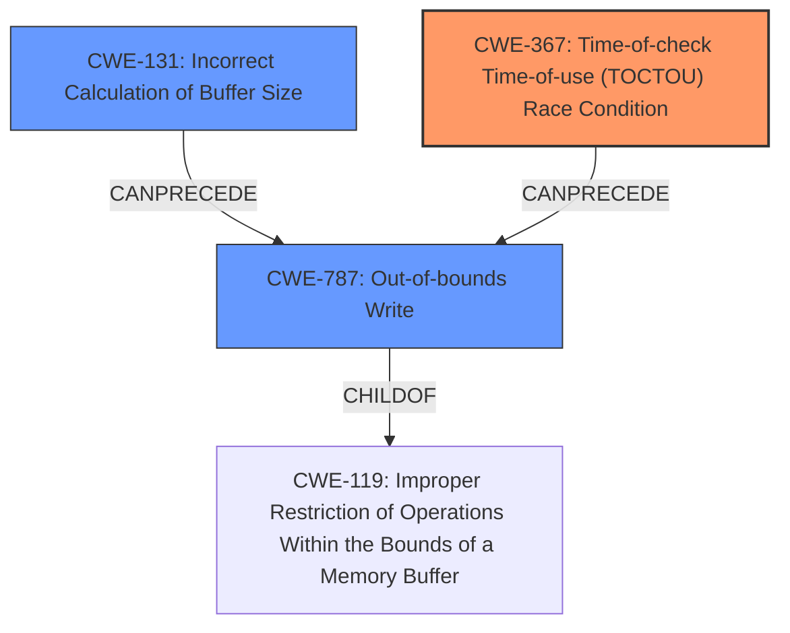

# Final Resolution for CVE-2021-30349

# Summary
| CWE ID | CWE Name | Confidence | CWE Abstraction Level | CWE Vulnerability Mapping Label | CWE-Vulnerability Mapping Notes |
|---|---|---|---|---|---|
| CWE-367 | Time-of-check Time-of-use (TOCTOU) Race Condition | 0.65 | Base | Allowed | Primary CWE |
| CWE-131 | Incorrect Calculation of Buffer Size | 0.6 | Base | Allowed | Secondary Candidate |
| CWE-787 | Out-of-bounds Write | 0.3 | Base | Allowed | Secondary Candidate |

## Evidence and Confidence

*   **Confidence Score:** 0.65
*   **Evidence Strength:** MEDIUM

## Relationship Analysis
The decision to classify the vulnerability primarily as CWE-367 (Time-of-check Time-of-use Race Condition) is influenced by the vulnerability description mentioning "improper access control sequence for AC database after memory allocation." This suggests a potential race condition where the state of the database changes between the access control check and the actual use. However, the analysis acknowledges that CWE-367 might be related to other weaknesses like CWE-131 (Incorrect Calculation of Buffer Size) and CWE-787 (Out-of-bounds Write). CWE-787 is often a consequence of other root causes.

## Vulnerability Chain
The vulnerability chain starts with a **ROOTCAUSE** which may be the **CWE-131** Incorrect Calculation of Buffer Size which leads to **CWE-367** Time-of-check Time-of-use (TOCTOU) Race Condition due to improper access control sequence and results in **CWE-787** Out-of-bounds Write. The initial flaw in buffer calculation can lead to memory corruption because the TOCTOU condition allows unauthorized or incorrect access due to a timing window, eventually causing an out-of-bounds write.

## Summary of Analysis
The initial analysis correctly identifies CWE-367 as a potential primary CWE due to the "improper access control sequence" description. However, the analysis lacks specificity regarding the conditions that enable the race condition. The analysis also notes CWE-131 and CWE-787 as secondary candidates, which is reasonable given the memory allocation and corruption aspects.

The criticism provides valuable feedback by highlighting the need for more specific information about the access control check, the data being protected, and the concurrent operations involved. It also suggests considering related CWEs such as CWE-413 (Improper Locking) and CWE-362 (Concurrent Execution using Shared Resource with Improper Synchronization).

The final decision is to maintain CWE-367 as the primary CWE but with a slightly reduced confidence score (0.65) due to the lack of specific details. CWE-131 remains a secondary candidate with a confidence score of 0.6 because incorrect buffer size calculation is a common cause of memory corruption. CWE-787 is retained as a secondary candidate with a low confidence score (0.3) because it is generally a consequence rather than a root cause. The classification reflects the optimal level of specificity based on the available evidence, which is somewhat limited. More information about the specific implementation and attack scenario would be necessary for a more definitive assessment. The evidence for a race condition is present in the description "improper access control sequence for AC database after memory allocation", which suggests a timing issue.