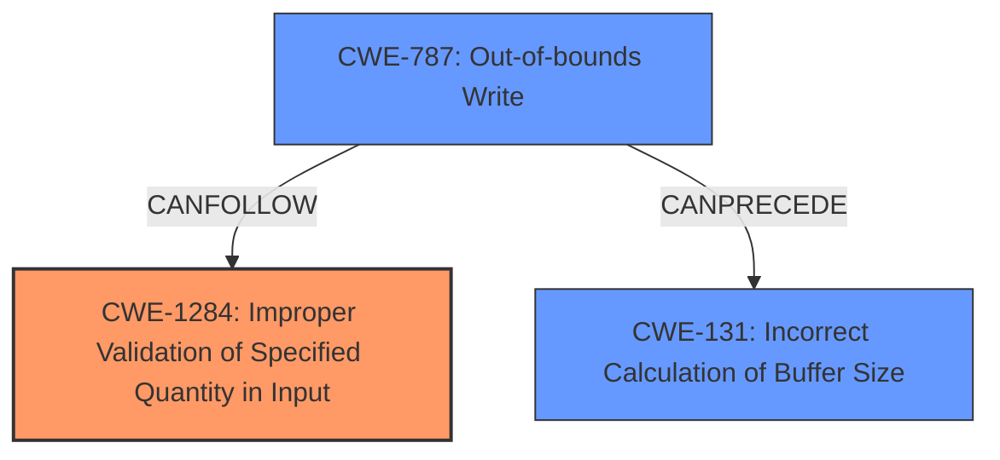

# Final Resolution for CVE-2021-30350

# Summary 
| CWE ID | CWE Name | Confidence | CWE Abstraction Level | CWE Vulnerability Mapping Label | CWE-Vulnerability Mapping Notes |
|---|---|---|---|---|---|
| CWE-1284 | Improper Validation of Specified Quantity in Input | 0.85 | Base | Allowed | Primary CWE: The **lack of MBN header size verification against input buffer** is directly related to the improper validation of the size of the buffer. |
| CWE-787 | Out-of-bounds Write | 0.60 | Base | Allowed | Secondary Candidate: Due to the **lack of MBN header size verification against input buffer**, an out-of-bounds write can occur, leading to memory corruption. This is a potential outcome contingent on the attacker-controlled MBN header size exceeding the buffer's boundaries. |
| CWE-131 | Incorrect Calculation of Buffer Size | 0.50 | Base | Allowed | Secondary Candidate: The **lack of MBN header size verification against input buffer** implies that buffer size is either incorrectly calculated or not checked, leading to potential memory corruption. However, the description of CWE-131 focuses on the calculation itself being flawed, not necessarily the absence of a validation step. |

## Evidence and Confidence

*   **Confidence Score:** 0.80
*   **Evidence Strength:** MEDIUM

## Relationship Analysis
The primary **weakness** is the **lack of validation** of the MBN header size, which aligns with CWE-1284. CWE-787 is a potential consequence if the unvalidated size leads to an out-of-bounds write. CWE-131 is less directly related, as the description emphasizes a flawed calculation, not the absence of validation.

## Vulnerability Chain
The vulnerability chain starts with the **lack of MBN header size verification** (**ROOTCAUSE**, CWE-1284). This **weakness** can lead to an out-of-bounds write (CWE-787), resulting in memory corruption. The chain highlights how the **lack of validation** directly enables the potential for memory corruption through an out-of-bounds write.

## Summary of Analysis
The initial analysis and criticism both correctly identify CWE-1284 as the most relevant **weakness** due to the **lack of MBN header size verification**. The criticism helps refine the confidence levels, emphasizing that CWE-787 is a consequence contingent on the header size exceeding buffer boundaries. The analysis relies heavily on the vulnerability description, which clearly states the **lack of verification** as the root cause. The graph relationships confirm that CWE-1284 can lead to CWE-787. The selected CWEs are at the optimal level of specificity, with CWE-1284 capturing the core issue of missing input validation. The evidence provided, specifically "Lack of MBN header size verification against input buffer can lead to memory corruption," strongly supports this classification.