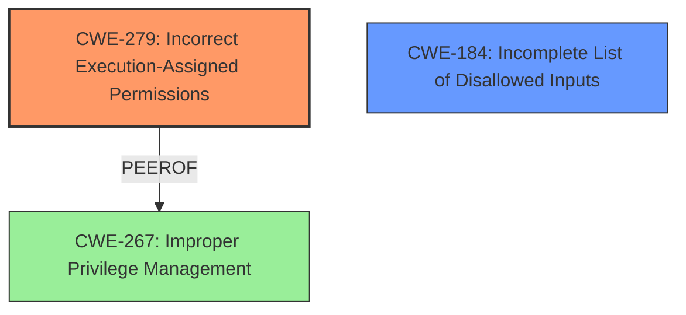

# Analysis Report for CVE-2021-30577

# Vulnerability Analysis Report: CVE-2021-30577

## Description

Insufficient policy enforcement in Installer in Google Chrome prior to 92.0.4515.107 allowed a remote attacker to perform local privilege escalation via a crafted file.

## Vulnerability Description Key Phrases

**Rootcause:** insufficient policy enforcement
**Impact:** local privilege escalation
**Vector:** crafted file
**Attacker:** remote attacker
**Product:** Google Chrome
**Version:** prior to 92.0.4515.107
**Component:** Installer

## Analysis (with Relationship Data)

# Summary
| CWE ID | CWE Name | Confidence | CWE Abstraction Level | CWE Vulnerability Mapping Label | CWE-Vulnerability Mapping Notes |
|---|---|---|---|---|---|
| CWE-267 | Improper Privilege Management | 0.75 | Base | Allowed | Primary CWE |
| CWE-184 | Incomplete List of Disallowed Inputs | 0.60 | Base | Allowed | Secondary Candidate CWE |

## Evidence and Confidence

*   **Confidence Score:** 0.70
*   **Evidence Strength:** MEDIUM

- **Analysis and Justification:**  
  - *Explanation:* The vulnerability description states "**insufficient policy enforcement** in Installer in Google Chrome prior to 92.0.4515.107 allowed a remote attacker to perform local privilege escalation via a crafted file." The CVE Reference Links Content Summary further emphasizes "**Insufficient policy enforcement** in the Installer component of the Chromium browser." This aligns with CWE-267, Improper Privilege Management, as the **insufficient policy enforcement** directly relates to improper management of privileges during the installation process. The crafted file likely exploits a weakness in how the installer handles privileges, leading to **local privilege escalation**. CWE-267 is a Base level CWE and the Usage is Allowed.
  - *Explanation:* I am considering CWE-184 as a secondary candidate since the **insufficient policy enforcement** could imply an incomplete list of disallowed inputs. The installer might not be properly validating the crafted file against a comprehensive list of prohibited or dangerous elements, leading to the **privilege escalation**. CWE-184 is a Base level CWE and the Usage is Allowed.

  - *Justification for Excluding Other CWEs:*
    - CWE-451 (User Interface (UI) Misrepresentation of Critical Information): This CWE is less relevant as the vulnerability stems from **policy enforcement** within the installer, not a misrepresentation of information to the user.
    - CWE-356 (Product UI does not Warn User of Unsafe Actions): Similar to CWE-451, this focuses on UI warnings, which is not the core issue of **insufficient policy enforcement** in the installer.
    - CWE-116 (Improper Encoding or Escaping of Output): Encoding issues are not explicitly mentioned in the vulnerability description or CVE summary.

- **Relationship Analysis:**
  - "CWE-267 is a Base level CWE which is the preferred level of abstraction for mapping to the root causes of vulnerabilities."
  - "CWE-184 is a Base level CWE which is the preferred level of abstraction for mapping to the root causes of vulnerabilities."
  - "There are no direct relationships defined in the provided information for CWE-267 and CWE-184."

- **Confidence Score:**
  - Confidence: 0.75 (Based on the description of **insufficient policy enforcement** leading to privilege escalation and the alignment with CWE-267. Considering CWE-184 as a possible secondary root cause.)

---

## Criticism of Analysis

Okay, here's a review of the provided analysis, considering the full CWE specifications you provided.

**Overall Assessment:**

The analysis is generally well-reasoned and provides a decent justification for the chosen CWEs. The inclusion of a secondary CWE candidate is a good practice. However, some improvements can be made in terms of precision and consideration of alternative, potentially more specific, CWEs. Also, I will challenge and debate some assumptions with justifications.

**Detailed Review:**

**1. CWE-267: Improper Privilege Management (Primary CWE)**

*   **Confidence:** The assigned confidence score of 0.75 is appropriate given the information. The description of "insufficient policy enforcement" leading to privilege escalation aligns well with the core concept of CWE-267. This CWE is applicable.

*   **Justification:** The justification is sound. Insufficient policy enforcement in the installer directly impacts how privileges are managed during installation, making CWE-267 a reasonable fit. The crafted file exploits weaknesses in privilege handling.

*   **CWE Specification Review:** The specification for CWE-267 accurately describes a scenario where a privilege can be used to perform unintended, unsafe actions. The provided mitigations for CWE-267, such as carefully managing privileges and using the principle of least privilege, are relevant to preventing this type of vulnerability in an installer.

*   **Potential Improvement:** One aspect could be further elaborated: What *specific* actions or objects were accessible due to the incorrect privilege management? Was it access to file system locations, registry keys, or other system resources? If this was known it could be mapped to a child CWE of CWE-267, as suggested in the specification "Maintenance" section. However, lacking that detail, it's acceptable to stay at the base level.

**2. CWE-184: Incomplete List of Disallowed Inputs (Secondary Candidate CWE)**

*   **Confidence:** The confidence score of 0.60 is reasonable. The rationale for considering it is valid, but not as directly evident as CWE-267.

*   **Justification:** The connection is that the "insufficient policy enforcement" *could* manifest as an incomplete denylist within the installer. The installer might not be thoroughly validating the crafted file against all possible malicious elements. This aligns with CWE-184.

*   **CWE Specification Review:** The description of CWE-184 fits the scenario where the installer relies on a list of disallowed inputs, but that list is not comprehensive enough to catch the crafted file. The mitigation provided for CWE-184 highlights the importance of not relying solely on detecting disallowed inputs and using other protection mechanisms, which is a good reminder for installer security.

*   **Potential Improvement:** The connection to CWE-184 is weaker than CWE-267, because it is an *assumption* that it is an incomplete list. It could be the policy existed but was not implemented correctly, for example.

**3. Justification for Excluding Other CWEs:**

*   **CWE-451 (User Interface (UI) Misrepresentation of Critical Information):** The justification is correct. This CWE focuses on misleading the user through the UI, which is not the primary issue here. The vulnerability stems from the installer's internal policy enforcement, not the UI.

*   **CWE-356 (Product UI does not Warn User of Unsafe Actions):** The justification is correct. This CWE is about lacking UI warnings, which is not the core issue.

*   **CWE-116 (Improper Encoding or Escaping of Output):** The justification is correct. Encoding issues are not explicitly part of the vulnerability description.

**4. Retriever Results Critique:**

*   **CWE-1021 (Improper Restriction of Rendered UI Layers or Frames):** While Clickjacking/UI Redress may be applicable, it is not the root cause of the vulnerability. The "crafted file" is the vector, and policy enforcement is the root cause.

*   **CWE-1386 (Insecure Operation on Windows Junction / Mount Point):** It is possible the attacker leveraged Windows Junctions/Mount points. This should have been a "secondary candidate CWE" if there was a specific reason to believe the crafted file leveraged Junction points, for example.

*   **CWE-356 (Product UI does not Warn User of Unsafe Actions):** Addressed. Not applicable.

*   **CWE-279 (Incorrect Execution-Assigned Permissions):** A good candidate to address. The crafted file likely bypasses expected permissions, and the installer does not respect the correct execution-assigned permissions. This could be considered as a primary candidate, or replacing CWE-184.

*   **CWE-358 (Improperly Implemented Security Check for Standard):** Unlikely applicable.

*   **CWE-416 (Use After Free):** Unlikely applicable.

*   **CWE-64 (Windows Shortcut Following (.LNK)):** It is possible the crafted file leveraged Windows Shortcuts. This should have been a "secondary candidate CWE" if there was a specific reason to believe the crafted file leveraged Windows Shortcuts, for example.

*   **CWE-451 (User Interface (UI) Misrepresentation of Critical Information):** Addressed. Not applicable.

*   **CWE-116 (Improper Encoding or Escaping of Output):** Addressed. Not applicable.

*   **CWE-284 (Improper Access Control):** Too broad. Avoid it.

**Recommendations:**

1.  **Consider CWE-279:** Re-evaluate the possibility of using CWE-279 (Incorrect Execution-Assigned Permissions) as a primary or secondary CWE. It directly relates to the privilege escalation aspect of the vulnerability. The crafted file causes the installer to operate with incorrect permissions.

2.  **Specificity:** While CWE-267 is a good starting point, attempt to identify more specific child CWEs if more detailed information becomes available about the precise mechanism of the vulnerability.

3.  **Justification Details:** If Junction Points or Windows Shortcuts were known to have been involved, make it a secondary candidate CWE and highlight this in the explanation.

4.  **Improve Confidence Scores:** Justify the assigned confidence scores with even more specific reasoning. For example, for CWE-267, you could explicitly mention which aspects of the vulnerability description led to that particular confidence level.

In summary, the analysis is reasonable, but can be improved by considering more specific CWEs, justifying the chosen confidence scores with more detail, and further elaborating the rationale for including or excluding certain CWEs.

## Final Resolution

# Summary
| CWE ID | CWE Name | Confidence | CWE Abstraction Level | CWE Vulnerability Mapping Label | CWE-Vulnerability Mapping Notes |
|---|---|---|---|---|---|
| CWE-279 | Incorrect Execution-Assigned Permissions | 0.80 | Base | Allowed | Primary CWE |
| CWE-184 | Incomplete List of Disallowed Inputs | 0.65 | Base | Allowed | Secondary Candidate CWE |

  - The Primary CWE should be first and noted as the Primary CWEs
  - The secondary candidate CWEs should be next and noted as secondary candidates.
  - The confidence is a confidence score 0 to 1 to rate your confidence in your assessment for that CWE.
  - The CWE Abstraction Level as one of these values: Base, Variant, Pillar, Class, Compound
  - The Mapping Notes Usage as one of these values: Allowed, Allowed-with-Review, Prohibited, Discouraged

## Evidence and Confidence

*   **Confidence Score:** 0.80
*   **Evidence Strength:** MEDIUM

## Relationship Analysis
The analysis focused on identifying the root cause of the privilege escalation. Initially, CWE-267 was considered, but CWE-279 offers a more direct mapping to the vulnerability where the crafted file bypasses expected permissions, leading to incorrect execution-assigned permissions. CWE-184 remains a secondary consideration as the **insufficient policy enforcement** could stem from an incomplete list of disallowed inputs. The parent-child relationships were not directly relevant, but the abstraction levels (Base) were considered to ensure specificity.

## Vulnerability Chain
The vulnerability chain starts with a crafted file bypassing **policy enforcement** during installation. This leads to incorrect execution-assigned permissions, allowing a remote attacker to perform **local privilege escalation**. The root cause is the insufficient validation of the crafted file, resulting in the installer granting elevated privileges.

## Summary of Analysis
The initial analysis identified CWE-267 as the primary **weakness**, but the criticism highlighted the potential for a more specific classification. "Insufficient policy enforcement in Installer in Google Chrome prior to 92.0.4515.107 allowed a remote attacker to perform local privilege escalation via a crafted file." Based on the provided vulnerability description, CWE-279 (Incorrect Execution-Assigned Permissions) is now considered the primary **rootcause** as it directly addresses the privilege escalation aspect. The installer does not respect the correct execution-assigned permissions due to the crafted file. CWE-184 (Incomplete List of Disallowed Inputs) is retained as a secondary candidate, reflecting the possibility that the **insufficient policy enforcement** stems from an incomplete denylist. The decision is based on the evidence that the crafted file leads to incorrect permission assignments during execution, making CWE-279 the optimal level of specificity.

*Report generated on 2025-03-17 01:30:08*
