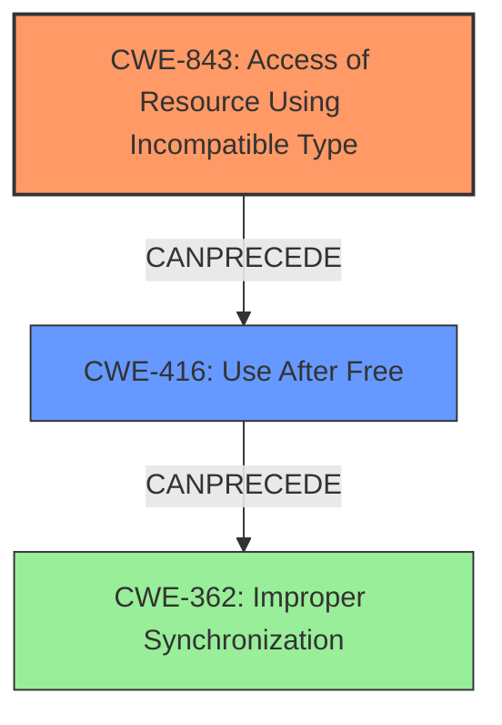

# Final Resolution for CVE-2021-30630

# Summary
| CWE ID  | CWE Name                                                       | Confidence | CWE Abstraction Level | CWE Vulnerability Mapping Label | CWE-Vulnerability Mapping Notes |
| :-------- | :------------------------------------------------------------- | :--------- | :-------------------- | :------------------------------ | :------------------------------ |
| CWE-843 | Access of Resource Using Incompatible Type ('Type Confusion') | 0.75       | Base                  | Allowed                         | Primary CWE                     |
| CWE-416 | Use After Free                                                 | 0.60       | Variant               | Allowed                         | Secondary Candidate             |

## Evidence and Confidence

*   **Confidence Score:** 0.70
*   **Evidence Strength:** MEDIUM

## Relationship Analysis
The primary weakness identified is **CWE-843 (Access of Resource Using Incompatible Type ('Type Confusion'))**. The initial analysis noted it has no direct relationships, which is not particularly helpful, but the criticism rightly points out that other memory safety issues like **CWE-125 (Out-of-bounds Read)** or **CWE-787 (Out-of-bounds Write)** could also contribute to type confusion.
**CWE-416 (Use After Free)** is considered as a secondary candidate. There is a potential chain relationship where **type confusion** (**CWE-843**) could lead to premature freeing of memory, subsequently triggering a **use-after-free** condition (**CWE-416**). The analysis mentions concurrency issues (**CWE-362**) as a potential chaining element, which is a reasonable consideration.
The initial consideration of **CWE-1021 (Improper Restriction of Rendered UI Layers or Frames)** is deemed weak, as the description focuses on data leakage rather than UI manipulation.

## Vulnerability Chain
The vulnerability chain starts with an **inappropriate implementation** within the Blink component, which is not a CWE, but the root cause. This leads to **CWE-843 (Type Confusion)**, where data is accessed using an incompatible type. This type confusion can then lead to a premature free, resulting in **CWE-416 (Use After Free)**. A compromised renderer process can then exploit this **use-after-free** to leak cross-origin data.

## Summary of Analysis
The analysis is primarily based on the provided vulnerability description: "Inappropriate implementation in Blink in Google Chrome prior to 93.0.4577.82 allowed a remote attacker who had compromised the renderer process to leak cross-origin data via a crafted HTML page."

The graph relationships influenced the decision by highlighting the potential for a chain of weaknesses, where **CWE-843 (Type Confusion)** could lead to **CWE-416 (Use After Free)**. This chaining aspect strengthens the argument for including both CWEs in the analysis.

The selected CWEs are at the optimal level of specificity because they directly address the root cause and resulting vulnerability. **CWE-843 (Type Confusion)** explains how the data is being misinterpreted, and **CWE-416 (Use After Free)** describes how memory corruption is exploited to leak cross-origin data. Removing **CWE-1021 (Improper Restriction of Rendered UI Layers or Frames)** was justified because the evidence did not support a connection to UI layer restrictions.

The decision to retain **CWE-843 (Type Confusion)** and **CWE-416 (Use After Free)** is based on the evidence of data leakage. The description of inappropriate implementation in Blink leading to cross-origin data leakage points to both **type confusion** and memory management issues. The retriever results also support the selection of these two CWEs.