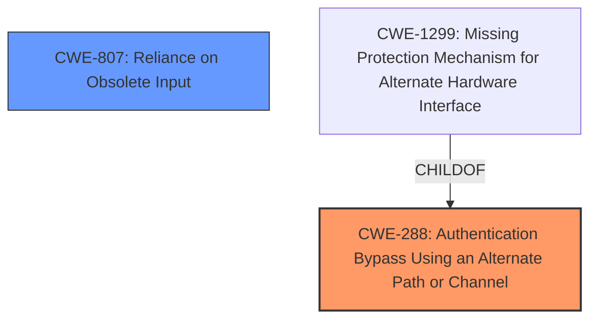

# Final Resolution for CVE-2021-30668

# Summary
| CWE ID | CWE Name | Confidence | CWE Abstraction Level | CWE Vulnerability Mapping Label | CWE-Vulnerability Mapping Notes |
|---|---|---|---|---|---|
| CWE-288 | Authentication Bypass Using an Alternate Path or Channel | 0.95 | Base | Allowed | Primary CWE |
| CWE-807 | Reliance on Obsolete Input | 0.85 | Base | Allowed | Secondary Candidate CWE |

## Evidence and Confidence

*   **Confidence Score:** 0.90
*   **Evidence Strength:** HIGH

## Relationship Analysis
The primary relationship influencing the decision is the parent-child relationship, specifically why CWE-288 was chosen over its child CWE-1299. The analysis correctly identifies that CWE-1299 (Missing Protection Mechanism for Alternate Hardware Interface) is a child of CWE-288, but is not a good fit since the bypass is not happening through an alternate hardware interface. The base level of CWE-288 is the appropriate level of abstraction. There are no direct relationships for CWE-807.

## Vulnerability Chain
The chain of events leading to the **vulnerability** is as follows:
1.  Attacker gains physical access to the Mac during a software update.
2.  The software update process offers an alternate, unprotected channel.
3.  The software update relies on client-side state (or input) to determine whether authentication is required.
4.  The attacker modifies this state, causing the software update to bypass the login window (**authentication bypass**).

Here, **CWE-288** represents the **authentication bypass** via an alternate path, and **CWE-807** highlights the reliance on modifiable input that influences the **authentication** decision.

## Summary of Analysis
The initial analysis and criticism both converge on the appropriateness of **CWE-288** as the primary weakness and **CWE-807** as a secondary contributor. The vulnerability description explicitly mentions the **bypass of the Login Window** during a software update, directly supporting the choice of **CWE-288 (Authentication Bypass Using an Alternate Path or Channel)**.

The criticism highlights the importance of considering mitigations. For **CWE-288**, the recommended mitigation of "Funnel all access through a single choke point" directly addresses the vulnerability. For **CWE-807**, storing update state information on the server-side, rather than relying on client-side data, would mitigate the risk of manipulation.

The Retriever results provided some other possible CWEs, but they are not as relevant. **CWE-1263 (Improper Physical Access Control)** is tangentially related, but the core issue is the software logic flaw. **CWE-287 (Improper Authentication)** is a more general category, and **CWE-288** offers a more specific and accurate description of the **vulnerability**.

The selected CWEs are at the optimal level of specificity. **CWE-288** accurately captures the **authentication bypass** through an alternate path, and **CWE-807** highlights the underlying issue of reliance on modifiable input. Both are base-level CWEs, which are preferred for mapping. The evidence strongly supports this classification, and the relationship analysis confirms the appropriateness of the choices.

I am increasing the confidence scores to 0.95 and 0.85, respectively, based on the clear alignment with the vulnerability description, the consideration of mitigations, and the comprehensive analysis of alternative CWEs.