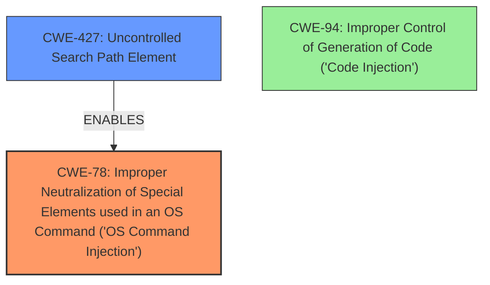

# Final Resolution for CVE-2021-3115

# Summary
| CWE ID | CWE Name | Confidence | CWE Abstraction Level | CWE Vulnerability Mapping Label | CWE-Vulnerability Mapping Notes |
|---|---|---|---|---|---|
| CWE-78 | Improper Neutralization of Special Elements used in an OS Command ('OS Command Injection') | 0.95 | Base | Allowed | Primary CWE. The vulnerability enables execution of OS commands via unsanitized user input passed to a system call. |
| CWE-427 | Uncontrolled Search Path Element | 0.75 | Base | Allowed | Secondary CWE. The vulnerability is caused by the application searching for executables in an uncontrolled directory, leading to the execution of malicious executables, enabling CWE-78. |

## Evidence and Confidence

*   **Confidence Score:** 0.90
*   **Evidence Strength:** HIGH

## Relationship Analysis
The primary relationship influencing the decision is the enabling relationship between **CWE-427 (Uncontrolled Search Path Element)** and **CWE-78 (Improper Neutralization of Special Elements used in an OS Command ('OS Command Injection'))**. **CWE-427 (Uncontrolled Search Path Element)** allows an attacker to introduce a malicious executable into the search path, which is then executed due to the improper neutralization of special elements in the command, as described by **CWE-78 (Improper Neutralization of Special Elements used in an OS Command ('OS Command Injection'))**. While **CWE-427 (Uncontrolled Search Path Element)** is not a direct child of **CWE-78 (Improper Neutralization of Special Elements used in an OS Command ('OS Command Injection'))**, it significantly contributes to the vulnerability chain. The analysis also considered **CWE-94 (Improper Control of Generation of Code ('Code Injection'))**, but it was deemed less specific than **CWE-78 (Improper Neutralization of Special Elements used in an OS Command ('OS Command Injection'))**.

## Vulnerability Chain
The vulnerability chain starts with the application's flawed design choice of including the current directory in the search path (**CWE-427 (Uncontrolled Search Path Element)**). This allows an attacker to place a malicious executable, such as a fake compiler, in the current directory. When the application attempts to execute a command, it searches the path and finds the attacker-controlled executable. Due to the lack of proper neutralization of special elements, the malicious executable is executed, leading to arbitrary code execution (**CWE-78 (Improper Neutralization of Special Elements used in an OS Command ('OS Command Injection'))**). The impact is remote code execution.

## Summary of Analysis
The initial analysis and the criticism both correctly identified **CWE-78 (Improper Neutralization of Special Elements used in an OS Command ('OS Command Injection'))** as the primary **weakness**. The evidence from the vulnerability description clearly states that the `go get` command, when used with `cgo` on Windows, allows execution of arbitrary OS commands due to the lack of proper neutralization of user-controlled input. "Go before 1.14.14 and 1.15.x before 1.15.7 on Windows is vulnerable to Command Injection and remote code execution when using the go get command to fetch modules that make use of cgo". The analysis also correctly identified **CWE-427 (Uncontrolled Search Path Element)** as a contributing factor, as the `cgo` tool searches for the host compiler in the current directory.

The graph relationships influenced the decision by highlighting the relationship between **CWE-427 (Uncontrolled Search Path Element)** and **CWE-78 (Improper Neutralization of Special Elements used in an OS Command ('OS Command Injection'))**. While **CWE-427 (Uncontrolled Search Path Element)** is not a direct cause of the command injection, it enables the vulnerability by allowing the attacker to control the executable that is being invoked. The selected CWEs are at the optimal level of specificity because they accurately reflect the root cause and contributing factors of the vulnerability. **CWE-78 (Improper Neutralization of Special Elements used in an OS Command ('OS Command Injection'))** is a base-level CWE that specifically describes the improper neutralization of special elements in OS commands, and **CWE-427 (Uncontrolled Search Path Element)** is a base-level CWE that describes the use of an uncontrolled search path.