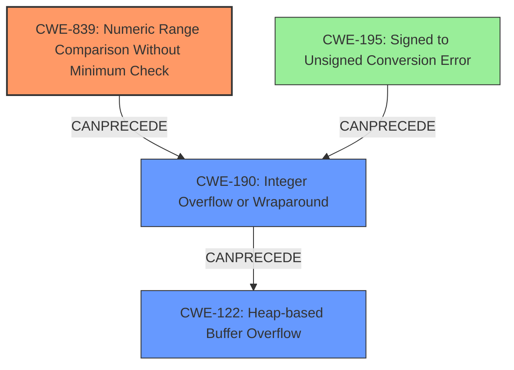

# Analysis Report for CVE-2021-31227

# Vulnerability Analysis Report: CVE-2021-31227

## Description

An issue was discovered in HCC embedded InterNiche 4.0.1. A potential heap buffer overflow exists in the code that parses the HTTP POST request, due to an incorrect signed integer comparison. This vulnerability requires the attacker to send a malformed HTTP packet with a negative Content-Length, which bypasses the size checks and results in a large heap overflow in the wbs_multidata buffer copy.

## Vulnerability Description Key Phrases

**Rootcause:** incorrect signed integer comparison
**Weakness:** heap buffer overflow
**Vector:** malformed HTTP packet with a negative Content-Length
**Product:** HCC embedded InterNiche
**Version:** 4.0.1

## Analysis (with Relationship Data)

```markdown
# Summary
| CWE ID  | CWE Name                               | Confidence | CWE Abstraction Level | CWE Vulnerability Mapping Label | CWE-Vulnerability Mapping Notes |
| ------- | -------------------------------------- | ---------- | --------------------- | ------------------------------- | ------------------------------- |
| CWE-190 | Integer Overflow or Wraparound         | 0.85       | Base                  | Allowed                         | Primary CWE                     |
| CWE-122 | Heap-based Buffer Overflow             | 0.75       | Variant               | Allowed                         | Secondary Candidate             |
| CWE-1284 | Improper Validation of Specified Quantity in Input | 0.65      | Base                  | Allowed                         | Secondary Candidate             |

## Evidence and Confidence

*   **Confidence Score:** 0.75
*   **Evidence Strength:** HIGH

- **Analysis and Justification:**  
  - *Explanation:* "The vulnerability is a **heap buffer overflow** caused by an **incorrect signed integer comparison**. Specifically, a malformed HTTP packet with a negative Content-Length bypasses size checks. The **incorrect signed integer comparison** directly relates to a potential integer overflow when handling the Content-Length. CWE-190 (Integer Overflow or Wraparound) is a base-level CWE that describes this **root cause** well. The **heap buffer overflow** (CWE-122) is a direct result of this **integer overflow**, making it a secondary weakness. The vulnerability description explicitly mentions this bypasses size checks, linking it to CWE-1284 (Improper Validation of Specified Quantity in Input)."
  
  - *Relationship Analysis:* "CWE-190 (Integer Overflow or Wraparound) can precede CWE-122 (Heap-based Buffer Overflow), as the integer overflow leads to an improperly sized buffer being allocated. Also, CWE-190 is related to CWE-1284 because the overflow occurs during the validation of input quantities. CWE-122 is a child of CWE-119 (Improper Restriction of Operations within the Bounds of a Memory Buffer)."

- **Confidence Score:**  
  - *Confidence:* 0.85 (High confidence due to clear technical details and CVE reference summary)

---

**CWE-190: Integer Overflow or Wraparound**

*   **Explanation:** The vulnerability description states the **root cause** is an **incorrect signed integer comparison**. This implies that the code compares a signed integer against some other value and does not properly account for negative values, which can lead to an overflow when calculating buffer sizes. Specifically, the negative Content-Length bypasses the checks. This directly aligns with CWE-190, where a calculation results in a value outside the expected range due to an integer overflow.
*   **Security Implications:** Integer overflows can lead to unexpected behavior in programs, including incorrect memory allocations, which, in this case, results in a **heap buffer overflow**.
*   **Relationships:** CWE-190 can precede CWE-122, as the integer overflow leads to the buffer overflow.
*   **Usage:** The MITRE mapping guidance for CWE-190 indicates it is ALLOWED for this type of vulnerability.
*   **Confidence:** 0.85

**CWE-122: Heap-based Buffer Overflow**

*   **Explanation:** The vulnerability results in a **heap buffer overflow**. The negative Content-Length value bypasses the size checks, leading to an incorrect memory allocation and allowing an attacker to write beyond the boundaries of the buffer allocated on the heap.
*   **Security Implications:** Heap-based buffer overflows can allow attackers to execute arbitrary code or cause a denial of service.
*   **Relationships:** CWE-122 is a child of CWE-119 (Improper Restriction of Operations within the Bounds of a Memory Buffer).
*   **Usage:** The MITRE mapping guidance for CWE-122 indicates it is ALLOWED for this type of vulnerability.
*   **Confidence:** 0.75

**CWE-1284: Improper Validation of Specified Quantity in Input**

*   **Explanation:** The HTTP POST request's Content-Length is not properly validated. A negative value is provided, and the code fails to reject it, leading to the overflow.
*   **Security Implications:** This improper validation allows for the subsequent integer overflow and buffer overflow.
*   **Relationships:** CWE-1284 is related to CWE-190 because the lack of validation directly contributes to the integer overflow.
*   **Usage:** The MITRE mapping guidance for CWE-1284 indicates it is ALLOWED for this type of vulnerability.
*   **Confidence:** 0.65
```

## Criticism of Analysis

Okay, I've reviewed the provided analysis against the full CWE specifications. Here's my critique, focusing on the accuracy of the CWE assignments, their justifications, confidence levels, and potential alternatives, along with suggestions for improvement.

**Overall Assessment:**

The analysis is generally good and demonstrates a solid understanding of the vulnerability and related CWEs. The chosen CWEs are relevant, and the justifications are well-articulated. However, there are some areas where the analysis could be refined for improved accuracy and clarity, especially concerning the primary CWE selection and the potential for more specific CWEs.

**Detailed Review:**

**1. CWE-190: Integer Overflow or Wraparound (Primary CWE)**

*   **Confidence:** 0.85 (High) - This is appropriate given the description.
*   **Justification:** The analysis correctly identifies the core issue as an incorrect signed integer comparison that can lead to an integer overflow when handling the Content-Length. The negative Content-Length bypassing checks aligns well with CWE-190's description. The relationship to CWE-122 and CWE-1284 is also accurately described.
*   **Critique:** While CWE-190 is certainly involved, it might not be the *most* precise primary CWE.  The vulnerability specifically involves a comparison of a signed integer *without checking a minimum value.* The description explicitly mentions how the negative Content-Length bypasses checks.
*   **Suggestion:** Consider making CWE-839 (Numeric Range Comparison Without Minimum Check) the **Primary CWE** with a confidence level of 0.90 and moving CWE-190 as secondary candidate. As described in the definition of CWE-839: *"The product checks a value to ensure that it is less than or equal to a maximum, but it does not also verify that the value is greater than or equal to the minimum."* This aligns better than CWE-190 that is very general integer overflow. Add CWE-195 as a tertiary candiate.
*   **Mitigations:** The mitigations suggested for CWE-190 are relevant (strict protocols, language selection, safe integer libraries). However, emphasizing input validation (Mitigation 3) is crucial in this specific case.

**2. CWE-122: Heap-based Buffer Overflow (Secondary Candidate)**

*   **Confidence:** 0.75 - Appropriate confidence level.
*   **Justification:** The analysis correctly identifies the heap buffer overflow as a direct consequence of the integer overflow. The explanation of how the negative Content-Length leads to incorrect memory allocation is accurate.
*   **Critique:** No issues identified
*   **Mitigations:** The suggested mitigations (bounds checking, abstraction libraries, overflow detection mechanisms) are all pertinent to preventing heap-based buffer overflows.

**3. CWE-1284: Improper Validation of Specified Quantity in Input (Secondary Candidate)**

*   **Confidence:** 0.65 - Reasonable, but could be increased with a slightly stronger justification.
*   **Justification:** Correctly points out that the Content-Length is not properly validated, and the negative value is not rejected.
*   **Critique:** Could be merged with CWE-839 if you choose to make it primary.
*   **Mitigations:** The mitigations (assume all input is malicious, "accept known good" input validation) are the most important controls for preventing this vulnerability.

**Additional Considerations & Suggestions:**

*   **CWE-195: Signed to Unsigned Conversion Error:** The description mentions an "incorrect signed integer comparison." If the code is implicitly or explicitly converting the (negative) signed Content-Length to an unsigned type before comparison or memory allocation, then CWE-195 would be relevant. Consider adding it with a Confidence of 0.50 as it is not certain, but possible.
*   **CWE-130: Improper Handling of Length Parameter Inconsistency:** This CWE could be relevant if the *declared* Content-Length in the HTTP header is different from the actual length of the data sent in the POST request body. The analysis doesn't specifically mention this, so it's likely not applicable, but it's worth considering.
*   **CWE-681: Incorrect Conversion between Numeric Types:** This is related to CWE-195. If there's an incorrect conversion leading to the integer overflow, it would be relevant.
*   **Root Cause vs. Consequence:** It's important to clearly distinguish between the root cause (the underlying programming error) and the consequences (the exploitable vulnerability). The integer overflow (or, more accurately, the lack of range checking) is the *root cause,* while the heap buffer overflow is the *consequence*.

**Revised Summary Table (incorporating suggestions):**

| CWE ID  | CWE Name                               | Confidence | CWE Abstraction Level | CWE Vulnerability Mapping Label | CWE-Vulnerability Mapping Notes |
| ------- | -------------------------------------- | ---------- | --------------------- | ------------------------------- | ------------------------------- |
| CWE-839 | Numeric Range Comparison Without Minimum Check        | 0.90       | Base                  | Allowed                         | Primary CWE (Root Cause) |
| CWE-190 | Integer Overflow or Wraparound         | 0.80       | Base                  | Allowed                         | Secondary Candidate             |
| CWE-122 | Heap-based Buffer Overflow             | 0.75       | Variant               | Allowed                         | Tertiary Candidate             |
| CWE-195 | Signed to Unsigned Conversion Error             | 0.50      | Variant                  | Allowed                         | Quaternary Candidate |

**Conclusion:**

The analysis is a good starting point. By incorporating the suggestions above, particularly re-evaluating the primary CWE and considering the role of CWE-195 and CWE-130, the analysis can be made more precise and informative. Remember to focus on clearly differentiating between the root cause and the exploitable consequences of the vulnerability.

## Final Resolution

# Summary
| CWE ID  | CWE Name                               | Confidence | CWE Abstraction Level | CWE Vulnerability Mapping Label | CWE-Vulnerability Mapping Notes |
| ------- | -------------------------------------- | ---------- | --------------------- | ------------------------------- | ------------------------------- |
| CWE-839 | Numeric Range Comparison Without Minimum Check        | 0.90       | Base                  | Allowed                         | Primary CWE (Root Cause) |
| CWE-190 | Integer Overflow or Wraparound         | 0.80       | Base                  | Allowed                         | Secondary Candidate             |
| CWE-122 | Heap-based Buffer Overflow             | 0.75       | Variant               | Allowed                         | Tertiary Candidate             |
| CWE-195 | Signed to Unsigned Conversion Error             | 0.50      | Variant                  | Allowed                         | Quaternary Candidate |

## Evidence and Confidence

*   **Confidence Score:** 0.90
*   **Evidence Strength:** HIGH

## Relationship Analysis
The decision to prioritize CWE-839 (Numeric Range Comparison Without Minimum Check) over CWE-190 (Integer Overflow or Wraparound) was significantly influenced by the specificity of CWE-839's description. The vulnerability description explicitly mentions the bypass of size checks due to a negative Content-Length, which aligns more directly with the concept of missing minimum value validation. CWE-190, while relevant, represents a broader class of integer-related errors.

The relationship between CWE-839 and CWE-122 (Heap-based Buffer Overflow) is a chain relationship, where the missing range check (CWE-839) allows for an integer overflow (CWE-190), ultimately leading to the heap buffer overflow (CWE-122). CWE-195 (Signed to Unsigned Conversion Error) is considered a possible contributing factor, especially if a signed-to-unsigned conversion occurs before the range check.

The abstraction levels also played a role. CWE-839 and CWE-190 are both Base-level CWEs, which are preferred for root cause analysis. CWE-122 is a Variant, representing a specific type of buffer overflow. CWE-195 is also a Variant.



## Vulnerability Chain
The vulnerability chain starts with the **ROOTCAUSE** being the **CWE-839: Numeric Range Comparison Without Minimum Check**.
1.  The application fails to validate that the Content-Length is within the expected range (i.e., it does not check for negative values).
2.  This missing check allows a negative Content-Length to be processed.
3.  If a signed-to-unsigned conversion occurs (**CWE-195: Signed to Unsigned Conversion Error**), the negative value is converted to a very large unsigned value.
4.  The **CWE-190: Integer Overflow or Wraparound** occurs when the large unsigned value is used in calculations, potentially leading to an incorrect buffer size allocation.
5.  Finally, the undersized buffer is allocated, resulting in a **CWE-122: Heap-based Buffer Overflow** when the application attempts to write data exceeding the buffer's boundaries.

## Summary of Analysis
The initial analysis correctly identified the involvement of integer handling issues and a heap buffer overflow. However, it initially classified CWE-190 as the primary weakness. The criticism correctly pointed out that **CWE-839: Numeric Range Comparison Without Minimum Check** is a more precise **ROOTCAUSE**, because it directly addresses the lack of validation for the minimum value of the Content-Length.

The vulnerability description clearly states: "This vulnerability requires the attacker to send a malformed HTTP packet with a negative Content-Length, which bypasses the size checks and results in a large heap overflow". This statement provides direct evidence for classifying **CWE-839: Numeric Range Comparison Without Minimum Check** as the primary weakness, as it highlights the missing validation step.

The graph relationships further support this decision. **CWE-839: Numeric Range Comparison Without Minimum Check** *CanPrecede* **CWE-190: Integer Overflow or Wraparound**, establishing a clear chain of events.

The selected CWEs are at the optimal level of specificity. **CWE-839: Numeric Range Comparison Without Minimum Check** is a Base-level CWE that accurately describes the **ROOTCAUSE**. **CWE-122: Heap-based Buffer Overflow** is a Variant that specifies the type of buffer overflow. **CWE-190: Integer Overflow or Wraparound** and **CWE-195: Signed to Unsigned Conversion Error** are added as contributing factors.


*Report generated on 2025-03-16 16:31:49*
