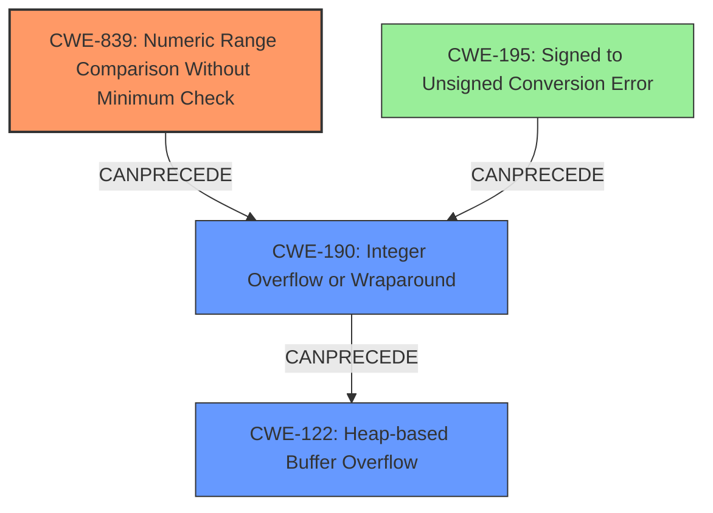

# Final Resolution for CVE-2021-31227

# Summary
| CWE ID  | CWE Name                               | Confidence | CWE Abstraction Level | CWE Vulnerability Mapping Label | CWE-Vulnerability Mapping Notes |
| ------- | -------------------------------------- | ---------- | --------------------- | ------------------------------- | ------------------------------- |
| CWE-839 | Numeric Range Comparison Without Minimum Check        | 0.90       | Base                  | Allowed                         | Primary CWE (Root Cause) |
| CWE-190 | Integer Overflow or Wraparound         | 0.80       | Base                  | Allowed                         | Secondary Candidate             |
| CWE-122 | Heap-based Buffer Overflow             | 0.75       | Variant               | Allowed                         | Tertiary Candidate             |
| CWE-195 | Signed to Unsigned Conversion Error             | 0.50      | Variant                  | Allowed                         | Quaternary Candidate |

## Evidence and Confidence

*   **Confidence Score:** 0.90
*   **Evidence Strength:** HIGH

## Relationship Analysis
The decision to prioritize CWE-839 (Numeric Range Comparison Without Minimum Check) over CWE-190 (Integer Overflow or Wraparound) was significantly influenced by the specificity of CWE-839's description. The vulnerability description explicitly mentions the bypass of size checks due to a negative Content-Length, which aligns more directly with the concept of missing minimum value validation. CWE-190, while relevant, represents a broader class of integer-related errors.

The relationship between CWE-839 and CWE-122 (Heap-based Buffer Overflow) is a chain relationship, where the missing range check (CWE-839) allows for an integer overflow (CWE-190), ultimately leading to the heap buffer overflow (CWE-122). CWE-195 (Signed to Unsigned Conversion Error) is considered a possible contributing factor, especially if a signed-to-unsigned conversion occurs before the range check.

The abstraction levels also played a role. CWE-839 and CWE-190 are both Base-level CWEs, which are preferred for root cause analysis. CWE-122 is a Variant, representing a specific type of buffer overflow. CWE-195 is also a Variant.

## Vulnerability Chain
The vulnerability chain starts with the **ROOTCAUSE** being the **CWE-839: Numeric Range Comparison Without Minimum Check**.
1.  The application fails to validate that the Content-Length is within the expected range (i.e., it does not check for negative values).
2.  This missing check allows a negative Content-Length to be processed.
3.  If a signed-to-unsigned conversion occurs (**CWE-195: Signed to Unsigned Conversion Error**), the negative value is converted to a very large unsigned value.
4.  The **CWE-190: Integer Overflow or Wraparound** occurs when the large unsigned value is used in calculations, potentially leading to an incorrect buffer size allocation.
5.  Finally, the undersized buffer is allocated, resulting in a **CWE-122: Heap-based Buffer Overflow** when the application attempts to write data exceeding the buffer's boundaries.

## Summary of Analysis
The initial analysis correctly identified the involvement of integer handling issues and a heap buffer overflow. However, it initially classified CWE-190 as the primary weakness. The criticism correctly pointed out that **CWE-839: Numeric Range Comparison Without Minimum Check** is a more precise **ROOTCAUSE**, because it directly addresses the lack of validation for the minimum value of the Content-Length.

The vulnerability description clearly states: "This vulnerability requires the attacker to send a malformed HTTP packet with a negative Content-Length, which bypasses the size checks and results in a large heap overflow". This statement provides direct evidence for classifying **CWE-839: Numeric Range Comparison Without Minimum Check** as the primary weakness, as it highlights the missing validation step.

The graph relationships further support this decision. **CWE-839: Numeric Range Comparison Without Minimum Check** *CanPrecede* **CWE-190: Integer Overflow or Wraparound**, establishing a clear chain of events.

The selected CWEs are at the optimal level of specificity. **CWE-839: Numeric Range Comparison Without Minimum Check** is a Base-level CWE that accurately describes the **ROOTCAUSE**. **CWE-122: Heap-based Buffer Overflow** is a Variant that specifies the type of buffer overflow. **CWE-190: Integer Overflow or Wraparound** and **CWE-195: Signed to Unsigned Conversion Error** are added as contributing factors.