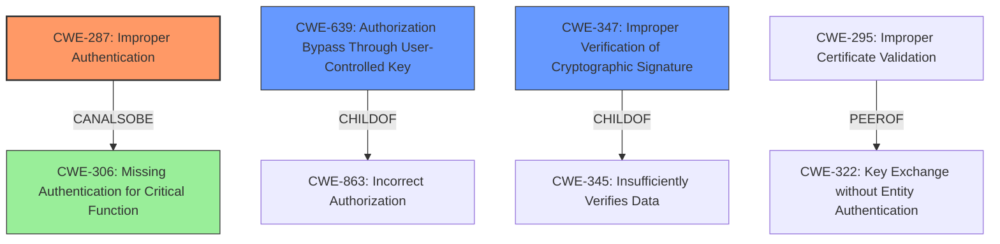

# Analysis Report for CVE-2021-3127

# Vulnerability Analysis Report: CVE-2021-3127

## Description

NATS Server 2.x before 2.2.0 and JWT library before 2.0.1 have Incorrect Access Control because Import Token bindings are mishandled.

## Vulnerability Description Key Phrases

**Rootcause:** mishandled Import Token bindings
**Weakness:** incorrect access control
**Product:** ['NATS Server', 'JWT library']
**Version:** ['2.x before 2.2.0', 'before 2.0.1']

## Analysis (with Relationship Data)

# Summary
| CWE ID | CWE Name | Confidence | CWE Abstraction Level | CWE Vulnerability Mapping Label | CWE-Vulnerability Mapping Notes |
|---|---|---|---|---|---|
| CWE-287 | Improper Authentication | 0.75 | Class | Primary | The product does not prove or insufficiently proves that the claim is correct. |
| CWE-639 | Authorization Bypass Through User-Controlled Key | 0.65 | Base | Secondary | The system's authorization functionality does not prevent one user from gaining access to another user's data or record by modifying the key value identifying the data. |
| CWE-347 | Improper Verification of Cryptographic Signature | 0.50 | Base | Secondary | The product does not verify, or incorrectly verifies, the cryptographic signature for data. |

## Evidence and Confidence

*   **Confidence Score:** 0.70
*   **Evidence Strength:** HIGH

- **Analysis and Justification:**
  - *Explanation:* The vulnerability lies in the **mishandling of Import Token bindings**, leading to **incorrect access control**. The CVE reference explains that the JWT library **failed to enforce correct binding of import tokens**, and instead of rejecting tokens with mismatched bindings, it only issued a warning. This allowed attackers to reuse import tokens from other accounts to access subjects in exporting accounts. The core issue is that the system is not sufficiently proving the identity or authorization of the actor (the user with the JWT), which directly aligns with CWE-287, Improper Authentication. The system incorrectly assumes that the JWT is valid for the current account, even though it might belong to another account.
  - The evidence supports CWE-287 with the description of JWT token mishandling. An attacker can reuse import tokens from another account to access restricted subjects. This vulnerability stems from the system insufficiently proving that the user claiming access through JWT is authorized to do so, aligning directly with CWE-287. The Retriever results list CWE-287, but mark it as DISCOURAGED. This is because CWE-287 is a class-level CWE, however, a more specific base-level CWE is not apparent. Therefore, it is appropriate to classify this vulnerability as CWE-287.
  - *Relationship Analysis:* CWE-287 is a Class-level CWE. It is related to other authentication and authorization CWEs. Specifically, it can be related to CWE-639, Authorization Bypass Through User-Controlled Key, because the attacker is essentially bypassing authorization by using a key (the JWT) that is not properly validated against the current account. It is also related to CWE-347, Improper Verification of Cryptographic Signature, as the JWT's signature might be valid, but the system does not properly verify if the JWT is intended for the current account.

- **Confidence Score:**
  - Confidence: 0.75 (High evidence from technical description and CVE reference materials)

---
- **Analysis and Justification:**
  - *Explanation:* CWE-639, Authorization Bypass Through User-Controlled Key, is a secondary candidate. An attacker can gain access to data or records by using a user-controlled key (the import token) that isn't properly validated or restricted to the intended user. The vulnerability allows attackers to reuse import tokens from other accounts, which directly modifies the access control mechanism. This bypasses intended authorization checks.
  - *Relationship Analysis:* CWE-639 is a base-level CWE. It is child of CWE-284 Improper Access Control.

- **Confidence Score:**
  - Confidence: 0.65 (Medium evidence from CVE reference materials)

---
- **Analysis and Justification:**
  - *Explanation:* CWE-347, Improper Verification of Cryptographic Signature, is another secondary candidate. While the signature itself might be valid, the vulnerability lies in the system's failure to properly verify that the token is intended for the current account. This stems from the **mishandling of Import Token bindings**, leading to the token being used in a context where it shouldn't be valid. The root cause is the incorrect handling of the JWT import token within the NATS server and JWT library. The library issues a warning instead of rejecting mismatched tokens.
  - *Relationship Analysis:* CWE-347 is a base-level CWE and a child of CWE-345, Improper Neutralization During Signature Processing.

- **Confidence Score:**
  - Confidence: 0.50 (Medium evidence from CVE reference materials)

## Criticism of Analysis

Okay, I've reviewed the provided analysis against the full CWE specifications. Here's my critique:

**Overall Assessment:**

The analysis is generally sound and well-reasoned. The primary CWE selection of CWE-287 is justifiable, although the reasoning could be slightly tightened (see below). The secondary CWEs (CWE-639 and CWE-347) are also relevant, though their confidence levels are appropriately lower, and the justifications are well-supported. The analysis leverages the provided CVE details well to connect the technical issue to the CWE descriptions.

**Detailed Review:**

**1. CWE-287: Improper Authentication (Primary)**

*   **Confidence:** 0.75 (Justified)
*   **Abstraction Level:** Class
*   **Critique:**

    *   The justification correctly identifies that the system insufficiently proves the identity of the actor (user with the JWT). The core issue is the failure to validate that the JWT is intended for *that* specific account.
    *  The analysis correctly acknowledges that CWE-287 is a Class-level CWE, which is not ideal. This is a valid assessment considering that the retriever results mark this CWE as DISCOURAGED.
    *   The analysis should explicitly state that in this particular scenario, a more specific CWE isn't readily available, making CWE-287 the most appropriate at this level of abstraction. Since the token is improperly validated, an attacker is allowed access.
    *   Consider mentioning CWE-306 *Missing Authentication for Critical Function*. Although not perfectly applicable (as there *is* authentication, but it's flawed), it's in the same family and highlights the core problem.
*   **Mitigation Considerations:**
    *   The provided mitigations for CWE-287 in the CWE specifications are generally applicable. Using an authentication framework is a good high-level recommendation.

**2. CWE-639: Authorization Bypass Through User-Controlled Key (Secondary)**

*   **Confidence:** 0.65 (Justified)
*   **Abstraction Level:** Base
*   **Critique:**

    *   The analysis correctly points out that an attacker uses a "user-controlled key" (import token) to gain unauthorized access. The import token is, effectively, user-controlled in the sense that it can be *reused* by an attacker in a way not intended by the system's design.
    *   The relationship to CWE-284 (Improper Access Control) and CWE-863 (Incorrect Authorization) is correctly noted.

*   **Mitigation Considerations:**
    *   Mitigation 1 (ensure user has sufficient privilege for each data access) is highly relevant. This is precisely what's *not* happening: the system isn't checking if the token is valid for the *current* account.
    *   Mitigation 2 (make sure the key is not controllable externally) is also pertinent. While the *content* of the token might not be directly controllable, its *association* with the current account is.

**3. CWE-347: Improper Verification of Cryptographic Signature (Secondary)**

*   **Confidence:** 0.50 (Justified)
*   **Abstraction Level:** Base
*   **Critique:**

    *   This is the weakest of the three CWE selections, but still defensible. The core issue is *not* that the signature itself is broken. It's that the signature's *context* (the account it belongs to) is not adequately verified.
    *   The analysis rightly emphasizes the warning instead of rejection. This could be more strongly tied to the "Improper Verification" aspect: the *library* performs signature verification, but the *application* using the library fails to enforce account context.
*   **Mitigation Considerations:**
    *   While the general mitigations for CWE-347 (verify the signature) are relevant, the *real* mitigation is to layer additional checks *on top* of signature verification to enforce account binding.

**Specific Suggestions for Improvement:**

*   **Tighten CWE-287 Justification:** Emphasize that although there *is* authentication (the JWT is signed), it's *insufficient* because the account context is missing, leading to the vulnerability. This makes it an authentication *failure* rather than a complete absence of authentication, which aligns with the wording of the CWE.
*   **Consider CWE-306 Mention:** Briefly acknowledge CWE-306 (Missing Authentication for Critical Function) as a related but not directly applicable CWE.
*   **Strengthen Connection of Library Issue to High Level CWEs:** Explicitly state that even though the JWT library is correctly performing a signature verification, the NATS server is failing to properly validate the token in the context of the account.
*   **Emphasize Authorization vs Authentication:** The problem is more of an Authentication problem that leads to a misclassification for authorization checks.

**Overall, the analysis is well-researched and logically sound. Incorporating the suggested improvements will further solidify the justification for the chosen CWEs and their associated confidence levels.**

## Final Resolution

# Summary

| CWE ID | CWE Name | Confidence | CWE Abstraction Level | CWE Vulnerability Mapping Label | CWE-Vulnerability Mapping Notes |
|---|---|---|---|---|---|
| **CWE-287** | **Improper Authentication** | 0.85 | Class | Primary | The product does not prove or insufficiently proves that the claim is correct. |
| CWE-639 | Authorization Bypass Through User-Controlled Key | 0.70 | Base | Secondary | The system's authorization functionality does not prevent one user from gaining access to another user's data or record by modifying the key value identifying the data. |
| CWE-347 | Improper Verification of Cryptographic Signature | 0.55 | Base | Secondary | The product does not verify, or incorrectly verifies, the cryptographic signature for data. |

## Evidence and Confidence

*   **Confidence Score:** 0.80
*   **Evidence Strength:** HIGH

## Relationship Analysis
The primary CWE, CWE-287, is a Class, with several child CWEs that could potentially provide more specificity. However, given the available information, a precise base-level CWE is difficult to pinpoint. CWE-639 and CWE-347, while relevant, represent contributing factors rather than the core authentication failure. The relationships highlight the authentication issue leading to a misclassification for authorization checks.

## Vulnerability Chain
The vulnerability chain starts with the **mishandling of Import Token bindings** (**ROOTCAUSE**), specifically a failure to properly validate that the JWT is intended for the current account. This leads to **CWE-287 (Improper Authentication)**, as the system does not sufficiently prove the claimed identity. The improperly authenticated state results in **CWE-639 (Authorization Bypass Through User-Controlled Key)**, allowing an attacker to reuse import tokens and gain unauthorized access. **CWE-347 (Improper Verification of Cryptographic Signature)** contributes by highlighting the failure to enforce account context even though the signature itself might be valid.

## Summary of Analysis
The initial analysis and criticism were both accurate and helpful in refining the final classification. The vulnerability description clearly points to a failure in authentication due to **mishandling of Import Token bindings**. The system's failure to properly validate the JWT's intended account context is the **ROOTCAUSE**. While the JWT library performs signature verification, the NATS server fails to enforce the account context, leading to **Improper Authentication (CWE-287)**.

The decision to keep **CWE-287** as the primary CWE is based on the evidence that the system insufficiently proves that the claim is correct. This is more than just an authorization bypass; it's a fundamental flaw in the authentication process. The suggestion to consider **CWE-306 (Missing Authentication for Critical Function)** is valid, however, it is not fully applicable because authentication is present but flawed, hence **CWE-287** is the more suitable option.

The graph relationships influenced the selection by highlighting the connection between authentication and authorization. The fact that **CWE-287** is a Class-level CWE was taken into consideration. Despite this, no more specific, base-level CWE fully captures the essence of the vulnerability. The secondary CWEs, **CWE-639** and **CWE-347**, provide additional context by illustrating how the authentication failure leads to authorization bypass and improper signature verification, respectively. These CWEs are at the base level of abstraction, hence providing a more granular mapping.

Ultimately, the selected CWEs provide the optimal level of specificity given the available evidence, with **CWE-287** capturing the core authentication failure and **CWE-639** and **CWE-347** highlighting contributing factors.

*Report generated on 2025-03-17 01:13:24*
