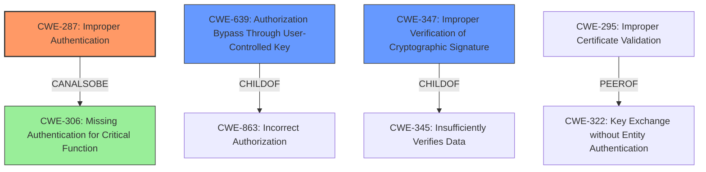

# Final Resolution for CVE-2021-3127

# Summary

| CWE ID | CWE Name | Confidence | CWE Abstraction Level | CWE Vulnerability Mapping Label | CWE-Vulnerability Mapping Notes |
|---|---|---|---|---|---|
| **CWE-287** | **Improper Authentication** | 0.85 | Class | Primary | The product does not prove or insufficiently proves that the claim is correct. |
| CWE-639 | Authorization Bypass Through User-Controlled Key | 0.70 | Base | Secondary | The system's authorization functionality does not prevent one user from gaining access to another user's data or record by modifying the key value identifying the data. |
| CWE-347 | Improper Verification of Cryptographic Signature | 0.55 | Base | Secondary | The product does not verify, or incorrectly verifies, the cryptographic signature for data. |

## Evidence and Confidence

*   **Confidence Score:** 0.80
*   **Evidence Strength:** HIGH

## Relationship Analysis
The primary CWE, CWE-287, is a Class, with several child CWEs that could potentially provide more specificity. However, given the available information, a precise base-level CWE is difficult to pinpoint. CWE-639 and CWE-347, while relevant, represent contributing factors rather than the core authentication failure. The relationships highlight the authentication issue leading to a misclassification for authorization checks.

## Vulnerability Chain
The vulnerability chain starts with the **mishandling of Import Token bindings** (**ROOTCAUSE**), specifically a failure to properly validate that the JWT is intended for the current account. This leads to **CWE-287 (Improper Authentication)**, as the system does not sufficiently prove the claimed identity. The improperly authenticated state results in **CWE-639 (Authorization Bypass Through User-Controlled Key)**, allowing an attacker to reuse import tokens and gain unauthorized access. **CWE-347 (Improper Verification of Cryptographic Signature)** contributes by highlighting the failure to enforce account context even though the signature itself might be valid.

## Summary of Analysis
The initial analysis and criticism were both accurate and helpful in refining the final classification. The vulnerability description clearly points to a failure in authentication due to **mishandling of Import Token bindings**. The system's failure to properly validate the JWT's intended account context is the **ROOTCAUSE**. While the JWT library performs signature verification, the NATS server fails to enforce the account context, leading to **Improper Authentication (CWE-287)**.

The decision to keep **CWE-287** as the primary CWE is based on the evidence that the system insufficiently proves that the claim is correct. This is more than just an authorization bypass; it's a fundamental flaw in the authentication process. The suggestion to consider **CWE-306 (Missing Authentication for Critical Function)** is valid, however, it is not fully applicable because authentication is present but flawed, hence **CWE-287** is the more suitable option.

The graph relationships influenced the selection by highlighting the connection between authentication and authorization. The fact that **CWE-287** is a Class-level CWE was taken into consideration. Despite this, no more specific, base-level CWE fully captures the essence of the vulnerability. The secondary CWEs, **CWE-639** and **CWE-347**, provide additional context by illustrating how the authentication failure leads to authorization bypass and improper signature verification, respectively. These CWEs are at the base level of abstraction, hence providing a more granular mapping.

Ultimately, the selected CWEs provide the optimal level of specificity given the available evidence, with **CWE-287** capturing the core authentication failure and **CWE-639** and **CWE-347** highlighting contributing factors.