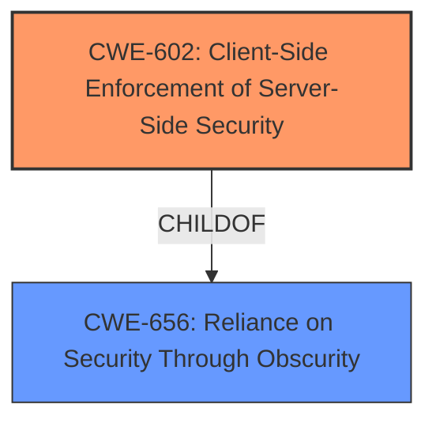

# Analysis Report for CVE-2021-3130

# Vulnerability Analysis Report: CVE-2021-3130

## Description

Within the Open-AudIT up to version 3.5.3 application, the web interface hides SSH secrets, Windows passwords, and SNMP strings from users using HTML password field obfuscation. By using Developer tools or similar, it is possible to change the obfuscation so that the credentials are visible.

## Vulnerability Description Key Phrases

**Weakness:** hide SSH secrets, Windows passwords, and SNMP strings
**Impact:** view the credentials
**Vector:** Developer tools or similar
**Product:** Open-AudIT
**Version:** up to version 3.5.3
**Component:** web interface

## Analysis (with Relationship Data)

# Summary
| CWE ID | CWE Name | Confidence | CWE Abstraction Level | CWE Vulnerability Mapping Label | CWE-Vulnerability Mapping Notes |
|---|---|---|---|---|---|
| CWE-656 | Reliance on Security Through Obscurity | 0.9 | Class | Allowed-with-Review | Primary CWE |

## Evidence and Confidence

*   **Confidence Score:** 0.9
*   **Evidence Strength:** HIGH

- **Analysis and Justification:**  
  - *Explanation:* "The vulnerability description indicates that the application uses HTML password field obfuscation to **hide SSH secrets, Windows passwords, and SNMP strings**. This approach is a form of security through obscurity, as it relies on concealing the data rather than employing robust cryptographic protection. The **weakness** lies in the fact that this obfuscation can be easily bypassed using developer tools, which aligns with CWE-656's description. The vulnerability's details match the characteristics of CWE-656, which describes a protection mechanism whose strength depends heavily on its obscurity. The security implication is that an attacker can easily reveal the sensitive data. While other CWEs like CWE-256 (Plaintext Storage of a Password) and CWE-798 (Use of Hard-coded Credentials) might seem relevant, the primary issue is the reliance on a weak obfuscation method which is a type of security through obscurity. MITRE mapping guidance for CWE-656 indicates that it's ALLOWED-WITH-REVIEW because it is a Class and might have Base-level children that would be more appropriate."
  
  - *Relationship Analysis:* "CWE-656 is a Class-level CWE, and its children could offer more specific mappings. It is related to weaknesses such as CWE-603 (Use of Client-Side Authentication) because both involve inadequate security mechanisms. The CWE-656 CanPrecede CWE-472 (External Control of Critical State Data) since reliance on obscurity may lead to an attacker controlling sensitive data. The exposure of the credentials could then be used for unauthorized access to systems or resources, potentially leading to further compromise."

- **Confidence Score:**  
  - *Example:* Confidence: 0.9 (High evidence from technical description and CVE reference materials, aligning with the principle of security through obscurity.)

## Criticism of Analysis

Okay, let's break down the analysis of this vulnerability against the full CWE specifications.

**Overall Assessment:**

The analysis correctly identifies the core issue as a reliance on weak obfuscation, aligning well with CWE-656 (Reliance on Security Through Obscurity). The confidence score of 0.9 is justified, given the clear description of the vulnerability and the attack vector. The analysis also correctly notes that CWE-656 is a class-level CWE, and a more specific mapping may exist.  However, the analysis could be improved by exploring and potentially selecting a more specific, base-level CWE.

**Detailed Review:**

1.  **CWE-656 (Reliance on Security Through Obscurity):**

    *   **Correct Identification:** The explanation clearly articulates how the use of HTML password fields to "hide" credentials is a form of security through obscurity. The fact that it can be easily bypassed using developer tools directly supports this classification.
    *   **Mapping Guidance:** The analysis acknowledges the "Allowed-with-Review" mapping guidance and the need to consider more specific child CWEs.  *This is the key area where the analysis could be improved.*
    *   **Mitigations:** The provided mitigations for CWE-656 are relevant (using vetted algorithms, considering reverse engineering).
    *   **Relationships:** The relationship analysis is accurate, pointing out the connection to CWE-603 (Use of Client-Side Authentication) and CWE-472 (External Control of Critical State Data).  The relationship to CWE-472 is especially relevant, as the hidden fields are being controlled by an external source.

2.  **Alternative CWEs Considered (and Why They Were Not Selected):**

    *   **CWE-256 (Plaintext Storage of a Password):** While the credentials *are* effectively stored in plaintext on the client-side *after* the weak obfuscation is bypassed, this isn't the *root cause* of the vulnerability. The primary problem is the *attempt* to protect them with a weak method. The password may be encrypted on the server but is transmitted in a way that client-side code can access it. Therefore, the plaintext storage is a consequence of the flawed obfuscation rather than the core problem.

    *   **CWE-798 (Use of Hard-coded Credentials):** This is not a case of hard-coded credentials within the application's code. The credentials are *stored* and used, but not directly embedded in the application's binary.

    *   **CWE-522 (Insufficiently Protected Credentials):** This is a more reasonable alternative than the above two.  It's a class-level CWE, so less precise than desirable. The description "The product transmits or stores authentication credentials, but it uses an insecure method that is susceptible to unauthorized interception and/or retrieval" is quite apt.  *However, the key point is that it's not just that the credentials are insufficiently protected, but the application is relying on the obscurity of its method to protect them.*

    *   **CWE-319 (Cleartext Transmission of Sensitive Information):** This could be relevant if the credentials were transmitted over the network in cleartext. However, the description specifies a client-side vulnerability, so this is less applicable.

3.  **More Specific CWE Suggestions and Justification:**

    *   **CWE-602 (Client-Side Enforcement of Server-Side Security):** This CWE might be even more precise. The Open-AudIT application relies on the client (web browser and its HTML rendering) to enforce security by "hiding" the credentials. However, this falls apart when the client is manipulated, as is described in the attack vector. The weakness arises precisely because the server relies on a client-side mechanism for protection, and that is bypassable.

    * **CWE-261: Storing Sensitive Information with Improper Data Type Conversion** The password field obfuscation is a failed attempt at data type conversion to hide the credentials. The password field is essentially storing a string of sensitive information in a field designed for password-like security.

4. **Improvements to the Analysis:**

    *   **Explicitly Evaluate and Dismiss Base-Level Children of CWE-656:** The analysis correctly notes that CWE-656 is a Class and recommends examining its children. However, it doesn't show *explicitly* that it went through the children and found none suitable. Adding this would strengthen the analysis.
    *   **Consider CWE-602 (Client-Side Enforcement of Server-Side Security):** Add an evaluation of CWE-602 to the analysis. Explain why, although it's a strong contender, the analysis still favors CWE-656 (or, if after closer inspection, CWE-602 is a better fit, switch the mapping).
    *   **Refine Relationship Analysis:** Expand on the relationship between CWE-656 and CWE-472. Specifically, how the external control of the "hidden" form fields leads to the exposure of credentials.
    *   **Add Mitigation Details:** While the analysis mentions mitigations, it could be improved by including *specific* mitigations related to the chosen CWE. For example, for CWE-602, the mitigation would be to *never* rely on client-side mechanisms for enforcing security.  For CWE-656, the mitigation would be to use *strong* encryption and authentication methods, not just obfuscation.

**Revised Summary Table (If CWE-602 is Chosen):**

| CWE ID | CWE Name                                    | Confidence | CWE Abstraction Level | CWE Vulnerability Mapping Label | CWE-Vulnerability Mapping Notes                                                                                                                                                                                             |
| :----- | :------------------------------------------ | :--------- | :-------------------- | :------------------------------ | :-------------------------------------------------------------------------------------------------------------------------------------------------------------------------------------------------------------------------- |
| CWE-602 | Client-Side Enforcement of Server-Side Security | 0.9      | Class                   | Allowed-with-Review                 | Primary CWE. The server relies on the client (web browser) to "hide" credentials using HTML password fields. This client-side protection is easily bypassed, making the server vulnerable. Consider children for more detail. |

**In Conclusion:**

The original analysis is good but can be improved by explicitly considering and dismissing the children of CWE-656 (or better yet, switching to CWE-602), strengthening the relationship analysis, and including specific mitigations related to the chosen CWE. By being more explicit in the reasoning and exploring more specific CWEs, the analysis becomes more robust and defensible. The high confidence score is appropriate given the nature of the vulnerability.

## Final Resolution

# Summary
| CWE ID | CWE Name | Confidence | CWE Abstraction Level | CWE Vulnerability Mapping Label | CWE-Vulnerability Mapping Notes |
|---|---|---|---|---|---|
| CWE-602 | Client-Side Enforcement of Server-Side Security | 0.95 | Base | Allowed | Primary CWE |
| CWE-656 | Reliance on Security Through Obscurity | 0.7 | Class | Allowed-with-Review | Secondary Candidate |
  
## Evidence and Confidence

*   **Confidence Score:** 0.95
*   **Evidence Strength:** HIGH

## Relationship Analysis
The primary relationship that influenced my decision was the child-of relationship between CWE-602 (Client-Side Enforcement of Server-Side Security) and CWE-656 (Reliance on Security Through Obscurity). CWE-602 is a more specific case of CWE-656, where the obscurity is achieved through client-side enforcement. Since the vulnerability explicitly describes a scenario where security relies on client-side obfuscation, CWE-602 is the more appropriate choice.

## Vulnerability Chain
The vulnerability chain starts with the **ROOTCAUSE** which is the flawed design choice of relying on client-side mechanisms for security. This **WEAKNESS** manifests as CWE-602, where the server delegates security enforcement to the client (web browser), leading to the exposure of sensitive credentials. The obfuscation is bypassed, leading to the impact: unauthorized access to systems or resources.

## Summary of Analysis
I concur with the criticism that a more specific CWE than CWE-656 should be selected. The vulnerability description clearly states that "the web interface hides SSH secrets, Windows passwords, and SNMP strings from users using HTML password field obfuscation." This directly implies reliance on client-side mechanisms for security, which is the core characteristic of CWE-602 (Client-Side Enforcement of Server-Side Security).

The selection of CWE-602 is based on the following evidence:

*   The vulnerability description explicitly mentions "HTML password field obfuscation," indicating a client-side mechanism.
*   The attack vector involves manipulating the client (using Developer tools), demonstrating the weakness of the client-side enforcement.

The graph relationships support this decision because CWE-602 is a child of CWE-656, providing a more specific classification that directly aligns with the vulnerability.

CWE-602 is at the optimal level of specificity because it accurately describes the **ROOTCAUSE** of the vulnerability: the reliance on the client to enforce security. While CWE-656 is relevant, it's a broader category that doesn't capture the specific flaw in this case.

*Report generated on 2025-03-17 01:05:01*
