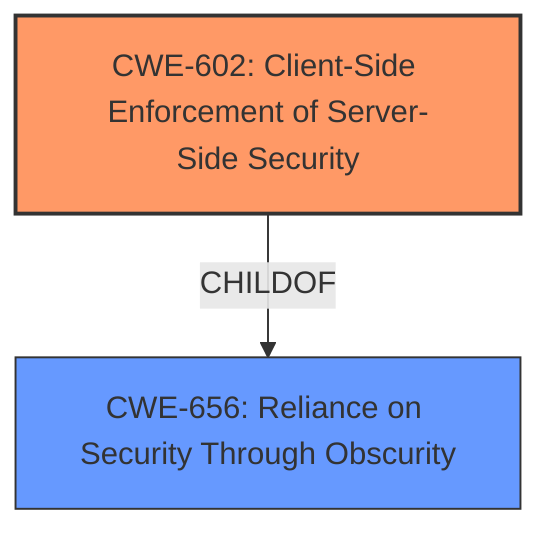

# Final Resolution for CVE-2021-3130

# Summary
| CWE ID | CWE Name | Confidence | CWE Abstraction Level | CWE Vulnerability Mapping Label | CWE-Vulnerability Mapping Notes |
|---|---|---|---|---|---|
| CWE-602 | Client-Side Enforcement of Server-Side Security | 0.95 | Base | Allowed | Primary CWE |
| CWE-656 | Reliance on Security Through Obscurity | 0.7 | Class | Allowed-with-Review | Secondary Candidate |
  
## Evidence and Confidence

*   **Confidence Score:** 0.95
*   **Evidence Strength:** HIGH

## Relationship Analysis
The primary relationship that influenced my decision was the child-of relationship between CWE-602 (Client-Side Enforcement of Server-Side Security) and CWE-656 (Reliance on Security Through Obscurity). CWE-602 is a more specific case of CWE-656, where the obscurity is achieved through client-side enforcement. Since the vulnerability explicitly describes a scenario where security relies on client-side obfuscation, CWE-602 is the more appropriate choice.

## Vulnerability Chain
The vulnerability chain starts with the **ROOTCAUSE** which is the flawed design choice of relying on client-side mechanisms for security. This **WEAKNESS** manifests as CWE-602, where the server delegates security enforcement to the client (web browser), leading to the exposure of sensitive credentials. The obfuscation is bypassed, leading to the impact: unauthorized access to systems or resources.

## Summary of Analysis
I concur with the criticism that a more specific CWE than CWE-656 should be selected. The vulnerability description clearly states that "the web interface hides SSH secrets, Windows passwords, and SNMP strings from users using HTML password field obfuscation." This directly implies reliance on client-side mechanisms for security, which is the core characteristic of CWE-602 (Client-Side Enforcement of Server-Side Security).

The selection of CWE-602 is based on the following evidence:

*   The vulnerability description explicitly mentions "HTML password field obfuscation," indicating a client-side mechanism.
*   The attack vector involves manipulating the client (using Developer tools), demonstrating the weakness of the client-side enforcement.

The graph relationships support this decision because CWE-602 is a child of CWE-656, providing a more specific classification that directly aligns with the vulnerability.

CWE-602 is at the optimal level of specificity because it accurately describes the **ROOTCAUSE** of the vulnerability: the reliance on the client to enforce security. While CWE-656 is relevant, it's a broader category that doesn't capture the specific flaw in this case.