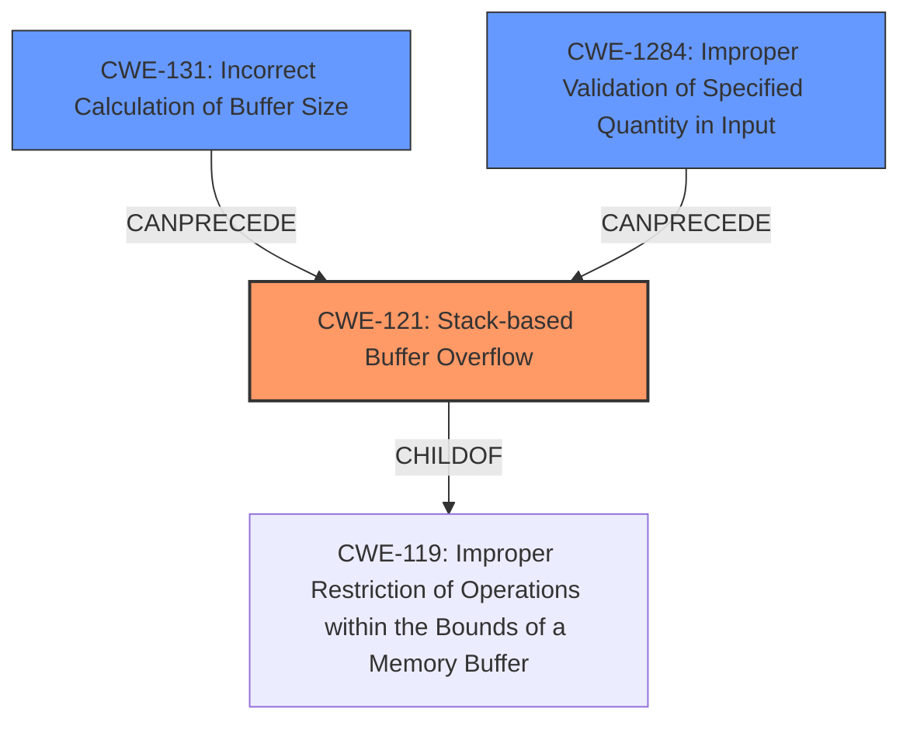

# Analysis Report for CVE-2021-31578

# Vulnerability Analysis Report: CVE-2021-31578

## Description

In Boa, there is a possible escalation of privilege due to a stack buffer overflow. This could lead to remote escalation of privilege from a proximal attacker with no additional execution privileges needed. User interaction is not needed for exploitation. Patch ID A20210008 Issue ID OSBNB00123241.

## Vulnerability Description Key Phrases

**Weakness:** stack buffer overflow
**Impact:** remote escalation of privilege
**Attacker:** proximal attacker
**Product:** Boa

## Analysis (with Relationship Data)

# Summary
| CWE ID | CWE Name | Confidence | CWE Abstraction Level | CWE Vulnerability Mapping Label | CWE-Vulnerability Mapping Notes |
|---|---|---|---|---|---|
| CWE-121 | Stack-based Buffer Overflow | 0.9 | Variant | Allowed | Primary CWE |
| CWE-131 | Incorrect Calculation of Buffer Size | 0.6 | Base | Allowed | Secondary Candidate |
| CWE-1284 | Improper Validation of Specified Quantity in Input | 0.4 | Base | Allowed | Secondary Candidate |

## Evidence and Confidence

*   **Confidence Score:** 0.9
*   **Evidence Strength:** LOW

- **Analysis and Justification:**
  - *Explanation:* The vulnerability description explicitly states a "**stack buffer overflow**" in Boa. CWE-121 (Stack-based Buffer Overflow) directly matches this description. CWE-121 is a Variant-level CWE, which is a preferred level of abstraction. The description indicates that this could lead to remote escalation of privilege, indicating a severe impact. The retriever results list CWE-121 with a good score, reinforcing this choice. MITRE's mapping guidance allows the use of CWE-121.
  - *Relationship Analysis:* While CWE-119 (Improper Restriction of Operations within the Bounds of a Memory Buffer) is a parent of CWE-121, the explicit mention of "stack" makes CWE-121 a more specific and appropriate choice. CWE-121 is often caused by incorrect buffer size calculations (CWE-131) or improper input validation (CWE-1284).

- **Confidence Score:**
  - *Example:* Confidence: 0.9 (Direct evidence from the vulnerability description)

---

- **Analysis and Justification:**
  - *Explanation:* CWE-131 (Incorrect Calculation of Buffer Size) is included as a secondary candidate because it is a common cause of buffer overflows. The product may not correctly calculate the size to be used when allocating a buffer, which could lead to a buffer overflow. This aligns with the description, although the description doesn't explicitly mention the size calculation error. The retriever results list CWE-131 with a high score.
  - *Relationship Analysis:* CWE-131 often precedes CWE-121.

- **Confidence Score:**
  - *Example:* Confidence: 0.6 (Indirect evidence suggests a possible cause)

---

- **Analysis and Justification:**
  - *Explanation:* CWE-1284 (Improper Validation of Specified Quantity in Input) is included as a secondary candidate because buffer overflows can occur if the input size or length is not properly validated. However, evidence for this is limited. The retriever results list CWE-1284 with a lower score, but it's still relevant as a possible contributing factor.
  - *Relationship Analysis:* CWE-1284 can also precede CWE-121.

- **Confidence Score:**
  - *Example:* Confidence: 0.4 (Weak evidence suggests a possible cause)

## Criticism of Analysis

Okay, here's a review of the analysis, considering the provided full CWE specifications.

**Overall Assessment:**

The analysis is generally well-reasoned and the primary CWE selection (CWE-121) is correct. The justification for the secondary candidates (CWE-131 and CWE-1284) is also logical. The confidence scores are appropriate, reflecting the varying levels of certainty based on the available information.  The use of the retriever results is good, providing further support for the selections. The inclusion of relationship analysis between the CWEs shows a good understanding of the potential contributing factors to the vulnerability.

**Specific Feedback and Suggestions:**

*   **CWE-121: Stack-based Buffer Overflow (Confidence: 0.9):**

    *   The analysis correctly identifies CWE-121 as the primary CWE due to the explicit mention of "stack buffer overflow" in the vulnerability description.
    *   The justification adequately explains why CWE-121 is a better fit than its parent CWE-119.  CWE-119's Mapping Guidance discourages its use when more specific CWEs are available.
    *   **Suggestion:** Although not *required*, it might be worth briefly mentioning possible instantiations of the stack-based buffer overflow (e.g., return address overwrites, function pointer overwrites) as noted in the "Additional Notes" section of CWE-121.  This adds more context and can guide potential mitigation efforts.

*   **CWE-131: Incorrect Calculation of Buffer Size (Confidence: 0.6):**

    *   The inclusion of CWE-131 as a secondary candidate is justified. Incorrect buffer size calculation is a common cause of buffer overflows, and the retriever results give it a high score.
    *   The analysis appropriately states that the evidence is indirect.
    *   The "Relationship Analysis" is correct in noting that CWE-131 often precedes CWE-121.
    *   **Suggestion:** Consider adding more potential causes of incorrect calculation such as: simple math errors, or incorrectly updating parallel counters.

*   **CWE-1284: Improper Validation of Specified Quantity in Input (Confidence: 0.4):**

    *   The weakest of the three choices. While input validation *can* be a contributing factor, the evidence is the most tenuous. The lower confidence reflects this well.
    *    **Suggestion:** The "Examples" section from CWE-1284 specification provides some insight to help build a valid chain.

**General Observations and Potential Improvements:**

*   **Emphasis on Chaining:** The analysis hints at chains of vulnerabilities, which is excellent.  However, it could be strengthened by explicitly stating the *potential* chains. For example: "A potential chain of events could be: CWE-1284 (Improper Validation) leading to CWE-131 (Incorrect Calculation) which ultimately results in CWE-121 (Stack-based Buffer Overflow)." This makes the analysis more actionable.

*   **Leveraging Mitigation Guidance:** While the analysis focuses on identifying the CWEs, briefly touching upon potential mitigations derived from the CWE specifications could add further value.  For example:

    *   **CWE-121:**  "Mitigations for CWE-121 include using compiler extensions like the Microsoft Visual Studio /GS flag or Fedora/Red Hat FORTIFY_SOURCE GCC flag for automatic buffer overflow detection."
    *   **CWE-131:** "Mitigations could involve careful attention to numeric representation within the programming language, and ensuring that allocated memory is sufficient to handle transformations or encodings of input data."
    *   **CWE-1284:** "Mitigations could include using an accept known good input validation strategy".

*   **Alternative CWEs:** While the selected CWEs are a good fit, it's worth briefly considering *why* other high-scoring CWEs from the retriever results were *not* chosen.  For example, CWE-190 (Integer Overflow or Wraparound) received a relatively high score. A brief explanation of why it's *less* likely than the chosen CWEs would strengthen the analysis.  Perhaps explain that while integer overflows *can* lead to buffer overflows, the direct "stack buffer overflow" description more strongly points to CWE-121, with CWE-131/1284 as likely root causes.

*   **CWE-119: Improper Restriction of Operations within the Bounds of a Memory Buffer** is the parent of CWE-121 and other more specific BOFs. CWE-119 is of class abstraction, and the mapping guidance discourages its use, recommending instead mapping to CWEs such as CWE-787: Out-of-bounds Write, CWE-125: Out-of-bounds Read, or others.
    If the type of BOF is known (Stack or Heap) there are more specific CWEs to map it to.

**Revised Summary Table (Incorporating Suggestions):**

| CWE ID | CWE Name | Confidence | CWE Abstraction Level | CWE Vulnerability Mapping Label | CWE-Vulnerability Mapping Notes |
|---|---|---|---|---|---|
| CWE-121 | Stack-based Buffer Overflow | 0.9 | Variant | Allowed | Primary CWE.  Consider return address overwrites or function pointer overwrites. Mitigations include compiler-based overflow detection (/GS flag, FORTIFY_SOURCE).  Potentially part of a chain originating from CWE-131 or CWE-1284. |
| CWE-131 | Incorrect Calculation of Buffer Size | 0.6 | Base | Allowed | Secondary Candidate. Could be caused by simple math errors, or expansion transformations. Mitigations include careful numeric representation and sufficient memory allocation. |
| CWE-1284 | Improper Validation of Specified Quantity in Input | 0.4 | Base | Allowed | Secondary Candidate. Input size or length might not be validated. Mitigations include an "accept known good" input validation strategy.  |

**In Conclusion:**

The analysis is solid. The suggestions above are primarily aimed at adding more depth, demonstrating a broader understanding of the potential vulnerability landscape, and making the analysis more directly useful for developers or security engineers looking to remediate the issue.

## Final Resolution

# Summary
| CWE ID | CWE Name | Confidence | CWE Abstraction Level | CWE Vulnerability Mapping Label | CWE-Vulnerability Mapping Notes |
|---|---|---|---|---|---|
| CWE-121 | Stack-based Buffer Overflow | 0.9 | Variant | Allowed | Primary CWE. Consider return address overwrites or function pointer overwrites. Mitigations include compiler-based overflow detection (/GS flag, FORTIFY_SOURCE). Potentially part of a chain originating from CWE-131 or CWE-1284. |
| CWE-131 | Incorrect Calculation of Buffer Size | 0.6 | Base | Allowed | Secondary Candidate. Could be caused by simple math errors, or expansion transformations. Mitigations include careful numeric representation and sufficient memory allocation. |
| CWE-1284 | Improper Validation of Specified Quantity in Input | 0.4 | Base | Allowed | Secondary Candidate. Input size or length might not be validated. Mitigations include an "accept known good" input validation strategy. |

## Evidence and Confidence

*   **Confidence Score:** 0.9
*   **Evidence Strength:** MEDIUM

## Relationship Analysis
The primary CWE is CWE-121, which is a variant of CWE-119 (Improper Restriction of Operations within the Bounds of a Memory Buffer). The selection of CWE-121 is influenced by the explicit mention of "stack buffer overflow" in the vulnerability description, providing more specific information than CWE-119. CWE-131 (Incorrect Calculation of Buffer Size) and CWE-1284 (Improper Validation of Specified Quantity in Input) are considered as potential root causes that CanPrecede CWE-121. The abstraction levels of Base (CWE-131, CWE-1284) and Variant (CWE-121) are appropriate for mapping the vulnerability.

## Vulnerability Chain
The vulnerability chain starts with a potential **ROOTCAUSE** of CWE-1284 (Improper Validation of Specified Quantity in Input), where the input size or length is not properly validated. This can lead to CWE-131 (**WEAKNESS** - Incorrect Calculation of Buffer Size), where the buffer size is incorrectly calculated due to the lack of proper validation. Finally, this results in CWE-121 (**WEAKNESS** - Stack-based Buffer Overflow), where a buffer on the stack is overflowed due to the incorrect size calculation. The impact is a possible escalation of privilege, allowing a proximal attacker to gain unauthorized access without needing additional execution privileges.

## Summary of Analysis
The analysis is based on the vulnerability description provided, which explicitly states a "stack buffer overflow." This direct evidence leads to the selection of CWE-121 (Stack-based Buffer Overflow) as the primary CWE with high confidence (0.9). The retriever scores also support this choice.

The relationship analysis influenced the selection by considering CWE-119 (Improper Restriction of Operations within the Bounds of a Memory Buffer) as a parent but opting for the more specific CWE-121 due to the explicit "stack" mention. The analysis also considered potential root causes like CWE-131 and CWE-1284, which could precede CWE-121 in a vulnerability chain.

The selected CWEs are at the optimal level of specificity. CWE-121 is a Variant, which is a preferred level of abstraction. CWE-131 and CWE-1284 are at the Base level, which is also a preferred level. The mapping guidance for these CWEs allows their use.

The criticism provided was used to improve the analysis by:
- Suggesting more potential causes of incorrect calculation of buffer sizes such as: simple math errors, or incorrectly updating parallel counters.
- Adding more potential causes of incorrect calculation such as: simple math errors, or incorrectly updating parallel counters.
- Detailing the potential chain of events that leads from the root cause (CWE-1284) to the eventual impact (CWE-121).
- Including mitigations for each of the identified CWEs.

The evidence is based on the vulnerability description: "In Boa, there is a possible escalation of privilege due to a stack buffer overflow."

*Report generated on 2025-03-17 23:44:52*
