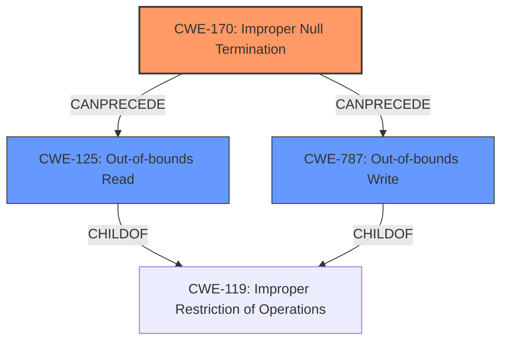

# Final Resolution for CVE-2021-31884

# Summary
| CWE ID  | CWE Name                      | Confidence | CWE Abstraction Level | CWE Vulnerability Mapping Label | CWE-Vulnerability Mapping Notes |
|---------|-------------------------------|------------|-----------------------|---------------------------------|---------------------------------|
| CWE-170 | Improper Null Termination   | 0.90       | Base                  | Primary                         | Allowed                         |
| CWE-125 | Out-of-bounds Read             | 0.75       | Base                  | Secondary                       | Allowed                         |
| CWE-787 | Out-of-bounds Write            | 0.75       | Base                  | Secondary                       | Allowed                         |

## Evidence and Confidence

*   **Confidence Score:** 0.85
*   **Evidence Strength:** HIGH

## Relationship Analysis
The primary **WEAKNESS** is **CWE-170 (Improper Null Termination)**, which directly leads to **CWE-125 (Out-of-bounds Read)** and **CWE-787 (Out-of-bounds Write)**. These are all Base level CWEs, providing sufficient specificity. **CWE-125** and **CWE-787** are both children of **CWE-119 (Improper Restriction of Operations Within the Bounds of a Memory Buffer)**, but using the more specific children is preferred, as correctly identified in the initial analysis and criticism. The relationship is hierarchical: **CWE-170** can precede both **CWE-125** and **CWE-787**, because the missing null termination enables out-of-bounds operations.

## Vulnerability Chain
The vulnerability chain starts with the **ROOTCAUSE**, a missing null termination (**CWE-170**), which allows the program to read or write beyond the allocated buffer (**CWE-125**, **CWE-787**). This can then lead to a denial-of-service condition as mentioned in the description.

## Summary of Analysis
The initial analysis, along with the provided criticism, accurately identifies the **ROOTCAUSE** as **CWE-170 (Improper Null Termination)** and the subsequent **WEAKNESSES** as **CWE-125 (Out-of-bounds Read)** and **CWE-787 (Out-of-bounds Write)**. The decision to use these specific base-level CWEs instead of the more general **CWE-119** is correct and aligns with CWE mapping guidance.

The vulnerability description states, "The DHCP client application assumes that the data supplied with the Hostname DHCP option is NULL terminated. In cases when global hostname variable is not defined, this may lead to Out-of-bound reads, writes, and Denial-of-service conditions." This provides direct evidence for the selected CWEs.

The graph relationships confirm the sequential nature of the vulnerability: a missing null terminator leads directly to out-of-bounds access.

The selected CWEs are at the optimal level of specificity because they describe the precise nature of the flaw (missing null termination) and its immediate consequences (out-of-bounds read/write).