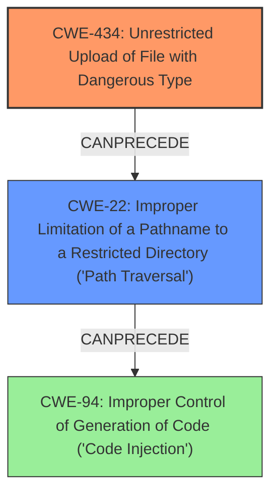

# Final Resolution for CVE-2021-31933

# Summary
| CWE ID | CWE Name | Confidence | CWE Abstraction Level | CWE Vulnerability Mapping Label | CWE-Vulnerability Mapping Notes |
|---|---|---|---|---|---|
| CWE-434 | Unrestricted Upload of File with Dangerous Type | 0.95 | Base | Allowed | Primary CWE |
| CWE-22 | Improper Limitation of a Pathname to a Restricted Directory ('Path Traversal') | 0.85 | Base | Allowed | Secondary Candidate |
| CWE-94 | Improper Control of Generation of Code ('Code Injection') | 0.75 | Base | Allowed-with-Review | Consequence of **CWE-434** and **CWE-22** |

## Evidence and Confidence

*   **Confidence Score:** 0.90
*   **Evidence Strength:** HIGH

## Relationship Analysis
The primary relationship is that **CWE-434** (Unrestricted Upload of File with Dangerous Type) and **CWE-22** (Improper Limitation of a Pathname to a Restricted Directory) can lead to **CWE-94** (Improper Control of Generation of Code ('Code Injection')). **CWE-434** is the root cause, as it allows the initial malicious file upload. **CWE-22** allows the attacker to place the file in a location where it can be executed. **CWE-94** is a consequence of the successful exploitation of these weaknesses. All three CWEs are at the Base level of abstraction, which is appropriate for root cause analysis.

## Vulnerability Chain
The vulnerability chain starts with **CWE-434**, the **unrestricted upload of a file with a dangerous type**. This allows an attacker to upload a file containing malicious code. **CWE-22** comes into play when the attacker uses **path traversal** to place the file in a specific directory where it can be executed. Finally, the execution of the uploaded file leads to **CWE-94**, **code injection**, resulting in arbitrary code execution on the server.

## Summary of Analysis
The initial analysis correctly identified **CWE-434** as the primary weakness, with **CWE-22** and **CWE-94** as contributing factors. The criticism provided useful suggestions for improvement, such as including more specific mitigations and emphasizing the chaining aspect of the vulnerability.

The vulnerability description explicitly states: "A remote code execution vulnerability exists in Chamilo through 1.11.14 due to **improper input sanitization** of a parameter used for file uploads, and **improper file-extension filtering** for certain filenames (e.g., .phar or .pht)." This directly supports the classification of **CWE-434**, as it involves the **unrestricted upload of a file with a dangerous type**.

The graph relationships influenced the final selection by highlighting the sequence of weaknesses. **CWE-434** enables **CWE-22**, which in turn leads to **CWE-94**. This chain of events provides a clear understanding of how the vulnerability can be exploited.

The selected CWEs are at the optimal level of specificity. **CWE-434** is a Base-level CWE that accurately reflects the root cause of the vulnerability. **CWE-22** is also a Base-level CWE that describes the path traversal aspect of the vulnerability. **CWE-94**, while also a Base-level CWE, is a consequence of the other two weaknesses and represents the end result of the exploitation.