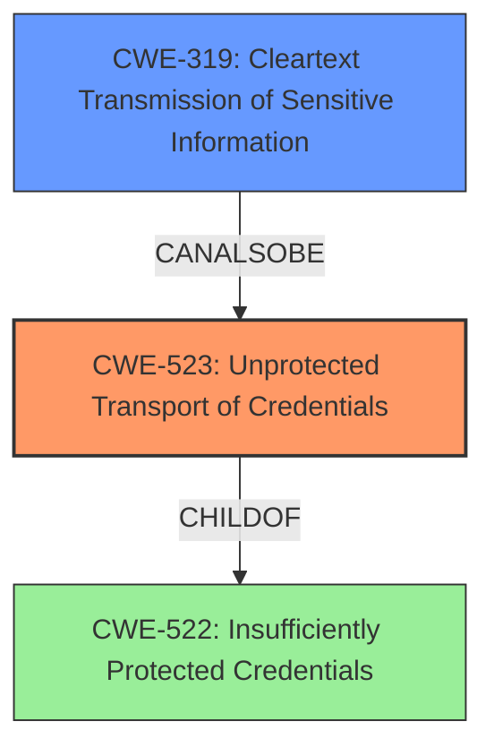

# Final Resolution for CVE-2021-32003

# Summary
| CWE ID | CWE Name | Confidence | CWE Abstraction Level | CWE Vulnerability Mapping Label | CWE-Vulnerability Mapping Notes |
|---|---|---|---|---|---|
| CWE-523 | Unprotected Transport of Credentials | 0.9 | Base | Allowed | Primary CWE: The vulnerability involves the unprotected transport of credentials, directly matching the CWE description and usage guidelines. |
| CWE-319 | Cleartext Transmission of Sensitive Information | 0.5 | Base | Allowed | Secondary Candidate: The vulnerability involves transmitting credentials in an unprotected manner, which could be considered a form of cleartext transmission. |

## Evidence and Confidence

*   **Confidence Score:** 0.9
*   **Evidence Strength:** HIGH

## Relationship Analysis
The primary CWE, CWE-523, is a Base level CWE, offering a specific description of the vulnerability: "Login pages do not use adequate measures to protect the user name and password while they are in transit from the client to the server." The secondary CWE, CWE-319, is also a Base level CWE but is more general. While both are applicable, CWE-523 directly addresses the **weakness** of **unprotected transport of credentials**, making it a more precise fit.

## Vulnerability Chain
The vulnerability chain begins with the **root cause**: the **unprotected transport of credentials**. This leads to the **weakness**, where a local attacker can capture these credentials if the SiteManager provisioning service is used after provisioning. The ultimate impact is a compromise of the system's security due to the exposed credentials. There are no missing links, as the chain flows directly from **root cause** to impact.

## Summary of Analysis
The initial analysis correctly identified CWE-523 as the primary CWE due to the direct match with the vulnerability description. The criticism suggested lowering the confidence score for CWE-319, which I agree with, because CWE-523 is a more specific fit. As stated in the vulnerability description, there is an "**unprotected transport of credentials** vulnerability in SiteManager provisioning service allows local attacker to capture credentials if the service is used after provisioning." This statement directly supports the selection of CWE-523. The graph relationships highlight the specificity of CWE-523, reinforcing that it is the optimal choice. The CWEs are at the optimal level of specificity, with CWE-523 being the most precise.