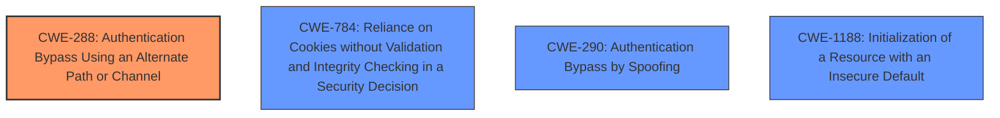

# Final Resolution for CVE-2021-32030

# Summary
| CWE ID | CWE Name | Confidence | CWE Abstraction Level | CWE Vulnerability Mapping Label | CWE-Vulnerability Mapping Notes |
|---|---|---|---|---|---|
| CWE-288 | Authentication Bypass Using an Alternate Path or Channel | 0.95 | Base | Primary | Allowed |
| CWE-784 | Reliance on Cookies without Validation and Integrity Checking in a Security Decision | 0.70 | Variant | Secondary Candidate | Allowed |
| CWE-290 | Authentication Bypass by Spoofing | 0.30 | Base | Secondary Candidate | Allowed |
| CWE-1188 | Initialization of a Resource with an Insecure Default | 0.30 | Base | Secondary Candidate | Allowed |

## Evidence and Confidence

*   **Confidence Score:** 0.90
*   **Evidence Strength:** HIGH

## Relationship Analysis
The primary CWE is CWE-288, which is a base-level CWE. It has a parent relationship to CWE-306 (Missing Authentication for Critical Function) and CWE-284 (Improper Access Control). CWE-784, CWE-290 and CWE-1188 are considered secondary candidates.

## Vulnerability Chain
The vulnerability chain begins with the **root cause**, which is the insufficient validation of the `asus_token` cookie. This leads to the **weakness** where an **unauthenticated user** can gain **unauthorized access** to the administrator interface by crafting a specific request with a malformed `asus_token` (starting with a null byte). The `auth_check` function fails to properly validate the session token if it starts with a null byte, especially when the `ifttt_token` is not set by default and the User-Agent matches an internal service user agent. This bypass is the **impact**.

## Summary of Analysis
The initial analysis correctly identified CWE-288 as the primary CWE. The criticism provided valuable suggestions for improvement, including considering additional CWEs and explicitly discussing mitigations.

The vulnerability description states: "The administrator application on ASUS GT-AC2900 devices before 3.0.0.4.386.42643 allows **authentication bypass** when processing remote input from an **unauthenticated user**, leading to **unauthorized access** to the administrator interface. This relates to handle_request in router/httpd/httpd.c and auth_check in web_hook.o. An attacker-supplied value of \0 matches the devices default value of \0 in some situations."

Based on this description, the following adjustments are made:

1.  **CWE-784 (Reliance on Cookies without Validation and Integrity Checking in a Security Decision):** Added as a secondary candidate. The vulnerability stems from inadequate validation of the `asus_token` cookie. The cookie is being used for a security decision (authentication), but its contents are not properly validated or checked for integrity.
2.  **CWE-290 (Authentication Bypass by Spoofing):** Retained as a secondary candidate with very low confidence. The reliance on the User-Agent string makes it *slightly* relevant. An attacker is "spoofing" the User-Agent to look like a trusted internal service. However, the primary bypass is the null byte in the token, not the User-Agent.
3.  **CWE-1188 (Initialization of a Resource with an Insecure Default):** Retained as a secondary candidate with very low confidence. The `ifttt_token` not being set by default contributes to the vulnerability. If it were initialized to a strong, random value, the bypass would be more difficult.

CWE-288 remains the primary CWE because it directly addresses the **authentication bypass** using an alternate path (the malformed token). It is at the optimal level of specificity, being a base-level CWE.