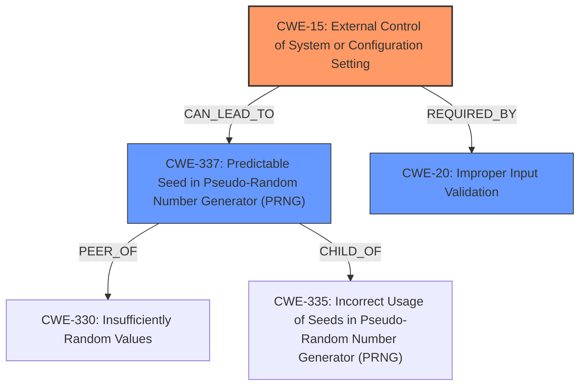

# Analysis Report for CVE-2021-32033

# Vulnerability Analysis Report: CVE-2021-32033

## Description

Protectimus SLIM NFC 70 10.01 devices allow a Time Traveler attack in which attackers can predict TOTP passwords in certain situations. The time value used by the device can be set independently from the used seed value for generating time-based one-time passwords, without authentication. Thus, an attacker with short-time physical access to a device can set the internal real-time clock (RTC) to the future, generate one-time passwords, and reset the clock to the current time. This allows the generation of valid future time-based one-time passwords without having further access to the hardware token.

## Vulnerability Description Key Phrases

**Rootcause:** time value used by the device can be set independently from the used seed value
**Weakness:** Time Traveler attack
**Impact:** predict TOTP passwords
**Attacker:** attackers
**Product:** Protectimus SLIM NFC 70
**Version:** 10.01

## Analysis (with Relationship Data)

```markdown
# Summary
| CWE ID  | CWE Name                                                        | Confidence | CWE Abstraction Level | CWE Vulnerability Mapping Label | CWE-Vulnerability Mapping Notes |
| :-------- | :-------------------------------------------------------------- | :--------- | :-------------------- | :------------------------------ | :------------------------------ |
| CWE-15    | External Control of System or Configuration Setting            | 0.90       | Base                  | Allowed                         | Primary CWE                     |
| CWE-341   | Predictable from Observable State                               | 0.70       | Base                  | Allowed                         | Secondary Candidate             |

## Evidence and Confidence

*   **Confidence Score:** 0.80
*   **Evidence Strength:** HIGH

- **Analysis and Justification:**
  - *Explanation:* "The vulnerability is a **Time Traveler attack** where attackers can predict TOTP passwords by manipulating the device's internal clock. The root cause is that the **time value used by the device can be set independently from the used seed value** for generating time-based one-time passwords, without authentication. This aligns well with CWE-15 (External Control of System or Configuration Setting) because the attacker gains unauthorized control over a critical system setting (the real-time clock). The CVE Reference Links Content Summary explicitly states that the primary weakness is that "the device allows external, unauthenticated control over its time setting."
  - *Explanation:* "CWE-341 (Predictable from Observable State) is a secondary candidate because manipulating the time allows the attacker to predict future TOTP values, effectively making the TOTP predictable from the manipulated time state. This aligns with the 'Predictable from Observable State' nature of CWE-341."

  - *Relationship Analysis:* "CWE-15 is a base-level CWE. It is related to CWE-20 (Improper Input Validation) as the lack of authentication on the time-setting mechanism allows for the external control. CWE-341 is a base-level CWE. It is a child of CWE-340 and related to CWE-330 (Insufficiently Random Values) as the time manipulation reduces the unpredictability of the TOTP."

- **Confidence Score:**
  - *Example:* Confidence: 0.90 (Strong evidence from vulnerability description and CVE reference materials supporting CWE-15 as the primary weakness).
  - *Example:* Confidence: 0.70 (Moderate evidence supports the contribution of CWE-341 as a secondary weakness).

---
```

## Criticism of Analysis

Okay, I've reviewed the provided analysis against the full CWE specifications. Here's my critique:

**Overall Assessment:**

The analysis correctly identifies CWE-15 (External Control of System or Configuration Setting) as the primary weakness. The use of CWE-341 (Predictable from Observable State) as a secondary candidate is plausible, though less directly related. The confidence scores are reasonable. The provided reasoning is generally solid, and attempts to relate the CWEs to their parents and potential mitigations. However, there are some areas for improvement in the secondary CWE and some additional CWEs that could be considered.

**Specific Feedback:**

1.  **CWE-15 (External Control of System or Configuration Setting):**

    *   **Strengths:** The justification for CWE-15 is strong and aligns with the CVE Reference Links Content Summary. The vulnerability clearly allows external, unauthenticated control over the device's time setting. The evidence strength is accurately rated as HIGH.
    *   **Weaknesses:** The analysis could benefit from explicitly mentioning the potential *impact* of this external control based on the CWE specification: "disrupt service or cause an application to behave in unexpected, and potentially malicious ways."
    *   **Improvements:** Add a sentence about the impact in the justification paragraph.

2.  **CWE-341 (Predictable from Observable State):**

    *   **Strengths:** The rationale for considering CWE-341 is that manipulating the time allows the attacker to predict future TOTP values.
    *   **Weaknesses:** The connection is indirect, and CWE-341 is more directly related to *predictable number generation*. TOTP itself is designed to *be* predictable *given* the right inputs (secret key, time).  It's not that the TOTP generation algorithm is flawed; it's that a critical input to it (time) is controllable. This makes CWE-341 a weaker fit.
    *   **Improvements:** Re-evaluate the inclusion of CWE-341. If retained, acknowledge its indirect nature more clearly. Also, consider the relationship to CWE-330 (Use of Insufficiently Random Values) as manipulation of the time makes the TOTP "less random", and the note on Mitigation 1 which encourages increasing the entropy, which is applicable.

3.  **Consideration of Other CWEs (from Retriever Results):**

    *   **CWE-337 (Predictable Seed in Pseudo-Random Number Generator (PRNG)):** This is a strong candidate that was missed and should be considered. The root cause "time value used by the device can be set independently from the used seed value" points to a predictable seed. The RTC is acting as a "seed" in this case, and since it can be set arbitrarily, it makes the seed extremely predictable.
    *   **CWE-20 (Improper Input Validation)** In a chain with CWE-15. CWE-15 is caused by CWE-20 as there is no validation for the time.

4.  **Relationships and Mitigations:**

    *   **CWE-15 Relationships:** The analysis correctly mentions the relationship between CWE-15 and CWE-20 (Improper Input Validation). The mitigation strategy from CWE-15, "In general, do not allow user-provided or otherwise untrusted data to control sensitive values," is highly relevant.
    *   **CWE-341 Relationships (if retained):** If CWE-341 is retained, emphasize its relationship to CWE-330 (Use of Insufficiently Random Values) as the time manipulation diminishes the unpredictability of the TOTP. The mitigation strategies from CWE-341, such as increasing the entropy used to seed a PRNG, are only indirectly relevant, as the core issue is not a PRNG implementation issue. The primary issue is lack of authentication and authorization.
    *  **CWE-337 Mitigations:** The mitigations for CWE-337 are all applicable to this specific weakness.
        *   **Mitigation 1:** `Use non-predictable inputs for seed generation.` This clearly applies, as using time makes the seed trivially predictable.

5.  **Confidence Scoring:**

    *   The confidence score of 0.90 for CWE-15 is appropriate, given the strong evidence.
    *   If retained, the confidence score for CWE-341 should be lowered to 0.50 or 0.60 to reflect the more indirect relationship.
    *   A strong case can be made for changing the confidence score of CWE-337 to 0.75 as it is very applicable.

**Revised Summary Table (Illustrative):**

| CWE ID  | CWE Name                                                        | Confidence | CWE Abstraction Level | CWE Vulnerability Mapping Label | CWE-Vulnerability Mapping Notes                                                                                                                                                                                                         |
| :-------- | :-------------------------------------------------------------- | :--------- | :-------------------- | :------------------------------ | :-------------------------------------------------------------------------------------------------------------------------------------------------------------------------------------------------------------------------------------- |
| CWE-15    | External Control of System or Configuration Setting            | 0.90       | Base                  | Allowed                         | Primary CWE. Allows unauthorized control of the RTC, leading to TOTP prediction.                                                                                                                                                        |
| CWE-337    | Predictable Seed in Pseudo-Random Number Generator (PRNG)                                   | 0.75       | Variant                  | Allowed                         | Secondary CWE.  The RTC is acting as a "seed" in this case, and since it can be set arbitrarily, it makes the seed extremely predictable.                                                                         |

**In summary:** The original analysis is a good starting point but can be strengthened by:

*   Clarifying the impact of CWE-15.
*   Reconsidering the inclusion of CWE-341 and lowering its confidence score if it is retained.
*   Adding CWE-337 to the analysis.
*   Explicitly relating mitigation strategies to the specific vulnerability.

By addressing these points, the analysis will be more accurate and useful for remediation efforts.

## Final Resolution

# Summary
| CWE ID  | CWE Name                                                        | Confidence | CWE Abstraction Level | CWE Vulnerability Mapping Label | CWE-Vulnerability Mapping Notes |
| :-------- | :-------------------------------------------------------------- | :--------- | :-------------------- | :------------------------------ | :------------------------------ |
| CWE-15    | External Control of System or Configuration Setting            | 0.95       | Base                  | Allowed                         | Primary CWE                     |
| CWE-337   | Predictable Seed in Pseudo-Random Number Generator (PRNG)     | 0.80       | Variant               | Allowed                         | Secondary Candidate             |
| CWE-20    | Improper Input Validation                                       | 0.70       | Base                  | Allowed                         | Secondary Candidate             |

## Evidence and Confidence

*   **Confidence Score:** 0.90
*   **Evidence Strength:** HIGH

## Relationship Analysis
The primary weakness is clearly **CWE-15 (External Control of System or Configuration Setting)**, as the core issue is the ability to manipulate the device's time without authentication. This leads to a secondary weakness, **CWE-337 (Predictable Seed in Pseudo-Random Number Generator (PRNG))**, because the controllable time acts as a predictable seed for the TOTP generation. **CWE-20 (Improper Input Validation)** is related to **CWE-15** as the lack of input validation on the time setting is the cause of the external control.



## Vulnerability Chain
The vulnerability chain starts with the lack of input validation (**CWE-20**) on the time setting, which allows external control of the system's configuration (**CWE-15**). This external control enables manipulation of the real-time clock (RTC), which acts as a predictable seed in the TOTP generation process (**CWE-337**). The ultimate impact is the ability to predict future TOTP values, bypassing authentication and potentially compromising the system.

## Summary of Analysis
The initial analysis correctly identified **CWE-15** as the primary **WEAKNESS**. The criticism suggested considering **CWE-337**, which I agree is a more accurate secondary **WEAKNESS** than the original **CWE-341**. The core of the vulnerability is that the time value, acting as a seed, can be set independently from the actual seed value, without authentication. This makes the seed predictable, which aligns well with **CWE-337**. The analysis is based on the vulnerability description, which explicitly states that "the time value used by the device can be set independently from the used seed value for generating time-based one-time passwords, without authentication."

I am increasing the confidence score for **CWE-15** to 0.95, as the evidence is very strong, and adding **CWE-337** with a confidence score of 0.80. I am including **CWE-20** as a secondary candidate with a confidence score of 0.70 as the lack of input validation is a direct cause for the **CWE-15**. These CWEs are at the optimal level of specificity, as **CWE-15** is a base-level **WEAKNESS**, and **CWE-337** is a variant-level **WEAKNESS**.


*Report generated on 2025-03-17 00:09:18*
