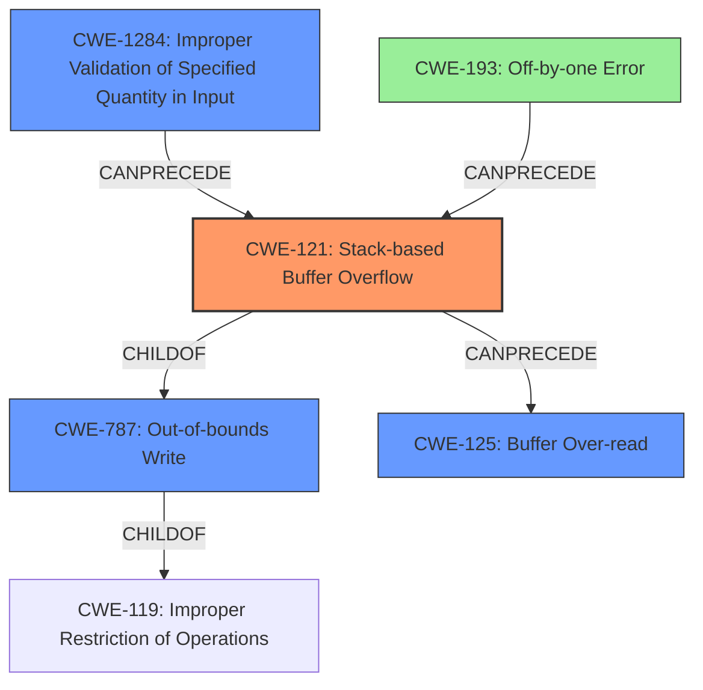

# Final Resolution for CVE-2021-32435

# Summary
| CWE ID | CWE Name | Confidence | CWE Abstraction Level | CWE Vulnerability Mapping Label | CWE-Vulnerability Mapping Notes |
|---|---|---|---|---|---|
| CWE-121 | Stack-based Buffer Overflow | 0.95 | Variant | Allowed | Primary CWE. Explicitly a stack-based buffer overflow due to unchecked input. |
| CWE-1284 | Improper Validation of Specified Quantity in Input | 0.85 | Base | Allowed | Secondary Candidate. Accurately reflects the root cause of failing to validate the `s->u.key.sf` value. |
| CWE-787 | Out-of-bounds Write | 0.80 | Base | Allowed | Secondary Candidate. The stack-based buffer overflow leads to an out-of-bounds write. |
| CWE-125 | Buffer Over-read | 0.70 | Base | Allowed | Secondary Candidate. The overflow can potentially lead to reading data beyond the buffer. |
| CWE-193 | Off-by-one Error | 0.50 | Base | Allowed | Contributing factor. Incorrect calculation may contribute to the overflow. Confidence lowered due to speculation. |

## Evidence and Confidence

*   **Confidence Score:** 0.90
*   **Evidence Strength:** HIGH

## Relationship Analysis
The analysis considered the hierarchical relationships, particularly the child-of relationship between CWE-121 (Stack-based Buffer Overflow) and CWE-119 (Improper Restriction of Operations within the Bounds of a Memory Buffer). It also recognized CWE-787 (Out-of-bounds Write) as the parent of CWE-121. The chain relationships were analyzed to understand the progression of the vulnerability, such as how CWE-1284 (Improper Validation of Specified Quantity in Input) can precede CWE-121. Peer relationships were examined to explore alternative classifications, but CWE-121 was deemed the most specific and appropriate primary CWE. Abstraction levels guided the selection of CWEs, balancing specificity with generalizability.

## Vulnerability Chain
The vulnerability chain starts with **CWE-1284 (Improper Validation of Specified Quantity in Input)**, where the size of `s->u.key.sf` is not validated. This leads to **CWE-121 (Stack-based Buffer Overflow)** in the `get_key` function, resulting in **CWE-787 (Out-of-bounds Write)**. The overflow can potentially cause **CWE-125 (Buffer Over-read)**. **CWE-193 (Off-by-one Error)** could be a contributing factor if the loop condition is slightly off. The final impact is a denial of service (DoS).

## Summary of Analysis
The initial analysis correctly identified **CWE-121 (Stack-based Buffer Overflow)** as the primary weakness, based on the explicit vulnerability description. The criticism highlighted the need for stronger evidence for **CWE-125 (Buffer Over-read)** and questioned the direct relevance of **CWE-193 (Off-by-one Error)**. The criticism also suggested considering **CWE-1284 (Improper Validation of Specified Quantity in Input)**, which I agree with and have added as a secondary CWE to capture the root cause. The relationship analysis influenced the decision by emphasizing the hierarchical relationship between **CWE-121** and its parent **CWE-787 (Out-of-bounds Write)**, and the potential chain from **CWE-1284** to **CWE-121**.

The selected CWEs are at the optimal level of specificity because **CWE-121** accurately describes the type of buffer overflow (stack-based), while **CWE-1284** captures the root cause of the vulnerability (improper input validation). **CWE-787** is included as a secondary CWE as it represents the general case of an out-of-bounds write, which is what a buffer overflow essentially is. **CWE-125** and **CWE-193** are retained with adjusted confidence levels to reflect their potential contribution to the vulnerability.

The decision is based on the provided evidence, the relationship analysis, and the MITRE mapping guidance. The inclusion of **CWE-1284** strengthens the analysis by identifying the **ROOTCAUSE** of the vulnerability, rather than just the symptom.