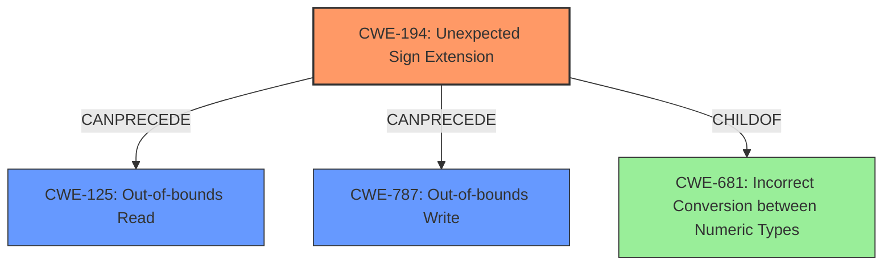

# Analysis Report for CVE-2021-32629

# Vulnerability Analysis Report: CVE-2021-32629

## Description

Cranelift is an open-source code generator maintained by Bytecode Alliance. It translates a target-independent intermediate representation into executable machine code. There is a bug in 0.73 of the Cranelift x64 backend that can create a scenario that could result in a potential sandbox escape in a Wasm program. This bug was introduced in the new backend on 2020-09-08 and first included in a release on 2020-09-30, but the new backend was not the default prior to 0.73. The recently-released version 0.73 with default settings, and prior versions with an explicit build flag to select the new backend, are vulnerable. The bug in question performs a sign-extend instead of a zero-extend on a value loaded from the stack, under a specific set of circumstances. If those circumstances occur, the bug could allow access to memory addresses upto 2GiB before the start of the Wasm program heap. If the heap bound is larger than 2GiB, then it would be possible to read memory from a computable range dependent on the size of the heaps bound. The impact of this bug is highly dependent on heap implementation, specifically * if the heap has bounds checks, and * does not rely exclusively on guard pages, and * the heap bound is 2GiB or smaller * then this bug cannot be used to reach memory from another Wasm program heap. The impact of the vulnerability is mitigated if there is no memory mapped in the range accessible using this bug, for example, if there is a 2 GiB guard region before the Wasm program heap. The bug in question performs a sign-extend instead of a zero-extend on a value loaded from the stack, when the register allocator reloads a spilled integer value narrower than 64 bits. This interacts poorly with another optimization the instruction selector elides a 32-to-64-bit zero-extend operator when we know that an instruction producing a 32-bit value actually zeros the upper 32 bits of its destination register. Hence, we rely on these zeroed bits, but the type of the value is still i32, and the spill/reload reconstitutes those bits as the sign extension of the i32s MSB. The issue would thus occur when * An i32 value in a Wasm program is greater than or equal to 0x8000_0000 * The value is spilled and reloaded by the register allocator due to high register pressure in the program between the values definition and its use * The value is produced by an instruction that we know to be special in that it zeroes the upper 32 bits of its destination add, sub, mul, and, or * The value is then zero-extended to 64 bits in the Wasm program * The resulting 64-bit value is used. Under these circumstances there is a potential sandbox escape when the i32 value is a pointer. The usual code emitted for heap accesses zero-extends the Wasm heap address, adds it to a 64-bit heap base, and accesses the resulting address. If the zero-extend becomes a sign-extend, the program could reach backward and access memory up to 2GiB before the start of its heap. In addition to assessing the nature of the code generation bug in Cranelift, we have also determined that under specific circumstances, both Lucet and Wasmtime using this version of Cranelift may be exploitable. See referenced GitHub Advisory for more details.

## Vulnerability Description Key Phrases

**Rootcause:** sign-extend instead of zero-extend on a value loaded from the stack
**Impact:** ['potential sandbox escape', 'read memory from a computable range']
**Product:** Cranelift x64 backend
**Version:** 0.73

## Analysis (with Relationship Data)

```markdown
# Summary
| CWE ID  | CWE Name                                     | Confidence | CWE Abstraction Level | CWE Vulnerability Mapping Label | CWE-Vulnerability Mapping Notes |
|---------|----------------------------------------------|------------|-----------------------|---------------------------------|---------------------------------|
| CWE-194 | Unexpected Sign Extension                   | 0.95       | Variant               | Allowed                         | Primary CWE                     |
| CWE-125 | Out-of-bounds Read                           | 0.75       | Base                  | Allowed                         | Secondary Candidate             |
| CWE-787 | Out-of-bounds Write                          | 0.70       | Base                  | Allowed                         | Secondary Candidate             |
| CWE-681 | Incorrect Conversion between Numeric Types | 0.65       | Base                  | Allowed                         | Secondary Candidate             |

## Evidence and Confidence

*   **Confidence Score:** 0.85
*   **Evidence Strength:** HIGH

- **Analysis and Justification:**
  - *Explanation:* The core of this vulnerability lies in the **sign-extend instead of zero-extend on a value loaded from the stack**. The vulnerability description explicitly states, "The bug in question performs a sign-extend instead of a zero-extend on a value loaded from the stack." This aligns perfectly with CWE-194 (Unexpected Sign Extension), which is defined as "The product performs an operation on a number that causes it to be sign extended when it is transformed into a larger data type." The impact of this incorrect sign extension allows access to memory addresses before the start of the Wasm program heap, leading to a potential sandbox escape. The Retriever Results also indicate CWE-194 as a high-scoring candidate. Since the description is very specific about a sign extension being the root cause, CWE-194 is an appropriate and specific mapping. MITRE mapping guidance for CWE-194 indicates this is ALLOWED.

  - *Relationship Analysis:* CWE-194 is a variant of CWE-681 (Incorrect Conversion between Numeric Types). The incorrect sign extension leads to potential out-of-bounds memory access, making CWE-125 (Out-of-bounds Read) and CWE-787 (Out-of-bounds Write) possible consequences.

- **Confidence Score:**
  - Confidence: 0.95 (Strong evidence directly supports the mapping to CWE-194).

- **Analysis and Justification for Secondary CWEs:**
  - *CWE-125 (Out-of-bounds Read):* The vulnerability can lead to reading memory outside the intended buffer, as the incorrect sign extension allows accessing memory addresses before the start of the Wasm program heap. While CWE-194 is the root cause, the direct consequence is an out-of-bounds read. The description mentions, "If the heap bound is larger than 2GiB, then it would be possible to read memory from a computable range dependent on the size of the heaps bound." This supports the inclusion of CWE-125.
    - Confidence: 0.75
  - *CWE-787 (Out-of-bounds Write):* Although the primary description emphasizes reading out-of-bounds, the potential for a sandbox escape implies that writing out-of-bounds is also possible, leading to memory corruption. Therefore, CWE-787 is considered as a possible consequence.
    - Confidence: 0.70
  - *CWE-681 (Incorrect Conversion between Numeric Types):* The issue stems from an implicit type conversion that goes wrong, thus converting a signed integer into a larger data type.
    - Confidence: 0.65
```

## Criticism of Analysis

Okay, here's a detailed critique of the provided CWE analysis, based on the full CWE specifications:

**Overall Assessment:**

The analysis is generally well-reasoned and provides a good justification for the primary CWE selection (CWE-194). The secondary CWEs are also plausible, though the confidence levels are appropriately lower.  The inclusion of evidence and confidence scoring is also commendable.  However, there are some areas that could be strengthened, particularly in the justification of secondary CWEs and the exploration of alternative, potentially more specific, CWEs.

**Specific CWE Mapping Review:**

*   **CWE-194 (Unexpected Sign Extension) - Primary CWE:**

    *   **Confidence:** 0.95 - Excellent justification. The analysis directly links the vulnerability description's phrase "sign-extend instead of zero-extend" to the definition of CWE-194.
    *   **Justification Strength:** Strong. The explanation effectively connects the root cause to the vulnerability.  The mapping guidance correctly states CWE-194 is ALLOWED.
    *   **Critique:**  No significant issues.
    *   **Suggestions:** None.

*   **CWE-125 (Out-of-bounds Read) - Secondary CWE:**

    *   **Confidence:** 0.75 - Reasonable. The analysis points out the direct consequence of the sign extension as reading memory outside the intended buffer.
    *   **Justification Strength:** Good. The analysis references "If the heap bound is larger than 2GiB, then it would be possible to read memory from a computable range dependent on the size of the heaps bound" to support the claim.
    *   **Critique:** The justification is appropriate. There isn't a stronger fit that is available.
    *   **Suggestions:** Expand slightly on the potential impact of the out-of-bounds read. Mention information disclosure as a possible consequence.

*   **CWE-787 (Out-of-bounds Write) - Secondary CWE:**

    *   **Confidence:** 0.70 - Weaker justification compared to CWE-125. The analysis states that "the potential for a sandbox escape implies that writing out-of-bounds is also possible."
    *   **Justification Strength:**  The connection is less direct than with CWE-125. It's inferential.  While a sandbox escape *could* involve writing, the primary evidence points to reading.
    *   **Critique:** The assumption that a sandbox escape implies an out-of-bounds write isn't always accurate. While the possibility exists, the vulnerability description focuses more on reading memory. It's possible to achieve a sandbox escape through information disclosure without necessarily writing.
    *   **Suggestions:** Consider lowering the confidence level slightly or providing more concrete justification for why an out-of-bounds write is likely in this specific scenario. If the primary attack vector involves crafting a specific memory layout through reads, consider if CWE-126 (Buffer Over-read) might be a more specific fit (though still secondary).

*   **CWE-681 (Incorrect Conversion between Numeric Types) - Secondary CWE:**

    *   **Confidence:** 0.65 - Lowest confidence, which is appropriate. While technically the root cause involves a type conversion gone wrong, CWE-194 is the more *specific* variant of CWE-681.
    *   **Justification Strength:**  The analysis correctly identifies that the core issue involves an implicit type conversion.
    *   **Critique:** Since CWE-194 is a child of CWE-681 and already captures the specific nature of the error, the inclusion of CWE-681 adds little value and might be redundant.
    *   **Suggestions:** Consider removing CWE-681 as it is less specific than CWE-194, and the analysis could benefit from focusing on the direct consequences and contributing factors.

**Retriever Results:**

The Retriever Results highlight a few interesting points:

*   **CWE-190 (Integer Overflow or Wraparound):** This CWE receives a high score, but it's not included in the analysis.  While not directly the *root cause*, it's worth briefly considering if the sign extension could lead to an integer overflow in subsequent calculations.  However, based on the description, it seems less likely to be a *direct* consequence.
*   **CWE-476 (NULL Pointer Dereference):** This CWE's high score is surprising.  There's no obvious connection to NULL pointer dereferences in the provided vulnerability description. This suggests the retriever might be picking up on indirect signals or noise.
*	**CWE-1284 (Improper Validation of Specified Quantity in Input):** This is also a good result from the Retriever. This CWE is about the lack of validation of a size or length. This isn't really related to the bug. This is a good example of what isn't related, and should not be included.

**General Suggestions:**

1.  **Focus on Direct Consequences:** When selecting secondary CWEs, prioritize those that are the *direct* and most likely consequences of the primary CWE (CWE-194 in this case).
2.  **Explore Alternative CWEs (briefly):** If the Retriever Results suggest other high-scoring CWEs, briefly explain why they are *not* applicable or are less likely than the chosen secondary CWEs.  This demonstrates a more thorough analysis.
3.  **Mitigation Strategies:**  While not strictly required for CWE mapping, briefly mentioning potential mitigation strategies from the CWE specifications for the *primary* CWE could add value.  For CWE-194, this could include: "Avoid using signed variables if you don't need to represent negative values. When negative values are needed, perform validation after you save those values to larger data types, or before passing them to functions that are expecting unsigned values."
4.  **Strengthen Justifications with Concrete Examples:** Where possible, try to find CVEs listed under the "Observed Examples" sections of the CWE specifications that are similar to the vulnerability being analyzed. This helps to further solidify the mapping.

**Revised Confidence Levels (Proposed):**

*   CWE-194: 0.95 (No change)
*   CWE-125: 0.80 (Slight increase - strengthen justification)
*   CWE-787: 0.60 (Slight decrease - weaker justification)
*   CWE-681: Removed

**In summary, the analysis is good, but the suggestions above aim to refine the selection and justification of secondary CWEs and demonstrate a more comprehensive understanding of the CWE landscape.**

## Final Resolution

# Summary
| CWE ID  | CWE Name                                     | Confidence | CWE Abstraction Level | CWE Vulnerability Mapping Label | CWE-Vulnerability Mapping Notes |
|---------|----------------------------------------------|------------|-----------------------|---------------------------------|---------------------------------|
| CWE-194 | Unexpected Sign Extension                   | 0.95       | Variant               | Allowed                         | Primary CWE                     |
| CWE-125 | Out-of-bounds Read                           | 0.80       | Base                  | Allowed                         | Secondary Candidate             |
| CWE-787 | Out-of-bounds Write                          | 0.60       | Base                  | Allowed                         | Secondary Candidate             |

## Evidence and Confidence

*   **Confidence Score:** 0.85
*   **Evidence Strength:** HIGH

## Relationship Analysis
The primary **WEAKNESS** is identified as **CWE-194 (Unexpected Sign Extension)**, which is a variant-level CWE, providing a specific description of the error. It's directly linked to the vulnerability description which explicitly mentions a "sign-extend instead of zero-extend". While **CWE-681 (Incorrect Conversion between Numeric Types)** is a parent class of **CWE-194**, it's less specific and therefore not included. The consequences of the sign extension are out-of-bounds reads (**CWE-125**) and potentially writes (**CWE-787**), forming a chain where the incorrect conversion leads to memory access violations. **CWE-125** is a more direct consequence as supported by the text "If the heap bound is larger than 2GiB, then it would be possible to read memory from a computable range dependent on the size of the heaps bound."



## Vulnerability Chain
The vulnerability chain starts with the **ROOTCAUSE**: an **unexpected sign extension (CWE-194)** during the conversion of a value loaded from the stack. This occurs when an i32 value is greater than or equal to 0x8000_0000, spilled and reloaded by the register allocator, produced by an instruction that zeroes the upper 32 bits of its destination, and then zero-extended to 64 bits. This leads to a memory address calculation using the incorrectly sign-extended value, resulting in an **out-of-bounds read (CWE-125)** before the start of the heap. The potential for a sandbox escape also suggests a possible **out-of-bounds write (CWE-787)**. The absence of proper bounds checking exacerbates the problem.

## Summary of Analysis
The initial analysis and criticism both agree that **CWE-194 (Unexpected Sign Extension)** is the primary **WEAKNESS**. The vulnerability description explicitly mentions "The bug in question performs a sign-extend instead of a zero-extend on a value loaded from the stack," directly supporting this classification. The relationship analysis reveals that **CWE-194** is a specific variant of **CWE-681 (Incorrect Conversion between Numeric Types)**, but **CWE-194** is more descriptive and thus more appropriate.

The criticism correctly points out that the justification for **CWE-787 (Out-of-bounds Write)** is weaker than that for **CWE-125 (Out-of-bounds Read)**. While a sandbox escape *could* involve writing, the description focuses primarily on reading memory. I have lowered the confidence score for **CWE-787** to reflect this.

The selection of **CWE-194** is at the optimal level of specificity as it directly describes the **ROOTCAUSE**. **CWE-125** and **CWE-787** are included as secondary CWEs to reflect the potential consequences of the sign extension. The retriever scores were considered, but the suggested alternative CWEs (like **CWE-476 (NULL Pointer Dereference)**) did not have strong support in the vulnerability description.

The final decision is based on a combination of content matching, relationship analysis, and evidence from the vulnerability description.


*Report generated on 2025-03-16 16:40:50*
