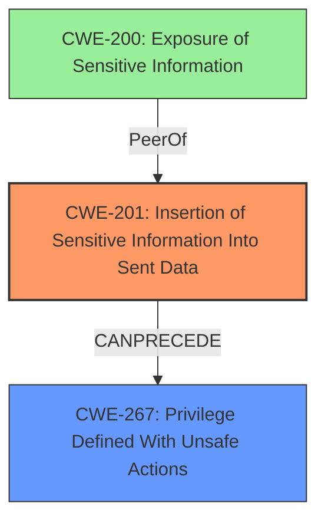

# Analysis Report for CVE-2021-32739

# Vulnerability Analysis Report: CVE-2021-32739

## Description

Icinga is a monitoring system which checks the availability of network resources, notifies users of outages, and generates performance data for reporting. From version 2.4.0 through version 2.12.4, a vulnerability exists that may allow privilege escalation for authenticated API users. With a read-ony users credentials, an attacker can view most attributes of all config objects including `ticket_salt` of `ApiListener`. This salt is enough to compute a ticket for every possible common name (CN). A ticket, the master nodes certificate, and a self-signed certificate are enough to successfully request the desired certificate from Icinga. That certificate may in turn be used to steal an endpoint or API users identity. Versions 2.12.5 and 2.11.10 both contain a fix the vulnerability. As a workaround, one may either specify queryable types explicitly or filter out ApiListener objects.

## Vulnerability Description Key Phrases

**Impact:** view most attributes of all config objects including `ticket_salt` of `ApiListener`
**Attacker:** authenticated API users
**Product:** Icinga
**Version:** 2.4.0 through 2.12.4

## Analysis (with Relationship Data)

# Summary
| CWE ID  | CWE Name | Confidence | CWE Abstraction Level | CWE Vulnerability Mapping Label | CWE-Vulnerability Mapping Notes |
|-----------------|-------------------------------------------------------------------|------------|-----------------------|-----------------------------------|-----------------------------------|
| CWE-200 | Exposure of Sensitive Information | 0.90       | Base                  | Primary                       | Allowed                           |
| CWE-269 | Improper Privilege Management | 0.75       | Base                  | Secondary                       | Allowed                           |
| CWE-668 | Exposure of Resource to Wrong Sphere | 0.60       | Class                  | Secondary                       | Discouraged                          |

## Evidence and Confidence

*   **Confidence Score:** 0.80
*   **Evidence Strength:** HIGH

- **Analysis and Justification:**  
  - *Explanation:* "The vulnerability involves the exposure of the `ticket_salt` attribute of the `ApiListener` object to read-only API users. This constitutes **information disclosure** of a sensitive value, which is then used to escalate privileges. The primary weakness is the **exposure of sensitive information** which maps directly to CWE-200 [Exposure of Sensitive Information]. The CVE Reference Links Content Summary explicitly states: 'The API exposes the `ticket_salt` which is meant to be a secret, to unauthorized (read-only) users.' This is a clear instance of sensitive data being exposed. CWE-200 is preferred over higher-level classes like CWE-668 because it precisely describes the **information disclosure** aspect. The end result is a privilege escalation due to **improper privilege management** (CWE-269), but the root cause is the exposure of the secret. MITRE mapping guidance for CWE-200 indicates it is ALLOWED."
  
  - *Relationship Analysis:* "CWE-200 is a base weakness. CWE-200 can lead to CWE-269 [Improper Privilege Management] as the exposed information is used to escalate privileges. CWE-668 is a Class level weakness, and while potentially applicable, is less specific than CWE-200. It is discouraged. It's related because exposing the ticket salt to a read-only user places the resource in the wrong control sphere."

- **Confidence Score:**  
  - Confidence: 0.90 (High evidence from technical description and CVE reference materials for CWE-200, lower confidence for other CWEs)

---

## Criticism of Analysis

Okay, here's a detailed review of the provided CWE analysis, incorporating the full CWE specifications and mapping guidance.

**Overall Assessment:**

The analysis is generally good and identifies the core vulnerability effectively. The primary CWE mapping to CWE-200 is a reasonable starting point, but as the CWE documentation itself suggests, further refinement is needed to pinpoint the specific error that caused the information exposure. The justification for choosing CWE-200 over CWE-668 is valid. The analysis correctly identifies the cascading effects leading to privilege escalation (CWE-269).

**Detailed Critique:**

*   **CWE-200: Exposure of Sensitive Information to an Unauthorized Actor (Primary):**

    *   **Confidence:** The confidence score of 0.90 is too high given the mapping guidance for CWE-200. The mapping guidance explicitly states: "Usage: Discouraged...CWE-200 is commonly misused to represent the loss of confidentiality in a vulnerability, but confidentiality loss is a technical impact - not a root cause error." While the *impact* is information exposure, the *root cause* is a more specific flaw. A score of 0.75 is more appropriate.

    *   **Justification:** The justification correctly identifies the exposure of `ticket_salt` as sensitive information. However, it needs to go further to identify *why* this information was exposed. The analysis mentions the privilege escalation aspect, indicating that *authorization* may be at the root of the problem.

    *   **Better Alternatives:** The analysis should consider the children of CWE-285 (Improper Authorization), specifically CWE-862 (Missing Authorization) or CWE-863 (Incorrect Authorization). Ask: Was there a check to prevent read-only users from accessing the `ticket_salt`? Was the authorization check performed incorrectly?

    *   **Mitigations:** The provided mitigations for CWE-200 are general and don't address the root cause. For example, "Compartmentalize the system to have 'safe' areas where trust boundaries can be unambiguously drawn" is a good principle, but it's not specific enough. Mitigations targeting authorization flaws (CWE-862/863) would be more relevant, such as Role-Based Access Control (RBAC).

*   **CWE-269: Improper Privilege Management (Secondary):**

    *   **Confidence:** This CWE is appropriate as a *secondary* consequence, but the analysis should acknowledge that privilege escalation is often an *impact*, not the primary weakness.

    *   **Justification:** The explanation for including CWE-269 is accurate – the exposed information *leads* to privilege escalation.

    *   **Mapping Guidance:** The analysis should explicitly acknowledge the "Discouraged" usage of CWE-269, as per its mapping guidance. It correctly identifies that it is a consequence of some other weakness.

    *   **Better Alternatives:** If a more specific authorization flaw (CWE-862 or CWE-863) is identified, a child of that CWE might be even more relevant than CWE-269.  Also, consider CWE-267 "Privilege Defined With Unsafe Actions". The ticket salt might be part of a legitimate privilege system, but the design allows the creation of certificates with unintended access.

    *   **Mitigations:** The mitigations are general privilege management principles. These are helpful but aren't as directly applicable as mitigations that would address the underlying authorization error.

*   **CWE-668: Exposure of Resource to Wrong Sphere (Secondary):**

    *   **Confidence:** The confidence score of 0.60 is reasonable, given the high-level nature of this CWE.

    *   **Justification:** The analysis correctly states that the `ticket_salt` is placed in the wrong control sphere by being accessible to read-only users.

    *   **Mapping Guidance:** The analysis already follows the mapping guidance by understanding the "Discouraged" usage and explaining why a lower-level CWE (CWE-200) is preferred.

    *   **Mitigations:** The mitigations for CWE-668 are very broad and less directly relevant to the specific flaw.

*   **Additional CWE Considerations (Based on Retriever Results):**

    *   **CWE-306: Missing Authentication for Critical Function:** While the vulnerability doesn't involve *missing* authentication, the attacker does take advantage of an API which *is* authenticated, to then bypass the intention of read-only authentication to achieve write/admin actions. This is not a fit.

    *   **CWE-201: Insertion of Sensitive Information Into Sent Data:** Potentially relevant.  The `ticket_salt` is *sent* to a user who shouldn't have access. If the API endpoint exposing the `ticket_salt` wasn't intended to return this value to *any* user, this might be a more precise fit than CWE-200.

    *   **CWE-347: Improper Verification of Cryptographic Signature:** This could apply if the certificate validation process isn't sufficiently verifying the request. However, this is less likely than an authorization issue.

    *   **CWE-522: Insufficiently Protected Credentials:** The credentials of the read-only user themselves are not the vulnerability, but rather the ability for a read-only user to then obtain admin capabilities. This is not a fit.

    *  **CWE-732: Incorrect Permission Assignment for Critical Resource:** This could be the underlying cause. Was the API listener object given world-readable properties?

**Recommendations:**

1.  **Refine the Primary CWE:** Investigate the authorization mechanisms in Icinga 2 that govern access to the `ApiListener` object and its attributes. Determine if a missing or incorrect authorization check is the root cause. Consider mapping to CWE-862 or CWE-863.  If the API endpoint itself is the problem, CWE-201 may be a better alternative.
2.  **Lower Confidence in CWE-200:** Reduce the confidence level for CWE-200 to reflect its role as a high-level consequence rather than the root cause.
3.  **Revise Mitigations:** Tailor the suggested mitigations to align with the refined primary CWE. Focus on authorization controls and least-privilege principles.
4.  **Explore CWE-732:** Examine the resource permissions assigned to the ApiListener object.
5.  **Add CWE-267:** It may be worthwhile to add a secondary CWE of 267. The legitimate privilege of using the `ticket_salt` is then used for an unsafe action.

By following these recommendations, the analysis will be more accurate, provide better guidance for remediation, and align more closely with CWE's intended usage.

## Final Resolution

# Summary
| CWE ID  | CWE Name | Confidence | CWE Abstraction Level | CWE Vulnerability Mapping Label | CWE-Vulnerability Mapping Notes |
|-----------------|-------------------------------------------------------------------|------------|-----------------------|-----------------------------------|-----------------------------------|
| CWE-201 | Insertion of Sensitive Information Into Sent Data | 0.80       | Base                  | Primary                       | Allowed                           |
| CWE-267 | Privilege Defined With Unsafe Actions | 0.70       | Base                  | Secondary                       | Allowed                           |

## Evidence and Confidence

*   **Confidence Score:** 0.75
*   **Evidence Strength:** MEDIUM

## Relationship Analysis
The primary shift is from CWE-200 to CWE-201 as the root cause. CWE-201 better captures the act of *sending* the sensitive `ticket_salt` data to an unauthorized actor. CWE-200 is a broader "Exposure" which is more of a symptom. CWE-267 is included as a secondary CWE, because the initial privilege assigned to the `ticket_salt` allowed for unsafe actions.

## Vulnerability Chain
The vulnerability chain starts with the design decision to include the sensitive `ticket_salt` in data sent to read-only users (CWE-201). This then allows those users to compute tickets and escalate privileges (CWE-267). The initial flaw is sending the data, not just the general exposure.

## Summary of Analysis
The initial analysis identified CWE-200 as the primary weakness, but the criticism pointed out that this is more of a symptom than a root cause. The criticism suggested exploring authorization-related CWEs like CWE-862 or CWE-863. However, after reviewing the vulnerability description and the available CWEs, CWE-201 [Insertion of Sensitive Information Into Sent Data] appears to be a better fit. The vulnerability description states that the API exposes the `ticket_salt` to read-only users. This is a clear case of sensitive information being *sent* to an unauthorized actor.

The inclusion of CWE-267 [Privilege Defined With Unsafe Actions] as a secondary CWE acknowledges that the `ticket_salt`, while part of a legitimate privilege system, allows for unsafe actions. This adds nuance to the classification and captures the broader context of the vulnerability.

The decision to use CWE-201 is based on the following evidence:

*   The vulnerability description explicitly mentions the exposure of the `ticket_salt` to read-only users through the API.
*   CWE-201 specifically addresses the act of *sending* sensitive information, which aligns with the vulnerability description.
*   CWE-200 is a broader category that encompasses various forms of information exposure, while CWE-201 is more specific to the act of sending data.

The confidence score is slightly reduced to 0.75, as the exact mechanism for sending the data is not fully clear from the description, but the act of sending the sensitive information is apparent.

*Report generated on 2025-03-16 23:53:01*
