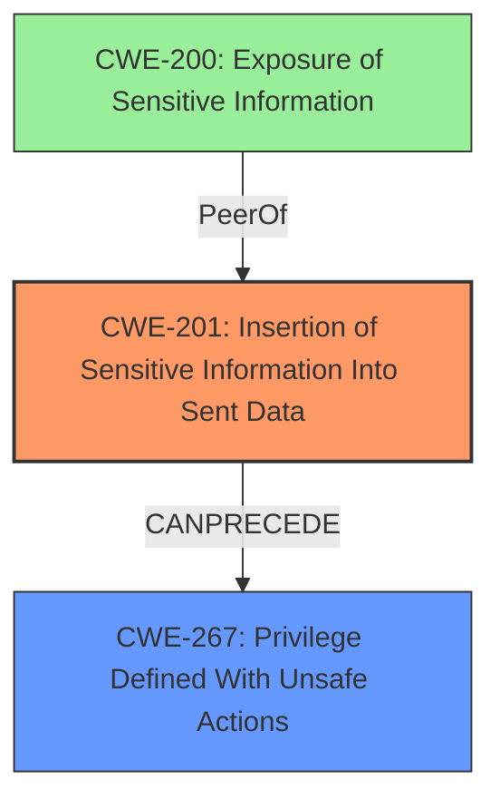

# Final Resolution for CVE-2021-32739

# Summary
| CWE ID  | CWE Name | Confidence | CWE Abstraction Level | CWE Vulnerability Mapping Label | CWE-Vulnerability Mapping Notes |
|-----------------|-------------------------------------------------------------------|------------|-----------------------|-----------------------------------|-----------------------------------|
| CWE-201 | Insertion of Sensitive Information Into Sent Data | 0.80       | Base                  | Primary                       | Allowed                           |
| CWE-267 | Privilege Defined With Unsafe Actions | 0.70       | Base                  | Secondary                       | Allowed                           |

## Evidence and Confidence

*   **Confidence Score:** 0.75
*   **Evidence Strength:** MEDIUM

## Relationship Analysis
The primary shift is from CWE-200 to CWE-201 as the root cause. CWE-201 better captures the act of *sending* the sensitive `ticket_salt` data to an unauthorized actor. CWE-200 is a broader "Exposure" which is more of a symptom. CWE-267 is included as a secondary CWE, because the initial privilege assigned to the `ticket_salt` allowed for unsafe actions.

## Vulnerability Chain
The vulnerability chain starts with the design decision to include the sensitive `ticket_salt` in data sent to read-only users (CWE-201). This then allows those users to compute tickets and escalate privileges (CWE-267). The initial flaw is sending the data, not just the general exposure.

## Summary of Analysis
The initial analysis identified CWE-200 as the primary weakness, but the criticism pointed out that this is more of a symptom than a root cause. The criticism suggested exploring authorization-related CWEs like CWE-862 or CWE-863. However, after reviewing the vulnerability description and the available CWEs, CWE-201 [Insertion of Sensitive Information Into Sent Data] appears to be a better fit. The vulnerability description states that the API exposes the `ticket_salt` to read-only users. This is a clear case of sensitive information being *sent* to an unauthorized actor.

The inclusion of CWE-267 [Privilege Defined With Unsafe Actions] as a secondary CWE acknowledges that the `ticket_salt`, while part of a legitimate privilege system, allows for unsafe actions. This adds nuance to the classification and captures the broader context of the vulnerability.

The decision to use CWE-201 is based on the following evidence:

*   The vulnerability description explicitly mentions the exposure of the `ticket_salt` to read-only users through the API.
*   CWE-201 specifically addresses the act of *sending* sensitive information, which aligns with the vulnerability description.
*   CWE-200 is a broader category that encompasses various forms of information exposure, while CWE-201 is more specific to the act of sending data.

The confidence score is slightly reduced to 0.75, as the exact mechanism for sending the data is not fully clear from the description, but the act of sending the sensitive information is apparent.