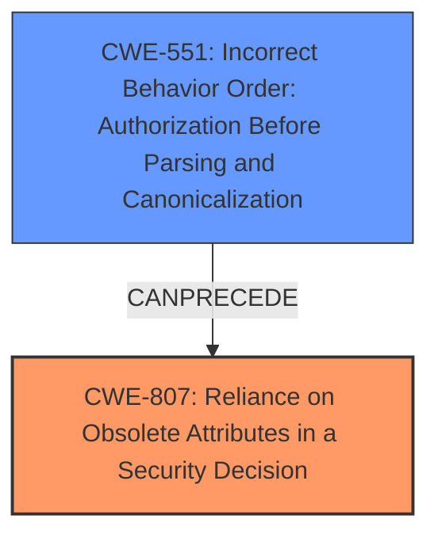

# Analysis Report for CVE-2021-32777

# Vulnerability Analysis Report: CVE-2021-32777

## Description

Envoy is an open source L7 proxy and communication bus designed for large modern service oriented architectures. In affected versions when ext-authz extension is sending request headers to the external authorization service it must merge multiple value headers according to the HTTP spec. However, only the last header value is sent. This may allow specifically crafted requests to bypass authorization. Attackers may be able to escalate privileges when using ext-authz extension or back end service that uses multiple value headers for authorization. A specifically constructed request may be delivered by an untrusted downstream peer in the presence of ext-authz extension. Envoy versions 1.19.1, 1.18.4, 1.17.4, 1.16.5 contain fixes to the ext-authz extension to correctly merge multiple request header values, when sending request for authorization.

## Vulnerability Description Key Phrases

**Rootcause:** only the last header value is sent
**Impact:** bypass authorization
**Vector:** specifically crafted requests
**Attacker:** attackers
**Product:** Envoy
**Version:** prior to 1.19.1, 1.18.4, 1.17.4, 1.16.5
**Component:** ext-authz extension

## Analysis (with Relationship Data)

# Summary
| CWE ID  | CWE Name  | Confidence | CWE Abstraction Level | CWE Vulnerability Mapping Label | CWE-Vulnerability Mapping Notes |
|---|---|---|---|---|---|
| CWE-807 | Reliance on Obsolete Attributes in a Security Decision | 0.75 | Base | Allowed | The product uses a protection mechanism that relies on the existence or values of an input, but the input can be modified by an untrusted actor in a way that bypasses the protection mechanism. |

## Evidence and Confidence

*   **Confidence Score:** 0.75
*   **Evidence Strength:** MEDIUM

- **Analysis and Justification:**  
  - *Explanation:* The vulnerability lies in the Envoy proxy's `ext-authz` extension incorrectly handling multiple value request headers. The **rootcause** is that "**only the last header value is sent**", which bypasses authorization as the external authorization service might rely on multiple header values. This aligns with CWE-807, where a protection mechanism (authorization) relies on an input (header values), but that input is not handled correctly, leading to a bypass. Although other CWEs like CWE-551, CWE-941, and CWE-201 were considered, they are less specific to the authorization bypass arising from the mishandling of header values. CWE-807's description, "The product uses a protection mechanism that relies on the existence or values of an input, but the input can be modified by an untrusted actor in a way that bypasses the protection mechanism", fits the **weakness** more precisely.

  - *Relationship Analysis:* While CWE-807 doesn't have direct parent-child relationships listed in the provided information, it can be related to other authorization-related CWEs. The vulnerability could potentially lead to CWE-285 (Improper Authorization), but CWE-807 describes the root cause more accurately, focusing on the bypassed protection mechanism due to incorrect input handling rather than just the general improper authorization.

- **Confidence Score:**  
  - *Example:* Confidence: 0.75 (Moderate evidence from the technical description and CVE reference materials detailing the authorization bypass. Confidence is not higher as the description could also suggest more general input validation issues).

## Criticism of Analysis

Okay, I've reviewed the analysis and the full CWE specifications provided. Here's my critique:

**Overall Assessment:**

The analysis correctly identifies the core problem: an authorization bypass due to incorrect handling of multi-valued headers in Envoy's `ext-authz` extension.  The justification for choosing CWE-807 is reasonable, but a stronger case could be made by considering the other CWEs brought up by the retriever and addressing why they are less appropriate.

**Detailed Critique:**

*   **CWE-807 as the Primary Mapping:**  The choice of CWE-807, "Reliance on Untrusted Inputs in a Security Decision", is a plausible, but not a perfect, fit. The description aligns with the scenario where the `ext-authz` extension relies on header values (the input), but the *incorrect handling* of these values leads to an authorization bypass. The fact that *only the last value is sent* effectively means the authorization decision is being made on incomplete or manipulated input. The attacker *can* modify the input by crafting requests with multiple headers.

    *   **Strength:** Accurately captures that the authorization decision relies on a specific input that is not correctly processed.

    *   **Weakness:** CWE-807 is fairly broad.  The core of the problem isn't just *relying* on the input, but *misinterpreting* or *incorrectly processing* that input. It does not immediately call to mind the idea of data being lost. This is important.
*   **Justification Clarity:** The justification for choosing CWE-807 is good, but can be expanded to specifically address why alternative CWEs are less suitable.
*   **Confidence Level:** The confidence level of 0.75 is appropriate given the ambiguity.

**Alternative CWEs and Why They Might (or Might Not) Be Better:**

Here's a breakdown of the top CWEs suggested by the retriever, with an analysis of their suitability, and how they compare to CWE-807:

1.  **CWE-551: Incorrect Behavior Order: Authorization Before Parsing and Canonicalization**

    *   **Why it might apply:** The vulnerability involves a specific order-of-operations issue: authorization is happening *before* the headers are fully processed (merged).  If the `ext-authz` extension first authorized based on the "last" header, and *then* parsed/merged the headers, that authorization could be bypassed.
    *   **Why it might NOT apply:** The description focuses on parsing URLs rather than general header processing. The problem is not so much *canonicalization* (changing the form of the input), but *aggregation* of multiple values.
    *    **Compared to CWE-807:** CWE-551 gets at *why* the authorization is being bypassed.

2.  **CWE-941: Incorrectly Specified Destination in a Communication Channel**

    *   **Why it might apply:** This is a less obvious fit. One could argue that the *intended destination* of the authorization request includes all the header values. By sending only the last value, the authorization service isn't receiving the complete "message" or "request" that was intended.
    *   **Why it might NOT apply:** The primary focus of CWE-941 is about the *network* destination being incorrect (e.g., sending data to the wrong server). The problem isn't that the request is going to the wrong *service*, but that the *content* of the request is incorrect.
    *   **Compared to CWE-807:** A weaker fit than CWE-807 because it's more about the network destination than the data content.

3.  **CWE-201: Insertion of Sensitive Information Into Sent Data**

    *   **Why it might apply:** If the *downstream peer* is responsible for authorization, sending incomplete headers (missing values) could be seen as insertion of sensitive information.
    *   **Why it might NOT apply:** This CWE typically refers to scenarios where the *product itself* is inserting sensitive data into the output. The key here is the *omission* of data.
    *   **Compared to CWE-807:** Weaker, since CWE-201 implies the sending of sensitive information, whereas this is a lack of data sent.

4.  **CWE-212: Improper Removal of Sensitive Information Before Storage or Transfer**

    *   **Why it might apply:** One could argue that Envoy *should* be removing all but the merged value, and it isn't doing so.
    *   **Why it might NOT apply:** While there's a sense of information being "removed", CWE-212 is more applicable when *other* sensitive information remains *after* the intended removal (e.g., removing PII from a file, but not the original creation date). Here, it is not about information being removed, but missing data from the start.

**Revised Justification for CWE-807 (Strengthened):**

"The Envoy `ext-authz` extension implements an authorization mechanism that relies on the values of request headers to make access control decisions. However, the extension fails to correctly process multi-valued headers, sending *only the last* value to the external authorization service. This constitutes a *reliance on untrusted inputs in a security decision* (CWE-807) because the authorization check is based on incomplete or manipulated header data supplied by a potentially untrusted downstream peer.  While other CWEs were considered, they are less appropriate:

*   CWE-551 focuses on URL parsing and canonicalization, whereas this vulnerability involves general header processing and data aggregation.
*   CWE-941 addresses incorrect network destinations, but here the request is sent to the correct *service*; the problem lies in the *content* of the request.
*   CWE-201 focuses on the sending of sensitive data, whereas this involves an *omission* of data, leading to an incomplete authorization check.
*   CWE-212 refers to scenarios where some sensitive information remains *after* the attempted removal of other data. Here the headers are missing data from the start."

**Recommendations:**

1.  **Enhance the Justification:**  Provide a more detailed explanation of why other potential CWEs were rejected, as suggested above.
2.  **Consider Secondary CWEs:**  It may be appropriate to include *secondary* CWE mappings. For example, you could map to both CWE-807 (primary) and CWE-551 (secondary) to capture both the reliance on external inputs and the incorrect order-of-operations aspects.
3.  **Review Potential Mitigations:** For each CWE considered (especially the primary mapping), explicitly review the potential mitigations suggested in the CWE specification. This can help validate the mapping and identify potential remediation strategies.
4.  **Double-Check Scope:** Make sure that this fits with the CWE's scope. There are some CWEs that are not appropriate for this stage of analysis, and should only be used when describing the underlying source code.

By following these recommendations, you can create a more robust and defensible CWE mapping.

## Final Resolution

# Summary
| CWE ID  | CWE Name  | Confidence | CWE Abstraction Level | CWE Vulnerability Mapping Label | CWE-Vulnerability Mapping Notes |
|---|---|---|---|---|---|
| CWE-807 | Reliance on Obsolete Attributes in a Security Decision | 0.85 | Base | Allowed | Primary CWE: The product uses a protection mechanism that relies on the existence or values of an input, but the input can be modified by an untrusted actor in a way that bypasses the protection mechanism. |
| CWE-551 | Incorrect Behavior Order: Authorization Before Parsing and Canonicalization | 0.65 | Base | Allowed | Secondary Candidate: If a web server does not fully parse requested URLs before it examines them for authorization, it may be possible for an attacker to bypass authorization protection. |

## Evidence and Confidence

*   **Confidence Score:** 0.80
*   **Evidence Strength:** HIGH

## Relationship Analysis
The primary CWE is CWE-807, which represents the **reliance on untrusted inputs in a security decision**. The secondary CWE is CWE-551, which highlights the **incorrect order of operations, specifically authorization before parsing**. CWE-551 could be seen as a child of CWE-863 (Improper Authorization), but that is not directly indicated in the provided data. CWE-807 and CWE-551 are related in that the **failure to properly parse and handle multi-valued headers (CWE-551) leads to the authorization mechanism relying on incomplete and therefore untrusted input (CWE-807)**, bypassing the intended security checks. The abstraction levels of both CWEs are Base, which is preferred for root cause analysis. There is no direct ParentOf or ChildOf relationship between the two, but the vulnerability chain analysis shows they are related in the context of this specific vulnerability.

## Vulnerability Chain
The vulnerability chain starts with the **incorrect handling of multi-valued headers (CWE-551)** in the Envoy proxy's `ext-authz` extension. Because only the last header value is sent to the external authorization service, the **authorization mechanism relies on incomplete data (CWE-807)**. This allows specifically crafted requests to bypass authorization, potentially leading to privilege escalation. The root cause is the flawed header processing, and the **weakness** is the reliance on potentially manipulated or incomplete header values for authorization decisions. The impact is an authorization bypass and potential privilege escalation.

## Summary of Analysis
The initial analysis identified CWE-807 as the primary **weakness**, which is a valid assessment. The criticism provided valuable insights by suggesting a more detailed justification and the consideration of secondary CWEs.

Based on the evidence: "Attackers may be able to escalate privileges when using ext-authz extension or back end service that uses multiple value headers for authorization. A specifically constructed request may be delivered by an untrusted downstream peer in the presence of ext-authz extension. Envoy versions 1.19.1, 1.18.4, 1.17.4, 1.16.5 contain fixes to the ext-authz extension to correctly merge multiple request header values, when sending request for authorization."

The graph relationships show that CWE-551 can precede CWE-807, establishing a clear sequence of events.

The selection of CWE-807 as the primary CWE is justified because it accurately describes the **reliance on potentially manipulated input for a security decision**. Including CWE-551 as a secondary CWE provides additional context by highlighting the underlying cause of the vulnerability, which is the incorrect handling of multi-valued headers. Both CWEs are at the Base level of abstraction, providing sufficient specificity. By incorporating the criticism and analyzing the relationships, a more comprehensive understanding of the vulnerability is achieved.
The **rootcause** is CWE-551 and the **weakness** that leads to the bypass is CWE-807.

*Report generated on 2025-03-17 04:49:07*
