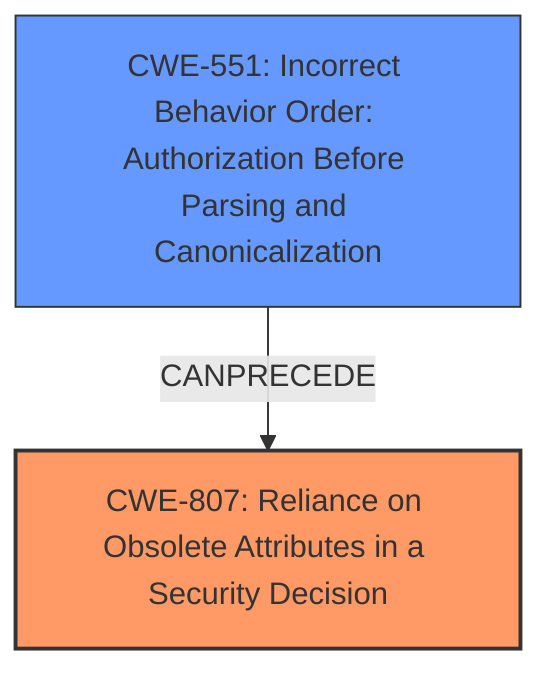

# Final Resolution for CVE-2021-32777

# Summary
| CWE ID  | CWE Name  | Confidence | CWE Abstraction Level | CWE Vulnerability Mapping Label | CWE-Vulnerability Mapping Notes |
|---|---|---|---|---|---|
| CWE-807 | Reliance on Obsolete Attributes in a Security Decision | 0.85 | Base | Allowed | Primary CWE: The product uses a protection mechanism that relies on the existence or values of an input, but the input can be modified by an untrusted actor in a way that bypasses the protection mechanism. |
| CWE-551 | Incorrect Behavior Order: Authorization Before Parsing and Canonicalization | 0.65 | Base | Allowed | Secondary Candidate: If a web server does not fully parse requested URLs before it examines them for authorization, it may be possible for an attacker to bypass authorization protection. |

## Evidence and Confidence

*   **Confidence Score:** 0.80
*   **Evidence Strength:** HIGH

## Relationship Analysis
The primary CWE is CWE-807, which represents the **reliance on untrusted inputs in a security decision**. The secondary CWE is CWE-551, which highlights the **incorrect order of operations, specifically authorization before parsing**. CWE-551 could be seen as a child of CWE-863 (Improper Authorization), but that is not directly indicated in the provided data. CWE-807 and CWE-551 are related in that the **failure to properly parse and handle multi-valued headers (CWE-551) leads to the authorization mechanism relying on incomplete and therefore untrusted input (CWE-807)**, bypassing the intended security checks. The abstraction levels of both CWEs are Base, which is preferred for root cause analysis. There is no direct ParentOf or ChildOf relationship between the two, but the vulnerability chain analysis shows they are related in the context of this specific vulnerability.

## Vulnerability Chain
The vulnerability chain starts with the **incorrect handling of multi-valued headers (CWE-551)** in the Envoy proxy's `ext-authz` extension. Because only the last header value is sent to the external authorization service, the **authorization mechanism relies on incomplete data (CWE-807)**. This allows specifically crafted requests to bypass authorization, potentially leading to privilege escalation. The root cause is the flawed header processing, and the **weakness** is the reliance on potentially manipulated or incomplete header values for authorization decisions. The impact is an authorization bypass and potential privilege escalation.

## Summary of Analysis
The initial analysis identified CWE-807 as the primary **weakness**, which is a valid assessment. The criticism provided valuable insights by suggesting a more detailed justification and the consideration of secondary CWEs.

Based on the evidence: "Attackers may be able to escalate privileges when using ext-authz extension or back end service that uses multiple value headers for authorization. A specifically constructed request may be delivered by an untrusted downstream peer in the presence of ext-authz extension. Envoy versions 1.19.1, 1.18.4, 1.17.4, 1.16.5 contain fixes to the ext-authz extension to correctly merge multiple request header values, when sending request for authorization."

The graph relationships show that CWE-551 can precede CWE-807, establishing a clear sequence of events.

The selection of CWE-807 as the primary CWE is justified because it accurately describes the **reliance on potentially manipulated input for a security decision**. Including CWE-551 as a secondary CWE provides additional context by highlighting the underlying cause of the vulnerability, which is the incorrect handling of multi-valued headers. Both CWEs are at the Base level of abstraction, providing sufficient specificity. By incorporating the criticism and analyzing the relationships, a more comprehensive understanding of the vulnerability is achieved.
The **rootcause** is CWE-551 and the **weakness** that leads to the bypass is CWE-807.