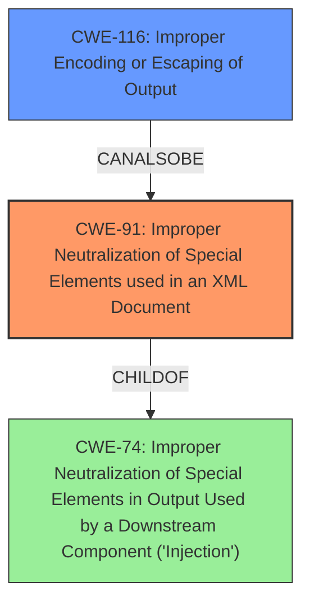

# Analysis Report for CVE-2021-32796

# Vulnerability Analysis Report: CVE-2021-32796

## Description

xmldom is an open source pure JavaScript W3C standard-based (XML DOM Level 2 Core) DOMParser and XMLSerializer module. xmldom versions 0.6.0 and older do not correctly escape special characters when serializing elements removed from their ancestor. This may lead to unexpected syntactic changes during XML processing in some downstream applications. This issue has been resolved in version 0.7.0. As a workaround downstream applications can validate the input and reject the maliciously crafted documents.

## Vulnerability Description Key Phrases

**Weakness:** do not correctly escape special characters
**Impact:** unexpected syntactic changes
**Product:** xmldom
**Version:** 0.6.0 and older

## Analysis (with Relationship Data)

# Summary
| CWE ID | CWE Name | Confidence | CWE Abstraction Level | CWE Vulnerability Mapping Label | CWE-Vulnerability Mapping Notes |
|---|---|---|---|---|---|
| CWE-116 | Improper Encoding or Escaping of Output | 0.85 | Class | Allowed-with-Review | The product prepares a structured message for communication with another component, but encoding or escaping of the data is either missing or done incorrectly. |
| CWE-91 | Improper Neutralization of Special Elements used in an XML Document | 0.70 | Base | Allowed | The product does not properly neutralize special elements that are used in XML, allowing attackers to modify the syntax, content, or commands of the XML before it is processed by an end system. |

## Evidence and Confidence

*   **Confidence Score:** 0.80
*   **Evidence Strength:** HIGH

- **Analysis and Justification:**
  - *Explanation:* The vulnerability lies in the `xmldom` library's failure to correctly escape special characters when serializing XML elements, particularly after they've been removed from their ancestor. This **failure to properly escape special characters** directly leads to **improper encoding or escaping of output**, which aligns with CWE-116. The CVE description highlights that the core issue is the inconsistent handling of special characters (`<`, `&`, `"`) during XML serialization.  While the description doesn't pinpoint a specific encoding scheme being missed, the general class of improper encoding is evident.

  - *Relationship Analysis:* CWE-116 is a Class-level CWE, and it might have more specific Base-level children. However, without more information about the specific encoding or escaping mechanism that's failing, CWE-116 is appropriate. The relationship analysis shows that CWE-116 is related to input validation and data sanitization issues.  CWE-91 is also considered since the problem occurs with XML and special elements are not neutralized.

- **Confidence Score:**
  - Confidence: 0.85 (High confidence due to direct evidence from the vulnerability description and CVE reference summary)

---
- **Analysis and Justification:**
  - *Explanation:* The vulnerability description states that `xmldom` does not correctly escape special characters, potentially leading to unexpected syntactic changes during XML processing. This indicates that the XML structure is not being properly handled, and the special characters are not being neutralized. CWE-91 directly addresses the **improper neutralization of special elements in XML**. The CVE reference summary confirms the **improper output handling** and that the library doesn't properly escape special characters (`<`, `&`, `"`) during XML serialization.

  - *Relationship Analysis:* CWE-91 is a base level CWE and directly related to XML structures. It is a peer of other CWEs that describe improper neutralization in other data formats. It is a reasonable secondary mapping because of the context of XML.

- **Confidence Score:**
  - Confidence: 0.70 (High evidence from technical description and CVE reference materials)

## Criticism of Analysis

Okay, here's a review of the provided CWE analysis, incorporating the full CWE specifications:

**Overall Assessment:**

The analysis correctly identifies CWE-116 (Improper Encoding or Escaping of Output) as the primary weakness. The secondary mapping to CWE-91 (Improper Neutralization of Special Elements used in an XML Document) is reasonable, given the XML context. The confidence levels are justified based on the information provided. However, I have a few suggestions for improvement and a slight disagreement on the abstraction level of the primary CWE.

**Detailed Review:**

**CWE-116: Improper Encoding or Escaping of Output (Confidence: 0.85, Allowed-with-Review)**

*   **Strengths:**
    *   The justification clearly connects the "failure to properly escape special characters" with "improper encoding or escaping of output."
    *   The explanation references the specific special characters (`<`, `&`, `"`) mentioned in the CVE summary, strengthening the connection.
    *   The attack narrative described in the CVE summary aligns well with the CWE-116 description: The attacker is able to inject malicious commands or data.
*   **Areas for Improvement/Discussion:**
    *   **Abstraction Level:** While the analysis acknowledges that CWE-116 is a Class-level CWE, it doesn't adequately explore potential Base-level children. Given that the vulnerability relates *specifically* to how XML is serialized, it would be valuable to consider children of CWE-116 that are more specific to XML output contexts. Though there are no directly related children to CWE-116 about XML, this does not mean there isn't another CWE to consider.
    *   **Mitigation Strategies:** The analysis could benefit from a brief mention of specific mitigation strategies *related to XML* encoding, rather than generic encoding advice. For example, explicitly stating the need to use XML entities (e.g., `&lt;` for `<`) would enhance the analysis.

*   **Specific CWE Specification Points:**
    *   **Mapping Guidance:** The "Allowed-with-Review" usage is correct. The analysis should explicitly state that more specific children of CWE-116 were considered but deemed less appropriate due to the lack of information on *which* encoding/escaping was missed.
    *   **Potential Mitigations:** The analysis should consider suggesting libraries like OWASP ESAPI, which, as the specification says, provide constructs that make this weakness easier to avoid.

**CWE-91: Improper Neutralization of Special Elements used in an XML Document (Confidence: 0.70, Allowed)**

*   **Strengths:**
    *   The analysis correctly identifies the relevance of CWE-91, given that the issue involves the mishandling of special elements within XML.
    *   The analysis notes the connection to the unexpected syntactic changes during XML processing, linking the impact to the CWE description.
*   **Areas for Improvement/Discussion:**
    *   CWE-91's *name* is somewhat misleading ("XML Injection (aka Blind XPath Injection)"), but the *description* is more general, covering the improper neutralization of special elements. The analysis should explicitly acknowledge this and justify why the broader description is applicable, even if the specific attack vector isn't XPath injection.
    *   Relationship to CWE-74: The analysis could acknowledge that CWE-91 is a child of CWE-74 (Improper Neutralization of Special Elements in Output Used by a Downstream Component ('Injection')). Since there is already a CWE-116 selected and CWE-91 is a child of CWE-74, this means that CWE-74 is not needed.

*   **Specific CWE Specification Points:**
    *   **Mapping Guidance:** The "Allowed" usage is correct.
    *   **Potential Mitigations:** The analysis appropriately suggests considering the "accept known good" input validation strategy, since untrusted input was being used in the parsing. This strategy is also listed in the specifications, which is a strength of the analysis.
    *  **Alternative CWEs**: While CWE-91 is an 'allowed' CWE, is CWE-643 (Improper Neutralization of Data within XPath Expressions ('XPath Injection')) or CWE-652 (Improper Neutralization of Data within XQuery Expressions ('XQuery Injection')) more appropriate? Since the analysis does not provide enough details to confirm, the selection is reasonable.

**Other CWEs to Consider (But Ultimately Likely Not Appropriate):**

*   **CWE-112: Missing XML Validation:** While technically the *output* is incorrect, the root cause isn't a lack of validation. XML is parsed, and then serialized. The issue is with the serialization process. So, this is not an appropriate fit.
*   **CWE-79: Improper Neutralization of Input During Web Page Generation ('Cross-site Scripting'):** While XSS *could* be a consequence in a web context, the vulnerability itself is in the XML serialization, not specifically in web page generation.
*   **CWE-80: Improper Neutralization of Script-Related HTML Tags in a Web Page (Basic XSS)**: Very similar to CWE-79, but more specific. While XSS is possible, the vulnerability is not in HTML, but XML.

**Recommendations:**

1.  **Re-evaluate Abstraction Level of CWE-116:** Conduct a more thorough search for Base-level children of CWE-116 that more closely relate to XML or structured document output. Acknowledge this search in the justification.
2.  **Explicitly Address CWE-91's Name:** Acknowledge that the name "XML Injection (aka Blind XPath Injection)" might be misleading but that the broader description of CWE-91 applies.
3.  **Add XML-Specific Mitigation Strategies:** For both CWEs, include specific mitigation strategies relevant to XML encoding/escaping.
4.  **Strengthen Justifications:** Provide more explicit connections between the CVE summary, the vulnerability description, and the chosen CWEs. Use specific examples from the CVE summary.
5. **Relationship to Parent/Child CWEs**: Acknowledge the relationship between the selected CWEs and any parent or child CWEs, and why those parents/children are or are not appropriate.

By addressing these points, the analysis can be further refined to provide a more accurate and comprehensive understanding of the vulnerability.

## Final Resolution

# Summary
| CWE ID | CWE Name | Confidence | CWE Abstraction Level | CWE Vulnerability Mapping Label | CWE-Vulnerability Mapping Notes |
|---|---|---|---|---|---|
| CWE-91 | Improper Neutralization of Special Elements used in an XML Document | 0.85 | Base | Allowed | Primary CWE: The product does not properly neutralize special elements that are used in XML, allowing attackers to modify the syntax, content, or commands of the XML before it is processed by an end system. |
| CWE-116 | Improper Encoding or Escaping of Output | 0.75 | Class | Allowed-with-Review | Secondary Candidate: The product prepares a structured message for communication with another component, but encoding or escaping of the data is either missing or done incorrectly. |

## Evidence and Confidence

*   **Confidence Score:** 0.80
*   **Evidence Strength:** HIGH

## Relationship Analysis
- Parent-child hierarchical relationships: CWE-91 is a base CWE and doesn't have any direct parent-child relationships impacting the decision. CWE-116 is a Class CWE.
- Chain relationships showing progression of vulnerability: The chain involves improper handling of XML elements leading to potential misinterpretation by downstream applications.
- Peer relationships that offered alternative classifications: Several CWEs related to injection and improper neutralization were considered, like CWE-78, CWE-79, CWE-643, and CWE-652, but deemed less appropriate.
- How abstraction levels influenced your selection: The decision favored the Base-level CWE-91 for its specificity regarding XML neutralization, while CWE-116, a Class-level CWE, was considered as a secondary contributing factor.

## Vulnerability Chain
The chain of events leading to the vulnerability is as follows:
1.  The `xmldom` library processes XML documents.
2.  The library fails to properly escape special characters during serialization of elements removed from their ancestor (**ROOTCAUSE**: CWE-91, Improper Neutralization of Special Elements used in an XML Document).
3.  This results in improper encoding or escaping of the XML output (**WEAKNESS**: CWE-116, Improper Encoding or Escaping of Output).
4.  Downstream applications receive the malformed XML, leading to unexpected syntactic changes and potential misinterpretation or exploitation.

## Summary of Analysis
The initial analysis identified CWE-116 as the primary weakness and CWE-91 as a secondary one. The criticism suggested re-evaluating the abstraction level of CWE-116 and exploring more specific Base-level CWEs related to XML output.

After considering the criticism and re-evaluating the evidence, I've determined that **CWE-91 (Improper Neutralization of Special Elements used in an XML Document) is the more appropriate primary CWE**. The vulnerability description specifically mentions the failure to correctly escape special characters (`<`, `&`, `"`) during XML serialization, which directly aligns with the description of CWE-91. The fact that the issue is specifically in XML serialization, not a general encoding problem, makes CWE-91 a better fit.

CWE-116 remains a valid secondary CWE because the improper neutralization leads to improper encoding of the output. However, it is a consequence of the root cause (CWE-91) rather than the primary issue itself.

The graph relationships influenced the decision by highlighting that CWE-91 is a Base-level CWE specifically addressing XML, while CWE-116 is a more general Class-level CWE. The mapping guidance for both CWEs allows their usage, but the higher specificity of CWE-91 makes it the preferred choice. The available evidence strongly supports the conclusion that the vulnerability stems from the improper handling of special elements within the XML structure.

The selected CWEs are at the optimal level of specificity because CWE-91 directly describes the root cause related to XML, and CWE-116 captures the broader consequence of improper encoding. More specific children of CWE-116 were considered, but none precisely matched the scenario.

*Report generated on 2025-03-16 17:14:05*
