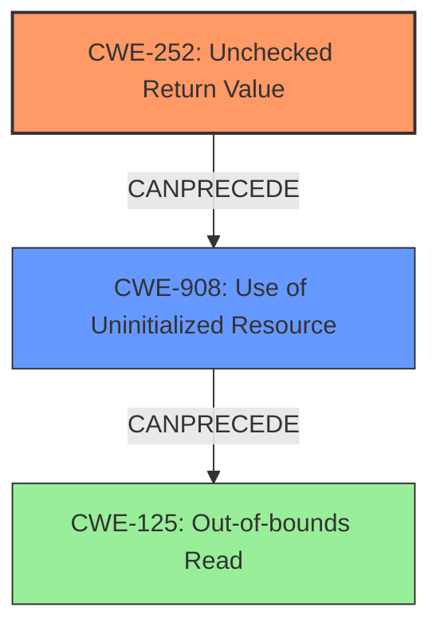

# Final Resolution for CVE-2021-32845

# Summary
| CWE ID | CWE Name | Confidence | CWE Abstraction Level | CWE Vulnerability Mapping Label | CWE-Vulnerability Mapping Notes |
|---|---|---|---|---|---|
| CWE-252 | Unchecked Return Value | 0.95 | Base | Allowed | Primary CWE |
| CWE-908 | Use of Uninitialized Resource | 0.85 | Base | Allowed | Secondary Candidate |
| CWE-125 | Out-of-bounds Read | 0.60 | Base | Allowed | Consequence |

## Evidence and Confidence

*   **Confidence Score:** 0.92
*   **Evidence Strength:** HIGH

## Relationship Analysis
The primary weakness is the **lack of checking the return value** of `vq_getchain` (**CWE-252**). This directly leads to the **use of uninitialized memory** in the form of the `iov` structure (**CWE-908**). The uninitialized memory is then used in a `read()` system call, which can result in an **out-of-bounds read** (**CWE-125**) if the uninitialized values happen to point to memory outside the allocated buffer.

## Vulnerability Chain
The vulnerability chain starts with the **root cause** of **CWE-252** [Unchecked Return Value], where the return value of the `vq_getchain` function is not checked. This leads to the `iov` structure being uninitialized (**CWE-908** [Use of Uninitialized Resource]). The use of this uninitialized structure in the `read()` system call can then lead to **CWE-125** [Out-of-bounds Read].

## Summary of Analysis
The initial analysis correctly identified **CWE-252** [Unchecked Return Value] as the primary **rootcause** because the vulnerability description explicitly states the missing check on the return value of the `vq_getchain` function. The analysis also correctly identified **CWE-908** [Use of Uninitialized Resource] as the secondary **weakness**, as the missing check leads to `iov` being uninitialized.

The suggestion in the criticism to consider **CWE-824** [Access of Uninitialized Pointer] instead of **CWE-908** [Use of Uninitialized Resource] was considered. While `iov.iov_base` is a pointer, the `iov.iov_len` is also uninitialized and used in the `read` call. Therefore, **CWE-908** [Use of Uninitialized Resource] is a more appropriate fit.

The suggestion to add **CWE-125** [Out-of-bounds Read] as a potential consequence was taken. The `read()` system call uses the uninitialized `iov` structure, and because `iov.iov_base` and `iov.iov_len` are uninitialized, the `read` call could attempt to read from an arbitrary memory location, leading to an out-of-bounds read.

The final classification reflects the chain of events, starting with the **rootcause** (**CWE-252** [Unchecked Return Value]), leading to the **weakness** (**CWE-908** [Use of Uninitialized Resource]), and finally to the **consequence** (**CWE-125** [Out-of-bounds Read]). The selected CWEs are at the optimal level of specificity, as they accurately represent the specific issues described in the vulnerability description.