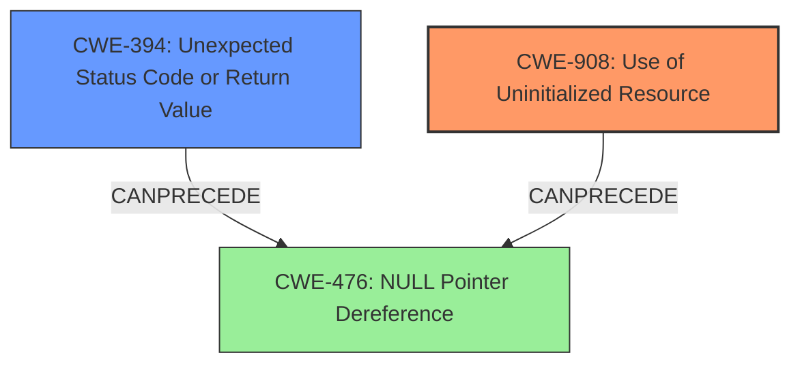

# Analysis Report for CVE-2021-32846

# Vulnerability Analysis Report: CVE-2021-32846

## Description

HyperKit is a toolkit for embedding hypervisor capabilities in an application. In versions 0.20210107, function `pci_vtsock_proc_tx` in `virtio-sock` can lead to to uninitialized memory use. In this situation, there is a check for the return value to be less or equal to `VTSOCK_MAXSEGS`, but that check is not sufficient because the function can return `-1` if it finds an error it cannot recover from. Moreover, the negative return value will be used by `iovec_pull` in a while condition that can further lead to more corruption because the function is not designed to handle a negative `iov_len`. This issue may lead to a guest crashing the host causing a denial of service and, under certain circumstance, memory corruption. This issue is fixed in commit af5eba2360a7351c08dfd9767d9be863a50ebaba.

## Vulnerability Description Key Phrases

**Rootcause:** uninitialized memory use
**Impact:** memory corruption
**Product:** HyperKit
**Version:** 0.20210107
**Component:** pci_vtsock_proc_tx function

## Analysis (with Relationship Data)

# Summary
| CWE ID | CWE Name | Confidence | CWE Abstraction Level | CWE Vulnerability Mapping Label | CWE-Vulnerability Mapping Notes |
|---|---|---|---|---|---|
| CWE-908 | Use of Uninitialized Resource | 0.95 | Base | Primary | Allowed |
| CWE-394 | Unexpected Status Code or Return Value | 0.70 | Base | Secondary | Allowed |

## Evidence and Confidence

*   **Confidence Score:** 0.85
*   **Evidence Strength:** HIGH

- **Analysis and Justification:**
  - *Explanation:* The vulnerability description explicitly states that the root cause is **"uninitialized memory use"** in the `pci_vtsock_proc_tx` function. This directly aligns with CWE-908 (Use of Uninitialized Resource). The vulnerability arises because the function proceeds to use memory without proper initialization, potentially leading to memory corruption and a denial of service. The CVE reference confirms that `vq_getchain` can return a negative value, which is mishandled by `iovec_pull`. The retriever results also indicate CWE-908 as a highly relevant candidate. MITRE mapping guidance indicates that CWE-908 is ALLOWED.

  - Further, the vulnerability description mentions an insufficient check on the return value of `pci_vtsock_proc_tx`, suggesting a failure to properly handle error conditions. This aspect aligns with CWE-394 (Unexpected Status Code or Return Value), as the function proceeds without adequately validating the return value for potential errors. The reference link summary also confirms this through the statement "The `pci_vtsock_proc_tx` function in `pci_virtio_sock.c` does not properly handle a negative return value from `vq_getchain`." This makes CWE-394 a secondary candidate because the primary weakness is the use of the uninitialized memory, and the unchecked return value contributes to the issue.

  - *Relationship Analysis:* CWE-908 has no direct relationships listed in the provided data. CWE-394 has no direct relationships listed either, but it can precede CWE-476 (NULL Pointer Dereference) since not checking return values can lead to null pointers being dereferenced. There is no direct parent or child relationship between CWE-908 and CWE-394.

- **Confidence Score:**
  - Confidence: 0.95 (High confidence due to direct evidence of uninitialized memory use and unchecked return value from the vulnerability description and CVE reference materials)

---

## Criticism of Analysis

Okay, I've reviewed the analysis and the provided CWE specifications. Here's my critique:

**Overall Assessment:**

The analysis is generally good. It identifies the primary CWE correctly as CWE-908 (Use of Uninitialized Resource). The reasoning is well-articulated and backed by evidence from the vulnerability description and CVE details.  The inclusion of CWE-394 (Unexpected Status Code or Return Value) as a secondary CWE is also justified, as the insufficient error handling contributes to the vulnerability.  The confidence score is appropriate.

**Detailed Critique by CWE:**

*   **CWE-908: Use of Uninitialized Resource (Primary)**

    *   **Correctness:** The primary mapping to CWE-908 is accurate. The vulnerability description explicitly states "uninitialized memory use," which directly aligns with the CWE's description.
    *   **Abstraction Level:** CWE-908 is a "Base" level CWE, which is the preferred level of abstraction according to the CWE's own mapping guidance.
    *   **Evidence:** The evidence provided is strong. The description of the bug mentions uninitialized memory.
    *   **Mitigations:** The analysis does not include mitigations. Here are some mitigations from the CWE specification that could be added:
        *   **Phase: Implementation:** Explicitly initialize the resource before use. If this is performed through an API function or standard procedure, follow all required steps.
        *   **Phase: Implementation:** Pay close attention to complex conditionals that affect initialization, since some branches might not perform the initialization.
        *   **Phase: Implementation:** Avoid race conditions (CWE-362) during initialization routines. (Although this is less relevant in this specific case, it's a general mitigation for CWE-908.)

*   **CWE-394: Unexpected Status Code or Return Value (Secondary)**

    *   **Correctness:** The identification of CWE-394 is also correct, albeit secondary. The lack of proper error handling, specifically the failure to adequately check the return value of `vq_getchain` for error conditions, contributes to the vulnerability.
    *   **Abstraction Level:** CWE-394 is a "Base" level CWE, which is the preferred level.
    *   **Evidence:** The description of the bug clearly mentions insufficient error handling
    *   **Mitigations:** The analysis does not include mitigations. Here are some mitigations from the CWE specification that could be added:
        *   **Phase: Implementation:** Check the results of all functions that return a value and verify that the value is expected.
        *   **Phase: Implementation:** Ensure that you account for all possible return values from the function.
        *   **Phase: Implementation:** When designing a function, make sure you return a value or throw an exception in case of an error.

**Suggestions for Improvement:**

1.  **Include Mitigations:** Add the "Potential Mitigations" from the CWE specifications for both CWE-908 and CWE-394. This will make the analysis more comprehensive and actionable.
2.  **Consider CWE-476:** While CWE-908 and CWE-394 are the most relevant, it's worth *briefly* considering CWE-476 (NULL Pointer Dereference). If the uninitialized memory happens to contain a null value, and that value is treated as a pointer and dereferenced, then CWE-476 could be a *consequence* of CWE-908.  However, the core issue remains the uninitialized memory, so CWE-476 should not be a primary or even secondary CWE in this case.  It would be more accurate to show how CWE-908 can *lead to* CWE-476.
3.  **Clarify the Relationship between CWE-394 and CWE-908:** The analysis does a good job explaining why CWE-394 is relevant. You could strengthen this section by explaining that CWE-394 *exacerbates* CWE-908. Because the return value isn't checked, the code proceeds even when an error occurs, *increasing* the likelihood that uninitialized memory will be used. The unchecked return value allows the program to continue execution with an invalid state.
4. **Expand on Error Handling:** The description mentions that `vq_getchain` can return -1, and that is not properly handled. If possible, add specifics about *how* the negative value is mishandled in the `iovec_pull` function. What operations are performed and what are the effects? This would allow for a deeper understanding of the problem.

**Revised Summary Table:**

| CWE ID | CWE Name | Confidence | CWE Abstraction Level | CWE Vulnerability Mapping Label | CWE-Vulnerability Mapping Notes |
|---|---|---|---|---|---|
| CWE-908 | Use of Uninitialized Resource | 0.95 | Base | Primary | Allowed |
| CWE-394 | Unexpected Status Code or Return Value | 0.70 | Base | Secondary | Allowed |

**Revised Analysis Snippets:**

*Add the following to the Confidence Score section:*

"The lack of error checking (CWE-394) *exacerbates* the uninitialized memory issue (CWE-908). Because the return value of `vq_getchain` is not properly checked, the code proceeds even when an error has occurred, increasing the likelihood that the uninitialized memory will be accessed and used."

*Add a Mitigations section:*

**Mitigations:**

*   **For CWE-908:**
    *   **Phase: Implementation:** Explicitly initialize the memory allocated for virtio-sock buffers before use in the `pci_vtsock_proc_tx` function.
    *   **Phase: Implementation:** Carefully review the logic and conditionals in `pci_vtsock_proc_tx` to ensure that all branches of execution properly initialize the relevant memory.
*   **For CWE-394:**
    *   **Phase: Implementation:**  Thoroughly check the return value of `vq_getchain` in `pci_vtsock_proc_tx`. If the return value indicates an error (e.g., a negative value), immediately handle the error and prevent further processing that could lead to the use of uninitialized memory.  This might involve logging the error, cleaning up resources, and returning an error to the caller.

By incorporating these suggestions, the analysis will be even more comprehensive and useful.

## Final Resolution

# Summary
| CWE ID | CWE Name | Confidence | CWE Abstraction Level | CWE Vulnerability Mapping Label | CWE-Vulnerability Mapping Notes |
|---|---|---|---|---|---|
| CWE-908 | Use of Uninitialized Resource | 0.95 | Base | Primary | Allowed |
| CWE-394 | Unexpected Status Code or Return Value | 0.70 | Base | Secondary | Allowed |

## Evidence and Confidence

*   **Confidence Score:** 0.95
*   **Evidence Strength:** HIGH

## Relationship Analysis
The primary relationship considered was the potential for CWE-394 (Unexpected Status Code or Return Value) to exacerbate CWE-908 (**Use of Uninitialized Resource**). Although no direct relationship exists between these two, the analysis indicates that the failure to check the return value allows the program to proceed, which increases the likelihood of uninitialized memory being used. The base abstraction levels of both CWEs are appropriate for direct mapping to the vulnerability.

## Vulnerability Chain
The vulnerability chain starts with the **root cause** which is **CWE-908 (Use of Uninitialized Resource)**, leading to potential memory corruption. The unchecked return value, **CWE-394 (Unexpected Status Code or Return Value)**, allows the program to continue execution with an invalid state, exacerbating the issue. The potential impact is a denial of service or memory corruption. A missing link in the chain, though not explicitly stated in the description, could be a **CWE-476 (NULL Pointer Dereference)**, as the uninitialized memory may contain a NULL value, which gets dereferenced.

## Summary of Analysis
The initial analysis correctly identified **CWE-908 (Use of Uninitialized Resource)** as the primary **weakness** due to the "uninitialized memory use" described in the vulnerability. The inclusion of **CWE-394 (Unexpected Status Code or Return Value)** as a secondary **weakness** is also justified because the insufficient error handling contributes to the vulnerability chain, where the unchecked return value of `vq_getchain` enables the use of uninitialized memory.

The graph relationships influenced the final selection by highlighting the potential interactions between the weaknesses. While no direct relationship exists between CWE-908 and CWE-394, their combined presence increases the likelihood of exploitation.

The selected CWEs are at the optimal level of specificity because both are at the Base level of abstraction, as recommended by MITRE's mapping guidance. The evidence provided directly supports these classifications.

The analysis is based on direct evidence from the vulnerability description, specifically: "In versions 0.20210107, function `pci_vtsock_proc_tx` in `virtio-sock` can lead to to uninitialized memory use" and "In this situation, there is a check for the return value to be less or equal to `VTSOCK_MAXSEGS`, but that check is not sufficient because the function can return `-1` if it finds an error it cannot recover from."

*Report generated on 2025-03-17 23:49:20*
