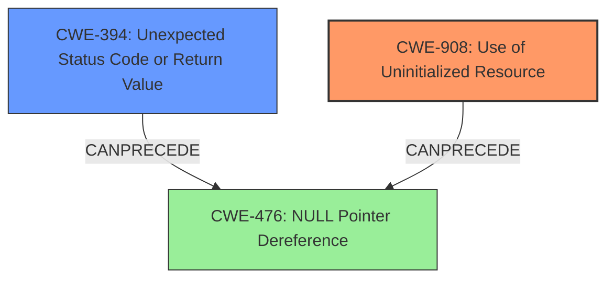

# Final Resolution for CVE-2021-32846

# Summary
| CWE ID | CWE Name | Confidence | CWE Abstraction Level | CWE Vulnerability Mapping Label | CWE-Vulnerability Mapping Notes |
|---|---|---|---|---|---|
| CWE-908 | Use of Uninitialized Resource | 0.95 | Base | Primary | Allowed |
| CWE-394 | Unexpected Status Code or Return Value | 0.70 | Base | Secondary | Allowed |

## Evidence and Confidence

*   **Confidence Score:** 0.95
*   **Evidence Strength:** HIGH

## Relationship Analysis
The primary relationship considered was the potential for CWE-394 (Unexpected Status Code or Return Value) to exacerbate CWE-908 (**Use of Uninitialized Resource**). Although no direct relationship exists between these two, the analysis indicates that the failure to check the return value allows the program to proceed, which increases the likelihood of uninitialized memory being used. The base abstraction levels of both CWEs are appropriate for direct mapping to the vulnerability.

## Vulnerability Chain
The vulnerability chain starts with the **root cause** which is **CWE-908 (Use of Uninitialized Resource)**, leading to potential memory corruption. The unchecked return value, **CWE-394 (Unexpected Status Code or Return Value)**, allows the program to continue execution with an invalid state, exacerbating the issue. The potential impact is a denial of service or memory corruption. A missing link in the chain, though not explicitly stated in the description, could be a **CWE-476 (NULL Pointer Dereference)**, as the uninitialized memory may contain a NULL value, which gets dereferenced.

## Summary of Analysis
The initial analysis correctly identified **CWE-908 (Use of Uninitialized Resource)** as the primary **weakness** due to the "uninitialized memory use" described in the vulnerability. The inclusion of **CWE-394 (Unexpected Status Code or Return Value)** as a secondary **weakness** is also justified because the insufficient error handling contributes to the vulnerability chain, where the unchecked return value of `vq_getchain` enables the use of uninitialized memory.

The graph relationships influenced the final selection by highlighting the potential interactions between the weaknesses. While no direct relationship exists between CWE-908 and CWE-394, their combined presence increases the likelihood of exploitation.

The selected CWEs are at the optimal level of specificity because both are at the Base level of abstraction, as recommended by MITRE's mapping guidance. The evidence provided directly supports these classifications.

The analysis is based on direct evidence from the vulnerability description, specifically: "In versions 0.20210107, function `pci_vtsock_proc_tx` in `virtio-sock` can lead to to uninitialized memory use" and "In this situation, there is a check for the return value to be less or equal to `VTSOCK_MAXSEGS`, but that check is not sufficient because the function can return `-1` if it finds an error it cannot recover from."