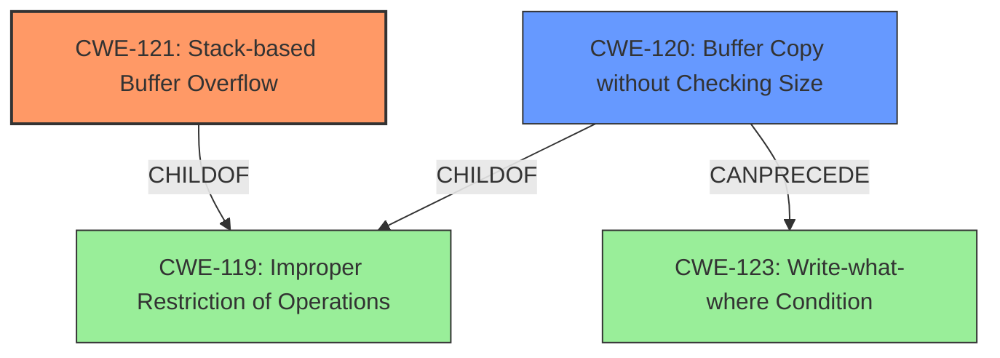

# Final Resolution for CVE-2021-32941

# Summary
| CWE ID | CWE Name | Confidence | CWE Abstraction Level | CWE Vulnerability Mapping Label | CWE-Vulnerability Mapping Notes |
|---|---|---|---|---|---|
| CWE-121 | Stack-based Buffer Overflow | 0.95 | Variant | Allowed | Primary CWE |
| CWE-120 | Buffer Copy without Checking Size of Input ('Classic Buffer Overflow') | 0.7 | Base | Allowed-with-Review | Secondary Candidate |

## Evidence and Confidence

*   **Confidence Score:** 0.90
*   **Evidence Strength:** HIGH

## Relationship Analysis
The primary relationship is that CWE-121 is a specific type of **buffer overflow** that occurs on the stack. CWE-120 represents a more general case of **buffer overflow** due to unchecked buffer copies. While CWE-120 is a child of CWE-119 (Improper Restriction of Operations within the Bounds of a Memory Buffer), it's considered a secondary candidate because the description doesn't explicitly mention a buffer copy operation, but it can be inferred. The "CANPRECEDE" relationship between CWE-120 and CWE-123 (Write-what-where Condition) indicates a potential path to arbitrary memory writes if the **buffer overflow** is exploited successfully.

## Vulnerability Chain
The vulnerability chain starts with a **stack-based buffer overflow (CWE-121)**, which is triggered by an unvalidated input leading to an out-of-bounds write. This could potentially lead to a "Write-What-Where" condition **(CWE-123)**, allowing the attacker to overwrite arbitrary memory locations. The root cause is the lack of proper bounds checking on the input, which is then copied to a stack-allocated buffer, potentially due to **buffer copy without checking size (CWE-120)**. The impact is arbitrary code execution with root privileges.

## Summary of Analysis
The initial analysis correctly identified CWE-121 as the primary CWE due to the explicit mention of a **stack-based buffer overflow** in the vulnerability description. The evidence from the vulnerability description ("...vulnerable to a stack-based buffer overflow, which allows an unauthorized remote attacker to execute arbitrary code with the same privileges as the server user (root).") directly supports this classification.

The criticism suggested strengthening the analysis of CWE-120 by considering potential scenarios in the NVR code where a buffer copy might be occurring. While there is no explicit mention of a buffer copy operation, the possibility exists, and it's common for **buffer overflows** to involve copying data into a buffer without proper size checks. Therefore, I am increasing the confidence score for CWE-120 to 0.7 to reflect this.

The graph relationships influenced my decision by highlighting the potential chain of events. The **buffer overflow (CWE-121)** could lead to arbitrary memory writes **(CWE-123)**, especially if an unchecked buffer copy is involved **(CWE-120)**.

The selected CWEs are at the optimal level of specificity because CWE-121 precisely describes the type of **buffer overflow** (stack-based), while CWE-120 captures the potential for unchecked buffer copies as a contributing factor. Using the more general CWE-119 would not provide enough detail about the specific nature of the vulnerability.