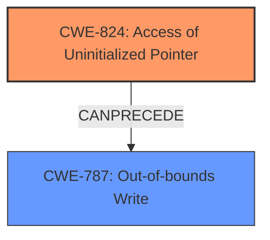

# Final Resolution for CVE-2021-33015

# Summary
| CWE ID  | CWE Name                                        | Confidence | CWE Abstraction Level | CWE Vulnerability Mapping Label | CWE-Vulnerability Mapping Notes |
| :-------- | :---------------------------------------------- | :--------- | :-------------------- | :------------------------------ | :------------------------------ |
| CWE-824 | Access of **Uninitialized Pointer**                | 0.95       | Base                  | Allowed                         | Primary CWE; Root Cause                   |
| CWE-787 | **Out-of-bounds Write**                           | 0.85       | Base                  | Allowed                         | Secondary Candidate; Consequence of CWE-824         |

## Evidence and Confidence

*   **Confidence Score:** 0.93
*   **Evidence Strength:** HIGH

## Relationship Analysis
The primary relationship is that CWE-824 (Access of **Uninitialized Pointer**) *CanPrecede* CWE-787 (**Out-of-bounds Write**). This accurately reflects the vulnerability where the **uninitialized pointer** is used to write data outside the intended buffer. Both CWEs are at the Base level, providing the optimal level of specificity. No peer relationships significantly impact the classification.

## Vulnerability Chain
The vulnerability chain starts with the **uninitialized pointer** (CWE-824). When this pointer is dereferenced and used in a write operation, it leads to an **out-of-bounds write** (CWE-787). The consequence of this is potential code execution.

## Summary of Analysis
The initial analysis and criticism accurately identify CWE-824 as the primary weakness and CWE-787 as a secondary consequence. The vulnerability description explicitly states an **out-of-bounds write** due to an **uninitialized pointer**: "Cscape (All Versions prior to 9.90 SP5) lacks proper validation of user-supplied data when parsing project files. This could lead to an **out-of-bounds write** via an **uninitialized pointer**."

The relationship analysis reinforces this by showing that CWE-824 can precede CWE-787. Both CWEs are at the Base level of abstraction, providing the optimal level of specificity.

I agree with the criticism that CWE-908 (Use of Uninitialized Resource) is similar, but CWE-824 is more specific because it involves a *pointer*. The analysis also correctly rejects CWE-1284 (Improper Validation of Specified Quantity in Input) as less directly applicable, and CWE-476 (NULL Pointer Dereference) as too specific (the pointer might not be NULL, just uninitialized). I also agree with rejecting CWE-20 (Improper Input Validation) because it is too high-level.

Final Determination: The assigned CWEs are accurate and well-justified. The primary CWE (CWE-824) represents the root cause, and the secondary CWE (CWE-787) represents a direct consequence. The analysis appropriately considers and rejects other potential CWEs.