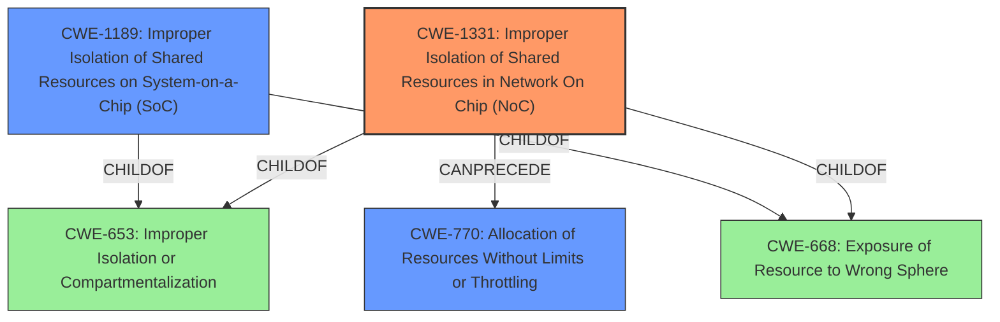

# Final Resolution for CVE-2021-33096

# Summary
| CWE ID    | CWE Name                                                              | Confidence | CWE Abstraction Level | CWE Vulnerability Mapping Label | CWE-Vulnerability Mapping Notes |
| :-------- | :-------------------------------------------------------------------- | :--------- | :---------------------- | :------------------------------ | :------------------------------ |
| CWE-1331  | Improper Isolation of Shared Resources in Network On Chip (NoC)       | 0.95       | Base                    | Primary                         | Allowed                         |
| CWE-1189 | Improper Isolation of Shared Resources on System-on-a-Chip (SoC) | 0.75       | Base                    | Secondary                         | Allowed                         |
| CWE-770 | Allocation of Resources Without Limits or Throttling | 0.60      | Base                    | Secondary                         | Allowed                         |

## Evidence and Confidence

*   **Confidence Score:** 0.9
*   **Evidence Strength:** HIGH

## Relationship Analysis
The primary relationship is hierarchical, with CWE-1331 being a more specific case of CWE-1189. Both are children of broader categories like CWE-668 and CWE-653, indicating general resource isolation issues. The chain relationship shows that **CWE-1331**, the **root cause**, can lead to resource allocation issues represented by **CWE-770**, potentially causing denial of service. The abstraction levels influenced the decision, favoring the base level CWE-1331 for its specificity over the class-level CWEs.

## Vulnerability Chain
The chain starts with **CWE-1331**, the **root cause**, where shared resources are improperly isolated within the Network on Chip. This lack of isolation (**WEAKNESS**) can allow an attacker to influence resource allocation, leading to **CWE-770**, where resources are allocated without limits or throttling. This ultimately results in a denial-of-service (DoS) impact.

## Summary of Analysis
The initial analysis and criticism provide a strong foundation for classifying this vulnerability. The decision is heavily based on the vulnerability description's explicit mention of "Improper isolation of shared resources in network on chip," which directly aligns with **CWE-1331** (Improper Isolation of Shared Resources in Network On Chip (NoC)). As stated in the initial analysis: "'The vulnerability description explicitly states **'Improper isolation of shared resources'** in the network on chip of Intel Ethernet Controllers and Adapters. This aligns directly with CWE-1331 (Improper Isolation of Shared Resources in Network On Chip (NoC)), which describes a scenario where a NoC does not isolate or incorrectly isolates its on-chip-fabric and internal resources, leading to potential vulnerabilities."

The graph relationships further support this decision. While **CWE-1189** (Improper Isolation of Shared Resources on System-on-a-Chip (SoC)) is a related and valid secondary classification, **CWE-1331** is more specific to the affected component. The initial classification of **CWE-400** (Uncontrolled Resource Consumption) is replaced with **CWE-770** (Allocation of Resources Without Limits or Throttling) as the impact instead of the **root cause**. The selected CWEs are at the optimal level of specificity, with **CWE-1331** as the primary **root cause** and **CWE-770** representing the immediate consequence of the isolation failure.