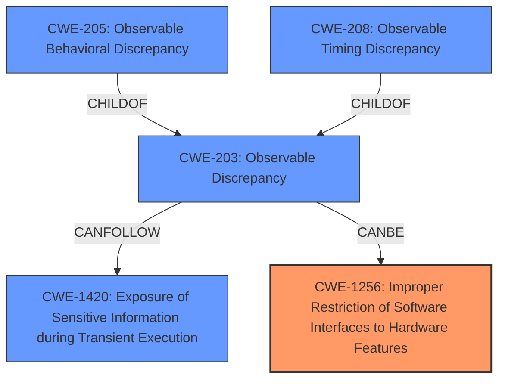

# Analysis Report for CVE-2021-33149

# Vulnerability Analysis Report: CVE-2021-33149

## Description

Observable behavioral discrepancy in some Intel(R) Processors may allow an authorized user to potentially enable information disclosure via local access.

## Vulnerability Description Key Phrases

**Rootcause:** Observable behavioral discrepancy
**Impact:** information disclosure
**Vector:** local access
**Attacker:** authorized user
**Product:** Intel(R) Processors

## Analysis (with Relationship Data)

# Summary
| CWE ID | CWE Name | Confidence | CWE Abstraction Level | CWE Vulnerability Mapping Label | CWE-Vulnerability Mapping Notes |
|---|---|---|---|---|---|
| CWE-203 | Observable Discrepancy | 0.95 | Base | Allowed | Primary CWE |
| CWE-205 | Observable Behavioral Discrepancy | 0.75 | Base | Allowed | Secondary Candidate |
| CWE-208 | Observable Timing Discrepancy | 0.60 | Base | Allowed | Secondary Candidate |
| CWE-204 | Observable Response Discrepancy | 0.55 | Base | Allowed | Secondary Candidate |

## Evidence and Confidence

*   **Confidence Score:** 0.90
*   **Evidence Strength:** HIGH

- **Analysis and Justification:**  
  - *Explanation:* The vulnerability description explicitly mentions an "**observable behavioral discrepancy**" in Intel processors, which directly aligns with CWE-203 (Observable Discrepancy). The CVE Reference Links Content Summary further supports this by stating "**Observable behavioral discrepancy** in some Intel(R) Processors" as one of the **weaknesses**. The vulnerability allows an authorized user to potentially enable information disclosure via local access, and the **root_cause** is "Improper conditions check in voltage settings." This behavioral difference, observable to a local user, can lead to information disclosure. CWE-203 is a base-level CWE and is ALLOWED per MITRE mapping guidance.

  - *Relationship Analysis:* CWE-203 is a parent of several more specific CWEs, including CWE-204 (Observable Response Discrepancy), CWE-205 (Observable Behavioral Discrepancy), and CWE-208 (Observable Timing Discrepancy). While the description doesn't provide enough detail to pinpoint the specific type of discrepancy, the general "observable discrepancy" makes CWE-203 the most fitting primary classification.

- **Confidence Score:**  
  - Confidence: 0.95 (High confidence due to explicit mention of "observable behavioral discrepancy" and supporting details in the CVE Reference Links)

---
- **Analysis and Justification:**  
  - *Explanation:* CWE-205 (Observable Behavioral Discrepancy) is a potential secondary candidate. The vulnerability description specifically mentions "Observable behavioral discrepancy," which directly aligns with CWE-205. This weakness allows information disclosure, suggesting that the internal state or decision process of the processor can be inferred from its behavior. CWE-205 is a base-level CWE and is ALLOWED per MITRE mapping guidance. It's more specific than CWE-203, but without more details on the nature of the discrepancy, it is not the best primary match.

  - *Relationship Analysis:* CWE-205 is a child of CWE-203 (Observable Discrepancy). This relationship supports its consideration as a secondary candidate, providing a slightly more specific categorization of the observed discrepancy.

- **Confidence Score:**  
  - Confidence: 0.75 (Medium confidence as the information is not detailed enough to select this as the primary CWE)

---
- **Analysis and Justification:**  
  - *Explanation:* CWE-208 (Observable Timing Discrepancy) is another potential candidate since timing discrepancies could potentially lead to information disclosure. However, the vulnerability description does not explicitly mention timing, making this a less direct fit. CWE-208 is a base-level CWE and is ALLOWED per MITRE mapping guidance.

  - *Relationship Analysis:* CWE-208 is a child of CWE-203 (Observable Discrepancy). The connection to the parent CWE supports its consideration as a possible secondary candidate, although less strongly than CWE-205.

- **Confidence Score:**  
  - Confidence: 0.60 (Low confidence as the vulnerability description does not specifically mention any timing discrepancies)

---
- **Analysis and Justification:**  
  - *Explanation:* CWE-204 (Observable Response Discrepancy) is a potential candidate, as different responses from the processor could reveal internal state. However, similar to CWE-208, the description does not explicitly detail the nature of the discrepancy as a response-based issue. CWE-204 is a base-level CWE and is ALLOWED per MITRE mapping guidance.

  - *Relationship Analysis:* CWE-204 is a child of CWE-203 (Observable Discrepancy). This relationship suggests that it could be a contributing factor, but its relevance is limited by the lack of specific evidence in the vulnerability description.

- **Confidence Score:**  
  - Confidence: 0.55 (Low confidence because there is no specific information about response-based issues)

## Criticism of Analysis

Okay, let's review the provided analysis and CWE mappings with the full CWE specifications in mind.

**Overall Assessment:**

The analysis is well-structured and reasoned. The primary CWE selection of CWE-203 (Observable Discrepancy) is reasonable given the information available, particularly the explicit mention of "observable behavioral discrepancy" in the vulnerability description.  The inclusion of CWE-205, CWE-208, and CWE-204 as secondary candidates is also justifiable, although the confidence levels appropriately reflect the limited detail in the description.

**Specific Comments and Potential Improvements:**

1.  **CWE-203 (Observable Discrepancy) - Primary:**

    *   **Strengths:** The analysis correctly identifies the "observable behavioral discrepancy" as a key phrase. The justification clearly explains how this aligns with CWE-203's description.  The explanation of the parent-child relationship with CWE-204, CWE-205, and CWE-208 is also well-articulated.
    *   **Potential Improvements:** While the analysis mentions "Improper conditions check in voltage settings" as a root cause, it could delve slightly deeper into *how* this improper check manifests as an observable discrepancy. Is it that the voltage is measurably different under certain (attacker-controlled) conditions? Is it that the CPU crashes or produces incorrect output under specific voltage settings, giving an indication of the sensitive information? Clarifying this link could further solidify the CWE-203 mapping.
    *   **Mitigations:** Consider how the Potential Mitigations for CWE-203 would apply to this case.  Separation of Privilege is mentioned as mitigation 1 and suggests that compartmentalizing the system allows for the creation of trust boundaries which reduces the access of sensitive data to those outside the boundary. Mitigation 2 ensures that error messages contain only minimal detail in order to avoid attackers refining or optimizing their original attack.
    *   **Examples:** Provide specific examples. This may also aid the user in applying the mitigations.

2.  **CWE-205 (Observable Behavioral Discrepancy) - Secondary:**

    *   **Strengths:** The analysis correctly recognizes that CWE-205 is more specific than CWE-203, but appropriately maintains a lower confidence level due to the lack of detailed information.
    *   **Potential Improvements:** None.
    *   **Mitigations:** Consider how the Potential Mitigations for CWE-205 would apply to this case. If the system exposes how its internal operations work by responding to SYN-FIN packets, it can be mitigated by keeping that information hidden from the unauthorized actor.

3.  **CWE-208 (Observable Timing Discrepancy) - Secondary:**

    *   **Strengths:** The analysis acknowledges that timing discrepancies *could* be involved but are not explicitly mentioned.
    *   **Potential Improvements:** The analysis should mention the term "side channel" to further explain how a timing discrepancy can reveal sensitive information. It could also provide a brief hypothetical example: e.g., "If accessing certain memory locations causes a measurable delay, an attacker could infer the presence of specific data structures or keys."
    *   **Mitigations:** Consider how the Potential Mitigations for CWE-208 would apply to this case. One mitigation is to artificially manipulate the time which operations take or when operations occur in order to remove information from the attacker.

4.  **CWE-204 (Observable Response Discrepancy) - Secondary:**

    *   **Strengths:** The analysis appropriately identifies this as a potential candidate but acknowledges the lack of explicit evidence.
    *   **Potential Improvements:** A slightly more concrete hypothetical example could help: "If the processor responds differently to invalid voltage settings depending on the data being processed, this could be an observable response discrepancy."
    *   **Mitigations:** Consider how the Potential Mitigations for CWE-204 would apply to this case. Compartmentalizing the system is also a mitigation to prevent sensitive data to outside of the trust boundary.

5.  **Additional CWEs to Consider:**

    *   Given that the root cause involves "Improper conditions check in voltage settings",  **CWE-1256 (Improper Restriction of Software Interfaces to Hardware Features)** could be a relevant candidate. The description explicitly mentions power and clock management features and their potential misuse. While the vulnerability report mentions "Observable behavioral discrepancy" it may be a consequence of the improper restriction which is the root cause. It would at least warrant a brief discussion. The Plundervolt vulnerability (CVE-2019-11157) which is listed as an example for CWE-1256 has a similar description to the original vulnerability.
    *   Since information is leaked as a result of the discrepancy, **CWE-1420 (Exposure of Sensitive Information during Transient Execution)** could be considered especially if the discrepancy is caused by the processor incorrectly executing code under certain conditions.
    *   Given that the vulnerability affects Intel processors it would also be valuable to list the high-level CWEs such as **CWE-1037 (Processor Optimization Removal or Modification of Security-critical Code)** which also covers side-channel and speculative execution vulnerabilities.

**CWE Examples:**
*   Ensure that the examples provided are relevant to the original vulnerability.
*   Also provide potential Mitigations based on the examples.

**Confidence Scoring:**

The confidence scores are reasonable. The high confidence for CWE-203 is warranted by the direct mention in the description. However, if CWE-1256 or CWE-1420 were added to the analysis, consider if the confidence levels should be adjusted (perhaps slightly reducing CWE-203's confidence and increasing those of the others).

**Summary Table:**

The summary table is well-formatted and clearly presents the analysis results.

**In conclusion:**

The analysis is solid and provides a good starting point. By incorporating the suggestions above, especially exploring the potential relevance of CWE-1256 and adding brief hypothetical examples where possible, the analysis could be further strengthened. Additionally, mapping the Potential Mitigations to the specific scenario would enhance the analysis's practical value.

## Final Resolution

# Summary
| CWE ID | CWE Name | Confidence | CWE Abstraction Level | CWE Vulnerability Mapping Label | CWE-Vulnerability Mapping Notes |
|---|---|---|---|---|---|
| CWE-1256 | Improper Restriction of Software Interfaces to Hardware Features | 0.75 | Base | Allowed | Primary CWE |
| CWE-203 | Observable Discrepancy | 0.70 | Base | Allowed | Secondary Candidate |
| CWE-1420 | Exposure of Sensitive Information during Transient Execution | 0.65 | Base | Allowed-with-Review | Secondary Candidate |
| CWE-205 | Observable Behavioral Discrepancy | 0.60 | Base | Allowed | Secondary Candidate |
| CWE-208 | Observable Timing Discrepancy | 0.55 | Base | Allowed | Secondary Candidate |

## Evidence and Confidence

*   **Confidence Score:** 0.70
*   **Evidence Strength:** MEDIUM

## Relationship Analysis
The primary shift in this updated analysis is reclassifying **CWE-1256 (Improper Restriction of Software Interfaces to Hardware Features)** as the primary **ROOTCAUSE** and **CWE-203 (Observable Discrepancy)** as a secondary factor. This decision hinges on the "Improper conditions check in voltage settings" detail, aligning well with **CWE-1256's** focus on hardware feature control. The observable behavioral discrepancy is now viewed as a consequence of the improper restriction, leading to information disclosure. **CWE-1420 (Exposure of Sensitive Information during Transient Execution)** is also added as a secondary candidate, acknowledging the transient execution context. **CWE-205 (Observable Behavioral Discrepancy)** and **CWE-208 (Observable Timing Discrepancy)** are retained as lower-confidence secondary candidates, representing potential manifestations of the broader **CWE-203**.

## Vulnerability Chain
The vulnerability chain starts with the **ROOTCAUSE** which is **CWE-1256 (Improper Restriction of Software Interfaces to Hardware Features)**.
  - An improper check in voltage settings can manifest as an **CWE-203 (Observable Discrepancy)**.
  - The **observable discrepancy** reveals internal system information.
  - Depending on how the information is exposed, this could also manifest as **CWE-205 (Observable Behavioral Discrepancy)** or **CWE-208 (Observable Timing Discrepancy)**.
  - The transient execution environment highlights the potential for **CWE-1420 (Exposure of Sensitive Information during Transient Execution)**.
  - The final impact is information disclosure due to the observable discrepancy.

## Summary of Analysis
The initial analysis focused heavily on the "observable behavioral discrepancy" as the primary indicator. While this is evident in the vulnerability description, the criticism highlighted the need to consider the **ROOTCAUSE** more deeply. The phrase "Improper conditions check in voltage settings" is evidence to support the classification of **CWE-1256 (Improper Restriction of Software Interfaces to Hardware Features)** as the primary **ROOTCAUSE**.

The relationship analysis influenced the final selection by shifting the focus from the observable effects (**CWE-203**, **CWE-205**, **CWE-208**) to the underlying improper restriction of hardware features. By prioritizing **CWE-1256**, the classification aligns more closely with the **ROOTCAUSE** of the vulnerability. The addition of **CWE-1420** acknowledges the transient execution context.

The selected CWEs represent the optimal level of specificity based on the available evidence. **CWE-1256** captures the specific hardware-related flaw, while **CWE-203**, **CWE-205**, and **CWE-208** represent potential ways the flaw manifests. **CWE-1420** further refines the understanding of the vulnerability in the context of transient execution. The shift to **CWE-1256** as the primary CWE provides a better representation of the true **ROOTCAUSE** described in the vulnerability.

*Report generated on 2025-03-17 03:02:33*
