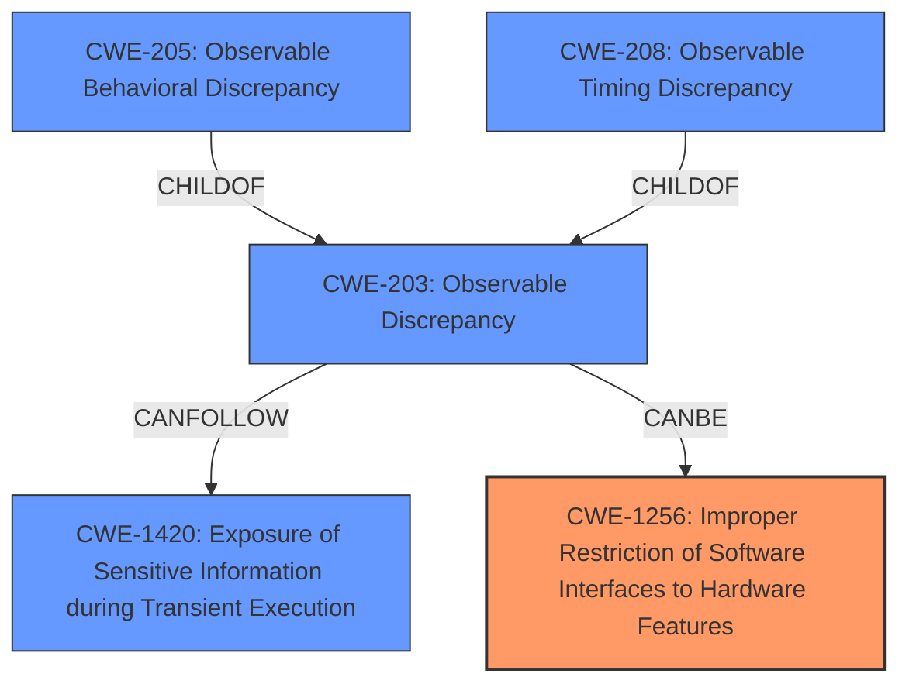

# Final Resolution for CVE-2021-33149

# Summary
| CWE ID | CWE Name | Confidence | CWE Abstraction Level | CWE Vulnerability Mapping Label | CWE-Vulnerability Mapping Notes |
|---|---|---|---|---|---|
| CWE-1256 | Improper Restriction of Software Interfaces to Hardware Features | 0.75 | Base | Allowed | Primary CWE |
| CWE-203 | Observable Discrepancy | 0.70 | Base | Allowed | Secondary Candidate |
| CWE-1420 | Exposure of Sensitive Information during Transient Execution | 0.65 | Base | Allowed-with-Review | Secondary Candidate |
| CWE-205 | Observable Behavioral Discrepancy | 0.60 | Base | Allowed | Secondary Candidate |
| CWE-208 | Observable Timing Discrepancy | 0.55 | Base | Allowed | Secondary Candidate |

## Evidence and Confidence

*   **Confidence Score:** 0.70
*   **Evidence Strength:** MEDIUM

## Relationship Analysis
The primary shift in this updated analysis is reclassifying **CWE-1256 (Improper Restriction of Software Interfaces to Hardware Features)** as the primary **ROOTCAUSE** and **CWE-203 (Observable Discrepancy)** as a secondary factor. This decision hinges on the "Improper conditions check in voltage settings" detail, aligning well with **CWE-1256's** focus on hardware feature control. The observable behavioral discrepancy is now viewed as a consequence of the improper restriction, leading to information disclosure. **CWE-1420 (Exposure of Sensitive Information during Transient Execution)** is also added as a secondary candidate, acknowledging the transient execution context. **CWE-205 (Observable Behavioral Discrepancy)** and **CWE-208 (Observable Timing Discrepancy)** are retained as lower-confidence secondary candidates, representing potential manifestations of the broader **CWE-203**.

## Vulnerability Chain
The vulnerability chain starts with the **ROOTCAUSE** which is **CWE-1256 (Improper Restriction of Software Interfaces to Hardware Features)**.
  - An improper check in voltage settings can manifest as an **CWE-203 (Observable Discrepancy)**.
  - The **observable discrepancy** reveals internal system information.
  - Depending on how the information is exposed, this could also manifest as **CWE-205 (Observable Behavioral Discrepancy)** or **CWE-208 (Observable Timing Discrepancy)**.
  - The transient execution environment highlights the potential for **CWE-1420 (Exposure of Sensitive Information during Transient Execution)**.
  - The final impact is information disclosure due to the observable discrepancy.

## Summary of Analysis
The initial analysis focused heavily on the "observable behavioral discrepancy" as the primary indicator. While this is evident in the vulnerability description, the criticism highlighted the need to consider the **ROOTCAUSE** more deeply. The phrase "Improper conditions check in voltage settings" is evidence to support the classification of **CWE-1256 (Improper Restriction of Software Interfaces to Hardware Features)** as the primary **ROOTCAUSE**.

The relationship analysis influenced the final selection by shifting the focus from the observable effects (**CWE-203**, **CWE-205**, **CWE-208**) to the underlying improper restriction of hardware features. By prioritizing **CWE-1256**, the classification aligns more closely with the **ROOTCAUSE** of the vulnerability. The addition of **CWE-1420** acknowledges the transient execution context.

The selected CWEs represent the optimal level of specificity based on the available evidence. **CWE-1256** captures the specific hardware-related flaw, while **CWE-203**, **CWE-205**, and **CWE-208** represent potential ways the flaw manifests. **CWE-1420** further refines the understanding of the vulnerability in the context of transient execution. The shift to **CWE-1256** as the primary CWE provides a better representation of the true **ROOTCAUSE** described in the vulnerability.