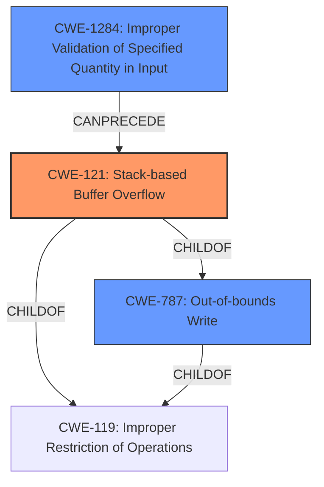

# Analysis Report for CVE-2021-33438

# Vulnerability Analysis Report: CVE-2021-33438

## Description

An issue was discovered in mjs (mJS Restricted JavaScript engine), ES6 (JavaScript version 6). There is stack buffer overflow in json_parse_array() in mjs.c.

## Vulnerability Description Key Phrases

**Weakness:** stack buffer overflow
**Product:** mjs
**Component:** json_parse_array() in mjs.c

## Analysis (with Relationship Data)

# Summary
| CWE ID | CWE Name | Confidence | CWE Abstraction Level | CWE Vulnerability Mapping Label | CWE-Vulnerability Mapping Notes |
|---|---|---|---|---|---|
| CWE-121 | Stack-based Buffer Overflow | 0.95 | Variant | Allowed | Primary CWE |
| CWE-125 | Out-of-bounds Read | 0.65 | Base | Allowed | Secondary Candidate |
| CWE-787 | Out-of-bounds Write | 0.65 | Base | Allowed | Secondary Candidate |

## Evidence and Confidence

*   **Confidence Score:** 0.90
*   **Evidence Strength:** HIGH

- **Analysis and Justification:**  
  - *Explanation:* The vulnerability description clearly states a "**stack buffer overflow**" in the `json_parse_array()` function. This directly aligns with CWE-121 (Stack-based Buffer Overflow), which describes a condition where a buffer allocated on the stack is overwritten. The CVE Reference Links Content Summary confirms this by stating the root cause is a stack buffer overflow in the mentioned function, triggered by a specially crafted file. The impact is a denial of service due to the program crashing. This detailed description and confirmation from CVE details makes CWE-121 the primary and most appropriate mapping. The MITRE mapping guidance allows CWE-121 for this kind of **buffer overflow** vulnerability.

  - *Relationship Analysis:* CWE-121 is a variant of CWE-119 (Improper Restriction of Operations within the Bounds of a Memory Buffer). It is also related to CWE-787 (Out-of-bounds Write) as the overflow results in writing outside the allocated buffer.

- **Confidence Score:**  
  - Confidence: 0.95 (High confidence due to explicit mention of stack buffer overflow and supporting CVE details)

- **Analysis and Justification:**  
  - *Explanation:* The vulnerability description mentions a "**stack buffer overflow**" where data is written beyond the allocated buffer size. This inherently means data is written out of bounds and potentially read from out of bounds. CWE-125 (Out-of-bounds Read) describes a condition where the product reads data past the end, or before the beginning, of the intended buffer. Since a **buffer overflow** often involves reading from unintended memory locations (though not explicitly stated here), CWE-125 is a candidate. The MITRE mapping guidance allows CWE-125 for this type of vulnerability. This is a secondary candidate because the primary issue is the write, but a read might be triggered.

  - *Relationship Analysis:* CWE-125 is a child of CWE-119 (Improper Restriction of Operations within the Bounds of a Memory Buffer). It can also be related to CWE-126 (Buffer Over-read), which is a more specific type of out-of-bounds read.

- **Confidence Score:**  
  - Confidence: 0.65 (Medium confidence as out-of-bounds read is a potential but not explicitly confirmed consequence of the overflow)

- **Analysis and Justification:**  
  - *Explanation:* The vulnerability description mentions a "**stack buffer overflow**" where data is written beyond the allocated buffer size. This directly relates to CWE-787 (Out-of-bounds Write), which describes a condition where the product writes data past the end, or before the beginning, of the intended buffer. While CWE-121 is a more specific variant, CWE-787 describes the fundamental write operation that causes the overflow. The MITRE mapping guidance allows CWE-787 for this type of vulnerability. This is a secondary candidate as it describes the general mechanism of the overflow.

  - *Relationship Analysis:* CWE-787 is a child of CWE-119 (Improper Restriction of Operations within the Bounds of a Memory Buffer).

- **Confidence Score:**  
  - Confidence: 0.65 (Medium confidence as the core mechanism is an out-of-bounds write, but a more specific CWE exists)

## Criticism of Analysis

Okay, I've reviewed your analysis of the vulnerability and the provided CWE specifications. Here's my critique:

**Overall Assessment:**

The analysis is generally good and well-reasoned. The primary CWE mapping to `CWE-121: Stack-based Buffer Overflow` is accurate and well-supported by the vulnerability description. The inclusion of `CWE-787: Out-of-bounds Write` and `CWE-125: Out-of-bounds Read` as secondary candidates is also justifiable, though the confidence levels assigned are appropriate.

**Detailed Review:**

*   **CWE-121: Stack-based Buffer Overflow (Primary):**

    *   **Confidence Level: 0.95** - This is reasonable given the explicit mention of a "stack buffer overflow" in the vulnerability description.
    *   **Justification:** The explanation is clear and directly links the vulnerability description to the definition of CWE-121.  It correctly identifies that the buffer being overwritten is on the stack.  The CVE summary confirmation further strengthens this mapping.
    *   **CWE Specification Alignment:** The analysis appropriately considers the parent-child relationships between CWE-121, CWE-787, and CWE-119.
    *   **Mapping Guidance:** The analysis follows the mapping guidance of using a more specific CWE (CWE-121) when the information is available, instead of relying solely on CWE-119.
    *   **Potential Mitigations:** The analysis should note the importance of input validation in the context of stack-based overflows, and also mention ASLR as a possible mitigation.

*   **CWE-787: Out-of-bounds Write (Secondary):**

    *   **Confidence Level: 0.65** - This is a suitable confidence level as it correctly recognizes that the core mechanism is an out-of-bounds write, but the more specific CWE-121 exists.
    *   **Justification:** The explanation accurately describes how a stack buffer overflow inherently involves writing data beyond the intended buffer's boundaries, which aligns with the definition of CWE-787.
    *   **CWE Specification Alignment:**  The analysis correctly positions CWE-787 as a child of CWE-119.
    *   **Mapping Guidance:**  The analysis correctly notes that while CWE-787 is a valid mapping, CWE-121 is a more precise variant, aligning with CWE's preference for specificity.

*   **CWE-125: Out-of-bounds Read (Secondary):**

    *   **Confidence Level: 0.65** - Appropriate. While not explicitly stated, a buffer overflow often leads to unintended reads from adjacent memory locations, making CWE-125 a plausible but less direct consequence.
    *   **Justification:** The explanation acknowledges that the overflow could potentially lead to out-of-bounds reads.
    *   **CWE Specification Alignment:** The analysis correctly places CWE-125 as a child of CWE-119 and relates it to CWE-126.
    *   **Mapping Guidance:** It aligns with the mapping guidance by considering CWE-125 as a potential consequence, even if not the primary mechanism.

**Suggestions for Improvement:**

1.  **Chain Analysis:** While the relationship analysis mentions parents and children, it could benefit from explicitly framing the vulnerability as a *chain*. For example:  "Improperly crafted JSON input (lack of input validation, implying CWE-20 or a child of CWE-20 such as CWE-1284) leads to a stack buffer overflow (CWE-121), resulting in a denial of service." This emphasizes the interconnectedness of weaknesses.
2.  **More Specific Mitigations:** The current mitigations are very general. It could improve by listing specific mitigations applicable to stack buffer overflows in C, such as using safer string handling functions (e.g., `strncpy` instead of `strcpy`, but emphasizing the need to handle the null termination correctly), compiler-based protections (like the `/GS` flag in Visual Studio or `-fstack-protector` in GCC), and Address Space Layout Randomization (ASLR). Mentioning that ASLR can make exploitation more difficult but isn't a complete defense.
3.  **Consider Input Validation (CWE-20 family):** The root cause of most buffer overflows is a failure to properly validate the input. While not the primary weakness demonstrated, acknowledging and *briefly* discussing the missing input validation (perhaps as a potential parent in the chain) is important.  It might not be explicitly stated in the report, but the vulnerability is always caused by some kind of bad data.  This links to mitigations around "accept known good" input strategies.
4.  **Observed Examples:** While you include observed examples for the different CWEs, finding an example that also involved JSON parsing would further strengthen your argument.

**Revised Summary Table:**

| CWE ID  | CWE Name                         | Confidence | CWE Abstraction Level | CWE Vulnerability Mapping Label | CWE-Vulnerability Mapping Notes                                                                                                                                                                             |
| :------ | :-------------------------------- | :--------- | :-------------------- | :------------------------------ | :-------------------------------------------------------------------------------------------------------------------------------------------------------------------------------------------------------- |
| CWE-121 | Stack-based Buffer Overflow         | 0.95       | Variant               | Allowed                       | Primary CWE. Triggered by a crafted JSON input leading to memory corruption on the stack.                                                                                                                   |
| CWE-787 | Out-of-bounds Write               | 0.65       | Base                  | Allowed                       | Secondary Candidate. Describes the fundamental write operation exceeding buffer boundaries, resulting from the overflow condition.                                                                                |
| CWE-125 | Out-of-bounds Read               | 0.65       | Base                  | Allowed                       | Secondary Candidate.  A possible consequence of the overflow, where memory is read from unintended locations; however, not explicitly confirmed in the vulnerability description.                                         |
| CWE-20  | Improper Input Validation          | 0.30       | Class              | Informative                       | The root cause likely involves a failure to validate the size of the array being created. Implies a chain: Improper Input -> CWE-121. Should only be used if more specific input validation weakness is not know.       |

**Revised Potential Mitigations (for CWE-121):**

*   **Input Validation:** Implement strict input validation on the JSON data to ensure that array sizes and element lengths do not exceed expected limits. Use an "accept known good" strategy.
*   **Safe String Handling:** Use safer string manipulation functions like `strncpy`, `strncat`, etc., and *always* ensure proper null termination.
*   **Compiler Protections:** Enable compiler-based buffer overflow protections such as `/GS` (Visual Studio) or `-fstack-protector` (GCC).
*   **Address Space Layout Randomization (ASLR):** While not a complete defense, ASLR can make exploitation more difficult by randomizing memory addresses.
*   **Data Execution Prevention (DEP) / No-Execute (NX):** Ensure that DEP/NX is enabled to prevent execution of code from memory regions intended for data.

By incorporating these suggestions, you can further refine your analysis and ensure that it's comprehensive and aligns with the CWE specifications and best practices.

## Final Resolution

# Summary

| CWE ID  | CWE Name                         | Confidence | CWE Abstraction Level | CWE Vulnerability Mapping Label | CWE-Vulnerability Mapping Notes                                                                                                                                                                             |
| :------ | :-------------------------------- | :--------- | :-------------------- | :------------------------------ | :-------------------------------------------------------------------------------------------------------------------------------------------------------------------------------------------------------- |
| CWE-121 | Stack-based Buffer Overflow         | 0.95       | Variant               | Allowed                       | Primary CWE. Triggered by a crafted JSON input leading to memory corruption on the stack.                                                                                                                   |
| CWE-787 | Out-of-bounds Write               | 0.65       | Base                  | Allowed                       | Secondary Candidate. Describes the fundamental write operation exceeding buffer boundaries, resulting from the overflow condition.                                                                                |
| CWE-125 | Out-of-bounds Read               | 0.65       | Base                  | Allowed                       | Secondary Candidate.  A possible consequence of the overflow, where memory is read from unintended locations; however, not explicitly confirmed in the vulnerability description.                                         |
| CWE-1284  | Improper Validation of Specified Quantity in Input          | 0.40       | Base               | Allowed                       | The root cause likely involves a failure to validate the size of the array being created. Implies a chain: Improper Input -> CWE-121.     |

## Evidence and Confidence

*   **Confidence Score:** 0.92
*   **Evidence Strength:** HIGH

## Relationship Analysis

The primary relationship influencing the decision is the hierarchical relationship between CWE-121 (Stack-based Buffer Overflow), CWE-787 (Out-of-bounds Write), and CWE-119 (Improper Restriction of Operations within the Bounds of a Memory Buffer). CWE-121 is a variant of CWE-119 and also a more specific case of CWE-787. The chain relationship is that improper input validation (CWE-1284) can precede a stack buffer overflow (CWE-121).

## Vulnerability Chain

The vulnerability chain starts with **CWE-1284: Improper Validation of Specified Quantity in Input**. This leads to **CWE-121: Stack-based Buffer Overflow**, where a buffer on the stack is overwritten due to the lack of proper size checks. The overflow can then potentially result in **CWE-125: Out-of-bounds Read**, as the program might try to read data from memory locations beyond the intended buffer. The final impact is a denial of service.

## Summary of Analysis

The initial analysis correctly identified **CWE-121: Stack-based Buffer Overflow** as the primary **WEAKNESS**, given the explicit mention of "stack buffer overflow" in the vulnerability description. The inclusion of **CWE-787: Out-of-bounds Write** and **CWE-125: Out-of-bounds Read** as secondary candidates is also reasonable.

The criticism provided valuable suggestions, particularly regarding the inclusion of **CWE-1284: Improper Validation of Specified Quantity in Input** to represent the **ROOTCAUSE** of the vulnerability. The suggestion to explicitly frame the vulnerability as a chain also helped clarify the relationship between the weaknesses.

The graph relationships influenced the final selection by highlighting the hierarchical relationships between the CWEs and the chain relationship between input validation and the buffer overflow.

The selected CWEs are at the optimal level of specificity. **CWE-121** is the most specific CWE that directly matches the vulnerability description. **CWE-787** and **CWE-125** are included as secondary candidates to provide a more complete picture of the vulnerability. The inclusion of **CWE-1284** is to show the full vulnerability chain and to highlight the need for input validation.

*Report generated on 2025-03-17 23:52:08*
