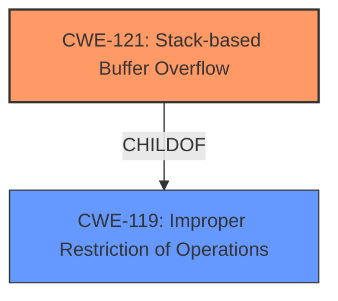

# Final Resolution for CVE-2021-33443

# Summary
| CWE ID | CWE Name | Confidence | CWE Abstraction Level | CWE Vulnerability Mapping Label | CWE-Vulnerability Mapping Notes |
|---|---|---|---|---|---|
| CWE-121 | Stack-based Buffer Overflow | 0.95 | Variant | Allowed | Primary CWE |

## Evidence and Confidence

*   **Confidence Score:** 0.95
*   **Evidence Strength:** HIGH

## Relationship Analysis
The primary relationship to consider is that CWE-121 (Stack-based Buffer Overflow) is a variant, or a more specific type, of the more general CWE-119 (Improper Restriction of Operations within the Bounds of a Memory Buffer). The analysis correctly identifies the relationship between CWE-121 and CWE-119, prioritizing the more specific CWE-121 because the vulnerability is explicitly described as a stack-based buffer overflow. Other CWEs considered, like CWE-190 (Integer Overflow or Wraparound) or CWE-770 (Allocation of Resources Without Limits or Throttling), are less directly relevant because the description doesn't provide specific evidence to support them as root causes.

## Vulnerability Chain
The vulnerability chain begins with a **STACK BUFFER OVERFLOW** (CWE-121). The **WEAKNESS** is that the product copies data into a stack-allocated buffer without properly checking the size of the input, leading to the overflow. This can allow an attacker to overwrite the return address on the stack, potentially leading to arbitrary code execution. The final impact is a denial of service or, potentially, arbitrary code execution.

## Summary of Analysis
The initial analysis and the criticism both converge on CWE-121 (Stack-based Buffer Overflow) as the most appropriate primary **WEAKNESS**. This decision is primarily based on the explicit mention of "stack buffer overflow" in the vulnerability description and the CVE reference summary. The evidence is strong and directly supports the classification.

The graph relationships, particularly the child-of relationship between CWE-121 and CWE-119, reinforce the decision to use CWE-121 due to its specificity. While CWE-119 is a broader category, CWE-121 provides a more precise classification.

The selected CWE is at the optimal level of specificity because it directly addresses the identified vulnerability type (stack-based buffer overflow). The mapping guidance for CWE-121 explicitly allows its use in such cases, further validating the decision.

The mitigations discussed, such as compiler/OS protections (stack canaries), safe APIs, and language choice, align with the nature of stack-based buffer overflows and are relevant to addressing this type of vulnerability.