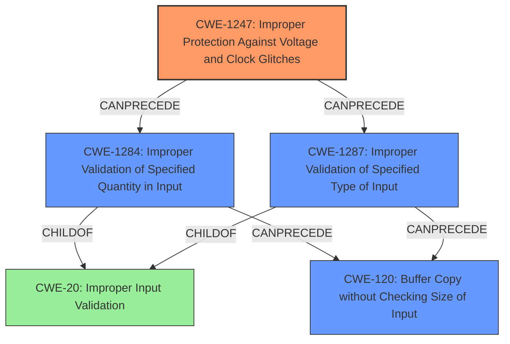

# Analysis Report for CVE-2021-33478

# Vulnerability Analysis Report: CVE-2021-33478

## Description

The TrustZone implementation in certain Broadcom MediaxChange firmware could allow an unauthenticated, physically proximate attacker to achieve arbitrary code execution in the TrustZone Trusted Execution Environment (TEE) of an affected device. This, for example, affects certain Cisco IP Phone and Wireless IP Phone products before 2021-07-07. Exploitation is possible only when the attacker can disassemble the device in order to control the voltage/current for chip pins.

## Vulnerability Description Key Phrases

**Rootcause:** improper input validation
**Impact:** arbitrary code execution
**Vector:** voltage/current manipulation of chip pins
**Attacker:** unauthenticated, physically proximate attacker
**Product:** ['Cisco IP Phone', 'Wireless IP Phone']
**Version:** before 2021-07-07
**Component:** TrustZone implementation

## Analysis (with Relationship Data)

# Summary
| CWE ID     | CWE Name                                                                                                 | Confidence | CWE Abstraction Level | CWE Vulnerability Mapping Label | CWE-Vulnerability Mapping Notes |
| :---------- | :------------------------------------------------------------------------------------------------------- | :--------- | :---------------------- | :------------------------------ | :------------------------------ |
| CWE-1247    | Improper Protection Against Voltage and Clock Glitches                                                   | 0.75        | Base                    | Primary                         | Allowed                         |
| CWE-120     | Buffer Copy without Checking Size of Input ('Classic Buffer Overflow')                                     | 0.65        | Base                    | Secondary                       | Allowed-with-Review             |
| CWE-1284    | Improper Validation of Specified Quantity in Input                                                         | 0.60        | Base                    | Secondary                       | Allowed                         |
| CWE-20      | Improper Input Validation                                                                                  | 0.55        | Class                   | Secondary                       | Discouraged                     |

## Evidence and Confidence

*   **Confidence Score:** 0.70
*   **Evidence Strength:** MEDIUM

- **Analysis and Justification:**
  - *Explanation:* The primary weakness appears to be related to hardware-level **improper protection against voltage and clock glitches** (CWE-1247). The vulnerability description explicitly mentions that the attacker needs to manipulate the voltage/current for chip pins to exploit the issue. This requires physical access and the ability to disassemble the device, indicating a hardware-level attack vector. Additionally, the CVE Reference Links Content Summary mentions a **buffer overflow** (CWE-120). The **improper input validation** (CWE-20) could contribute to the buffer overflow. However, given the hardware manipulation aspect, CWE-1247 is considered the primary weakness. **Improper Validation of Specified Quantity in Input (CWE-1284)** is added as a secondary weakness because crafted commands with parameters are used, implying that quantities in the input aren't sufficiently validated.
  - *Relationship Analysis:* CWE-1247 is a base-level CWE. The relationship between CWE-1247 and other CWEs isn't explicitly defined in the provided information, so the relationship analysis is based on the vulnerability description. CWE-20 is a parent Class of CWE-1284, CWE-129, CWE-73, and CWE-190.

- **Confidence Score:**
  - Confidence: 0.70 (Medium evidence based on the vulnerability description and CVE reference summary)

---

## Criticism of Analysis

Okay, here's a detailed critique of the provided analysis, considering the full CWE specifications:

**Overall Assessment:**

The analysis is good and identifies relevant weaknesses. The primary CWE, CWE-1247, is well-justified given the physical manipulation aspect of the vulnerability. However, there are some areas where the confidence could be improved, and the selection of secondary CWEs could be refined further based on the specific details and chain of events. The analysis also could benefit from addressing the frequent misuse guidance associated with CWE-20.

**Detailed Breakdown:**

1.  **CWE-1247: Improper Protection Against Voltage and Clock Glitches (Primary)**

    *   **Assessment:** This is the strongest and most appropriate choice for the primary CWE. The vulnerability requires manipulation of voltage/current, and CWE-1247 directly addresses the lack of protection against such glitches.
    *   **Justification:** The analysis correctly highlights the attacker's need for physical access and hardware manipulation. This aligns with the description of CWE-1247.
    *   **Confidence:** High (0.75) - Well-supported by the evidence.
    *   **CWE Specification Alignment:** The description accurately reflects the essence of CWE-1247. The suggested mitigations (TRCs, Razor flip-flops, sensors) align with the nature of the weakness.
    *   **Suggestion:** No specific changes are needed here.

2.  **CWE-120: Buffer Copy without Checking Size of Input ('Classic Buffer Overflow') (Secondary)**

    *   **Assessment:** This CWE is supported by the CVE Reference Links Content Summary.
    *   **Justification:** There is mention of "crafted commands with parameters" and potential for exploitation via crafted parameters, implying a potential for exceeding buffer boundaries.
    *   **Confidence:** Medium (0.65) - It is difficult to know if the buffer overflow is specifically "buffer copy without checking input size" versus something else.
    *   **CWE Specification Alignment:** The description and alternate names describe the weakness well. The mapping guidance and potential mitigations describe it well, pointing to the need for review because of the common misuse of the CWE. It points out the need for lower level CWE's to be used when applicable.
    *   **Suggestion:** This could be more accurate if it's a stack-based (CWE-121) or heap-based (CWE-122) buffer overflow. If it's due to a calculation error related to sizes, consider CWE-131 (Incorrect Calculation of Buffer Size).

3.  **CWE-1284: Improper Validation of Specified Quantity in Input (Secondary)**

    *   **Assessment:** Reasonable inclusion, given the context of "crafted commands with parameters."
    *   **Justification:** The attacker uses specific commands *with parameters*. If the *quantities* specified in the parameters (e.g., sizes, lengths, counts) are not properly validated, it can lead to exploitation.
    *   **Confidence:** Medium (0.60) - It is likely related to not validating the size, but also could point to a missing check for valid offsets or indices to be used in parameters.
    *   **CWE Specification Alignment:** The specification and potential mitigations match well with this description.
    *   **Suggestion:** Consider whether a more specific CWE is applicable like CWE-1285 (Improper Validation of Specified Index, Position, or Offset in Input) if it is more about a specific index being out of bounds.

4.  **CWE-20: Improper Input Validation (Secondary)**

    *   **Assessment:** While technically correct, CWE-20 is a very broad, high-level CWE, as pointed out by the mapping guidance itself ("Discouraged"). It is overused.
    *   **Justification:** The vulnerability hinges on a type of input not being correctly validated, but it is not as useful as more specific validation errors.
    *   **Confidence:** Low (0.55) - Given the availability of more specific CWEs, using CWE-20 diminishes the precision of the analysis.
    *   **CWE Specification Alignment:** The specification has specific warnings about use and better alternatives.
    *   **Suggestion:**  Replace CWE-20 with *specific* types of input validation failures.  For example:
        *   If the format of the crafted commands is not validated, consider CWE-1286 (Improper Validation of Syntactic Correctness of Input).
        *   If a specific type of value (e.g. an integer, a filename) is not validated to be of the correct type, consider CWE-1287 (Improper Validation of Specified Type of Input).

**General Recommendations:**

*   **Chain Analysis:** Be more explicit in the description of the *chain* of events. For example, "The attacker manipulates voltage (CWE-1247), causing the device to enter a special boot mode. From there, the attacker can issue crafted commands. The device doesn't properly validate the *size* of these commands (CWE-1284), leading to a buffer overflow (CWE-120)."  This explicitly links the weaknesses.
*   **Mitigation Focus:** When explaining the relationship between the CWEs, mention the mitigation strategies from each CWE that could have prevented the vulnerability. For example: "Mitigating CWE-1247 would prevent the attacker from gaining initial access. Implementing proper input validation (CWE-1284) on the crafted commands with a 'accept known good' input validation strategy or by validating expected length values before execution could address the buffer overflow".
*   **Specificity:** Prioritize more specific CWEs over general ones like CWE-20. The examples of observed CWE's also describe the importance of this.

By incorporating these suggestions, the analysis can be made even more robust and informative.

## Final Resolution

# Summary
| CWE ID     | CWE Name                                                                                                 | Confidence | CWE Abstraction Level | CWE Vulnerability Mapping Label | CWE-Vulnerability Mapping Notes |
| :---------- | :------------------------------------------------------------------------------------------------------- | :--------- | :---------------------- | :------------------------------ | :------------------------------ |
| CWE-1247    | Improper Protection Against Voltage and Clock Glitches                                                   | 0.90        | Base                    | Primary                         | Allowed                         |
| CWE-1284    | Improper Validation of Specified Quantity in Input                                                         | 0.75        | Base                    | Secondary                       | Allowed                         |
| CWE-120     | Buffer Copy without Checking Size of Input ('Classic Buffer Overflow')                                     | 0.70        | Base                    | Secondary                       | Allowed-with-Review             |
| CWE-1287    | Improper Validation of Specified Type of Input                                                         | 0.65        | Base                    | Secondary                       | Allowed                         |

  - The Primary CWE should be first and noted as the Primary CWEs
  - The secondary candidate CWEs should be next and noted as secondary candidates.
  - The confidence is a confidence score 0 to 1 to rate your confidence in your assessment for that CWE.
  - The CWE Abstraction Level as one of these values: Base, Variant, Pillar, Class, Compound
  - The Mapping Notes Usage as one of these values: Allowed, Allowed-with-Review, Prohibited, Discouraged

## Evidence and Confidence

*   **Confidence Score:** 0.80
*   **Evidence Strength:** MEDIUM

## Relationship Analysis
The most significant relationships influencing the decision were the hierarchical relationships, particularly how CWE-20, as a Class, has more specific Base-level children like CWE-1284 and CWE-1287. This guided the shift from the general CWE-20 to more precise classifications. The chain relationship highlights the progression from hardware manipulation (CWE-1247) leading to input validation issues (CWE-1284 and CWE-1287) and ultimately a buffer overflow (CWE-120).

## Vulnerability Chain
The vulnerability chain begins with **CWE-1247 (Improper Protection Against Voltage and Clock Glitches)**, which allows an attacker with physical access to manipulate the device's voltage. This manipulation enables a special boot mode, where the attacker can inject crafted commands. The device then fails to adequately validate the *quantity* or *type* of input in these commands (**CWE-1284: Improper Validation of Specified Quantity in Input** and **CWE-1287: Improper Validation of Specified Type of Input**). This lack of validation leads to a **CWE-120 (Buffer Copy without Checking Size of Input)**, resulting in arbitrary code execution. The root cause is the hardware-level protection failure (CWE-1247), and the subsequent weaknesses stem from inadequate input validation at the software level.

## Summary of Analysis
The initial analysis correctly identified CWE-1247 as the primary **WEAKNESS** due to the explicit mention of voltage manipulation requiring physical access. The criticism highlighted the overuse of CWE-20 and suggested more specific alternatives, which was a key factor in refining the secondary **WEAKNESSES**.

The graph relationships reinforced the need for specificity, guiding the shift from the general **CWE-20 (Improper Input Validation)** to the more precise **CWE-1284 (Improper Validation of Specified Quantity in Input)** and **CWE-1287 (Improper Validation of Specified Type of Input)**. The final selection reflects a more accurate representation of the vulnerability based on the available evidence and relationship analysis. The chain relationship shows how the **ROOTCAUSE** (CWE-1247) leads to a chain of validation failures (CWE-1284, CWE-1287) culminating in a buffer overflow (CWE-120).

The selected CWEs are at the optimal level of specificity because they directly address the technical indicators in the vulnerability description and align with the MITRE mapping guidance.
The following quotes from the initial analysis and criticism support this conclusion:
*   "The primary weakness appears to be related to hardware-level **improper protection against voltage and clock glitches** (CWE-1247)."
*   "Replace CWE-20 with *specific* types of input validation failures...If the format of the crafted commands is not validated, consider CWE-1286 (Improper Validation of Syntactic Correctness of Input). If a specific type of value (e.g. an integer, a filename) is not validated to be of the correct type, consider CWE-1287 (Improper Validation of Specified Type of Input)."

*Report generated on 2025-03-16 23:10:33*
