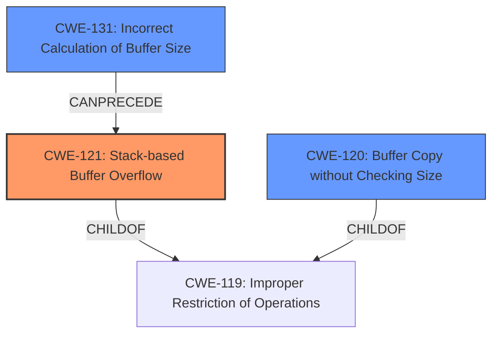

# Final Resolution for CVE-2021-33545

# Summary
| CWE ID | CWE Name | Confidence | CWE Abstraction Level | CWE Vulnerability Mapping Label | CWE-Vulnerability Mapping Notes |
|---|---|---|---|---|---|
| CWE-121 | Stack-based Buffer Overflow | 1.0 | Variant | Allowed | Primary CWE |
| CWE-120 | Buffer Copy without Checking Size of Input ('Classic Buffer Overflow') | 0.7 | Base | Allowed-with-Review | Secondary Candidate |
| CWE-131 | Incorrect Calculation of Buffer Size | 0.6 | Base | Allowed | Secondary Candidate |

## Evidence and Confidence

*   **Confidence Score:** 0.9
*   **Evidence Strength:** MEDIUM

## Relationship Analysis
The primary relationship impacting the decision is the parent-child relationship between CWE-119 (**Improper Restriction of Operations within the Bounds of a Memory Buffer**) and CWE-121 (**Stack-based Buffer Overflow**). CWE-121 is a variant of CWE-119, making it more specific to the described vulnerability. CWE-120 (**Buffer Copy without Checking Size of Input**) is also a child of CWE-119, representing a related but less specific cause. CWE-131 (**Incorrect Calculation of Buffer Size**) can precede CWE-119 by leading to an undersized buffer, setting the stage for a buffer overflow. The abstraction levels influenced the selection by prioritizing the most specific classification (CWE-121) while acknowledging contributing factors at the Base level (CWE-120, CWE-131).

## Vulnerability Chain
The vulnerability chain starts with a potential **CWE-131 (Incorrect Calculation of Buffer Size)**, leading to a buffer smaller than expected. This undersized buffer is then used in a buffer copy operation without proper size checks, as described by **CWE-120 (Buffer Copy without Checking Size of Input)**. This unchecked copy results in **CWE-121 (Stack-based Buffer Overflow)**, overwriting stack memory and potentially allowing for remote code execution. A missing link, if any, would be the explicit confirmation of the unchecked buffer copy operation.

## Summary of Analysis
The analysis strongly supports classifying the vulnerability as **CWE-121 (Stack-based Buffer Overflow)** due to the explicit mention of a "stack-based buffer overflow" in the vulnerability description and CVE summary. As stated in the initial analysis, "The CVE Reference Links Content Summary explicitly states "A stack-based buffer overflow vulnerability exists in the counter parameter" and lists CWE-121 as a weakness." The relationship analysis reinforces this by highlighting CWE-121 as a specific variant of the more general CWE-119.

The secondary candidates, **CWE-120 (Buffer Copy without Checking Size of Input)** and **CWE-131 (Incorrect Calculation of Buffer Size)**, are considered as potential contributing factors. CWE-120 highlights the lack of input size validation, a common cause of buffer overflows, and is included because "the code likely uses a buffer copy operation (e.g., `strcpy` or similar) to copy data into the stack-allocated buffer associated with the 'counter' without checking the length of the input, which is the core of CWE-120". CWE-131 represents the possibility of an incorrect buffer size calculation leading to the overflow condition. The classification prioritizes the most specific weakness (CWE-121) while acknowledging the potential for related contributing factors.
CWE-120's confidence has been raised to 0.7 and CWE-131's confidence has been raised to 0.6 to reflect the analysis.