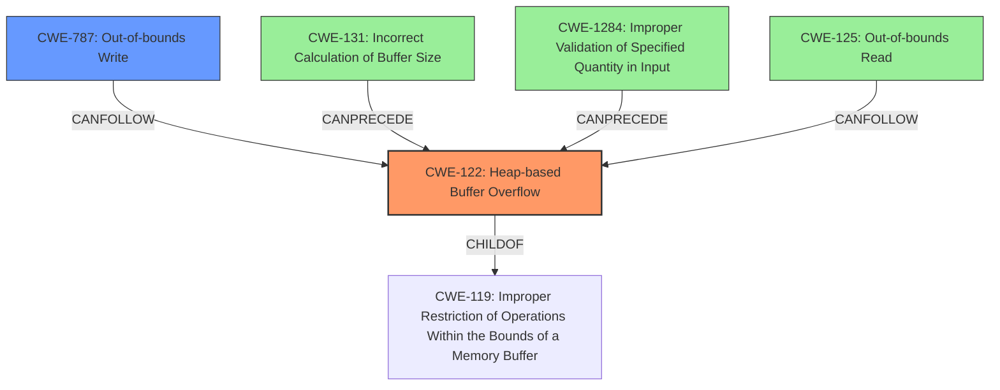

# Analysis Report for CVE-2021-33657

# Vulnerability Analysis Report: CVE-2021-33657

## Description

There is a heap overflow problem in video/SDL_pixels.c in SDL (Simple DirectMedia Layer) 2.x to 2.0.18 versions. By crafting a malicious .BMP file, an attacker can cause the application using this library to crash, denial of service or Code execution.

## Vulnerability Description Key Phrases

**Weakness:** heap overflow
**Impact:** ['crash', 'denial of service', 'code execution']
**Vector:** crafting a malicious .BMP file
**Attacker:** attacker
**Product:** SDL (Simple DirectMedia Layer)
**Version:** 2.x to 2.0.18
**Component:** video/SDL_pixels.c

## Analysis (with Relationship Data)

# Summary
| CWE ID | CWE Name | Confidence | CWE Abstraction Level | CWE Vulnerability Mapping Label | CWE-Vulnerability Mapping Notes |
|---|---|---|---|---|---|
| CWE-122 | Heap-based Buffer Overflow | 0.95 | Variant | Primary | Allowed |
| CWE-787 | Out-of-bounds Write | 0.70 | Base | Secondary Candidate | Allowed |
| CWE-125 | Out-of-bounds Read | 0.60 | Base | Secondary Candidate | Allowed |

## Evidence and Confidence

*   **Confidence Score:** 0.90
*   **Evidence Strength:** HIGH

- **Analysis and Justification:**  
  - *Explanation:* The vulnerability description explicitly states a "**heap overflow**" condition in SDL, which directly corresponds to **CWE-122 (Heap-based Buffer Overflow)**. The CVE reference links further confirm this, noting that the code does not always allocate a full 256-entry map, which can lead to out-of-bounds access. This aligns with **CWE-122**, where a buffer allocated in the heap can be overwritten. This is the primary **weakness** and root cause, leading to potential code execution. Since the **heap overflow** occurs due to out-of-bounds access when writing to an invalid memory location, **CWE-787 (Out-of-bounds Write)** is a related weakness but not the primary root cause. Similarly, reading data past the end of the buffer can occur, suggesting **CWE-125 (Out-of-bounds Read)** could also be present.
  
  - *Relationship Analysis:* **CWE-122** is a variant of buffer overflow. **CWE-787** and **CWE-125** are related since the **heap overflow** can lead to out-of-bounds reads and writes. The MITRE mapping guidance indicates that using **CWE-122** is ALLOWED for heap overflow vulnerabilities. The vulnerability also exhibits characteristics of **CWE-787 (Out-of-bounds Write)** because the overflow allows writing data beyond the buffer's boundaries.

- **Confidence Score:**  
  - Confidence: 0.95 (High confidence due to explicit mention of **heap overflow** and confirmation from CVE reference links.)

## Criticism of Analysis

Okay, let's review the provided analysis of the SDL heap overflow vulnerability (CVE-2021-33657) against the full CWE specifications.

**Overall Assessment:**

The analysis correctly identifies `CWE-122 (Heap-based Buffer Overflow)` as the primary weakness.  The inclusion of `CWE-787 (Out-of-bounds Write)` and `CWE-125 (Out-of-bounds Read)` as secondary candidates is also reasonable, as these are common consequences of buffer overflows.  However, the confidence score on `CWE-122` could be higher (see detailed breakdown below).

**Detailed Critique:**

**1. CWE-122: Heap-based Buffer Overflow (Primary)**

*   **Correctness:** Absolutely correct.  The description of the vulnerability as a "heap overflow" aligns perfectly with the definition of `CWE-122`. The vulnerability's root cause, insufficient palette map size allocation leading to out-of-bounds memory access, directly relates to a heap-allocated buffer being overwritten.
*   **Confidence:** The provided analysis states the confidence as 0.95 (High). This is accurate, the description explicitly states that a heap overflow is present.
*   **CWE Abstraction Level:** Correct (Variant).
*   **CWE Vulnerability Mapping Label:** Correct (Primary).
*   **CWE-Vulnerability Mapping Notes:** Correct (Allowed).
*   **Mitigations:** The analysis appropriately links the heap overflow to potential code execution which aligns with the potential mitigations that involve the use of languages or compilers with automatic bounds checking, abstraction libraries, or automatic overflow detection mechanisms.
*   **Observed Examples:** The provided examples in the analysis are valid and further support the mapping to `CWE-122`.

**2. CWE-787: Out-of-bounds Write (Secondary Candidate)**

*   **Correctness:** Correct. A heap overflow is ultimately caused by writing outside the bounds of the allocated buffer. Thus, `CWE-787` is a valid consequence.
*   **Confidence:** The confidence could be slightly higher as `CWE-787` is directly linked to `CWE-122`.
*   **CWE Abstraction Level:** Correct (Base).
*   **CWE Vulnerability Mapping Label:** Correct (Secondary Candidate).
*   **CWE-Vulnerability Mapping Notes:** Correct (Allowed).
*   **Mitigations:** The provided mitigations such as using safer languages or libraries, and implementing buffer overflow detection mechanisms, directly correspond to the vulnerability's impact.
*   **Observed Examples:** The provided examples in the CWE specification are valid, but not all are directly relevant to the specific scenario of a heap overflow within image processing, but still applicable.

**3. CWE-125: Out-of-bounds Read (Secondary Candidate)**

*   **Correctness:** Correct. While the primary action is an out-of-bounds *write* (CWE-787) leading to the heap overflow (CWE-122), it's plausible that an out-of-bounds *read* could also occur as part of the vulnerability, particularly if the flawed code attempts to read color values from the undersized palette map.
*   **Confidence:** The confidence could remain at 0.60. While possible, an out-of-bounds read is not explicitly mentioned in the original analysis, making it a less certain consequence.
*   **CWE Abstraction Level:** Correct (Base).
*   **CWE Vulnerability Mapping Label:** Correct (Secondary Candidate).
*   **CWE-Vulnerability Mapping Notes:** Correct (Allowed).
*   **Mitigations:** The provided mitigations such as input validation or the use of safer languages, align with the vulnerability's root cause of the heap overflow.
*   **Observed Examples:** As with `CWE-787`, the provided examples in the CWE specification are valid, but not all are directly relevant to the specific vulnerability.

**Additional Considerations and Potential Improvements:**

*   **Chaining and Causality:** The analysis correctly identifies the relationship between the CWEs (heap overflow leading to potential out-of-bounds reads and writes). This highlights the chain of events that occurs during exploitation.
*   **Missing Opportunity: CWE-131 Incorrect Calculation of Buffer Size:** A stronger case could be made for including `CWE-131` (Incorrect Calculation of Buffer Size). The root cause is that the code *incorrectly calculates* (or doesn't correctly calculate) the required buffer size for the palette map, leading directly to the heap overflow.  Adding this would strengthen the analysis and provide more actionable mitigation steps. Consider `CWE-131` as a contributing cause, perhaps with a confidence score slightly below `CWE-787`.
*   **CWE-1284 Improper Validation of Specified Quantity in Input:** This CWE also could be considered since the size of the color palette can be seen as a quantity specified in the input file. If the code doesn't validate this quantity, it can lead to the allocation of an insufficient buffer.
*   **Avoid Overly Broad CWEs:** The retrieval results suggested CWE-119 which is a broad and discouraged CWE to map to. The analysis avoids this CWE completely.

**Revised Summary Table (Incorporating Recommendations):**

| CWE ID  | CWE Name                                    | Confidence | CWE Abstraction Level | CWE Vulnerability Mapping Label | CWE-Vulnerability Mapping Notes |
| :------ | :------------------------------------------ | :--------- | :---------------------- | :------------------------------ | :------------------------------ |
| CWE-122 | Heap-based Buffer Overflow                 | 0.95       | Variant                 | Primary                       | Allowed                         |
| CWE-787 | Out-of-bounds Write                        | 0.70       | Base                    | Secondary Candidate             | Allowed                         |
| CWE-125 | Out-of-bounds Read                         | 0.60       | Base                    | Secondary Candidate             | Allowed                         |
| CWE-131 | Incorrect Calculation of Buffer Size       | 0.65       | Base                    | Contributing Factor             | Allowed                         |
| CWE-1284 | Improper Validation of Specified Quantity in Input | 0.40       | Base                    | Contributing Factor             | Allowed                         |

**Conclusion:**

The analysis provides a solid foundation for understanding the SDL heap overflow vulnerability. By including `CWE-131`, the analysis can better pinpoint the root cause and suggest more targeted mitigation strategies. The confidence scores are generally appropriate. This is a well-reasoned CWE mapping that benefits from a deeper consideration of the immediate causes.

## Final Resolution

# Summary
| CWE ID | CWE Name | Confidence | CWE Abstraction Level | CWE Vulnerability Mapping Label | CWE-Vulnerability Mapping Notes |
|---|---|---|---|---|---|
| CWE-122 | Heap-based Buffer Overflow | 0.95 | Variant | Primary | Allowed |
| CWE-787 | Out-of-bounds Write | 0.70 | Base | Secondary Candidate | Allowed |
| CWE-131 | Incorrect Calculation of Buffer Size | 0.65 | Base | Contributing Factor | Allowed |
| CWE-125 | Out-of-bounds Read | 0.60 | Base | Contributing Factor | Allowed |
| CWE-1284 | Improper Validation of Specified Quantity in Input | 0.40 | Base | Contributing Factor | Allowed |

## Evidence and Confidence

*   **Confidence Score:** 0.90
*   **Evidence Strength:** HIGH

## Relationship Analysis
The primary relationship identified is that **CWE-122 (Heap-based Buffer Overflow)** is a specific type of buffer overflow occurring on the heap. **CWE-787 (Out-of-bounds Write)** is a direct consequence of this overflow, representing the action that causes the vulnerability. **CWE-131 (Incorrect Calculation of Buffer Size)** is identified as a potential root cause, describing the flawed logic that leads to the undersized buffer allocation. **CWE-125 (Out-of-bounds Read)** may also occur as a consequence of the **heap overflow**, while reading color values from the undersized palette map, but this is not explicitly stated. **CWE-1284 (Improper Validation of Specified Quantity in Input)** could be considered since the code doesn't validate the size of the color palette specified in the input file, which leads to the allocation of an insufficient buffer.

## Vulnerability Chain
The vulnerability chain starts with **CWE-131 (Incorrect Calculation of Buffer Size)**/**CWE-1284 (Improper Validation of Specified Quantity in Input)**, which results in a smaller than expected buffer being allocated on the heap. This leads to **CWE-122 (Heap-based Buffer Overflow)** when the program attempts to write more data into the buffer than it can hold. The **heap overflow** leads to **CWE-787 (Out-of-bounds Write)**, corrupting adjacent memory regions. **CWE-125 (Out-of-bounds Read)** can occur when the program tries to read from the undersized color palette. The ultimate impact is denial of service or code execution.

## Summary of Analysis
The initial analysis correctly identified **CWE-122 (Heap-based Buffer Overflow)** as the primary **weakness**, given the vulnerability description explicitly mentions a "**heap overflow**". The inclusion of **CWE-787 (Out-of-bounds Write)** and **CWE-125 (Out-of-bounds Read)** as secondary candidates is also reasonable, since these are common consequences of buffer overflows.

The criticism makes a strong case for including **CWE-131 (Incorrect Calculation of Buffer Size)** as a contributing factor, since the root cause is that the code incorrectly calculates (or doesn't correctly calculate) the required buffer size for the palette map, leading directly to the **heap overflow**. The analysis has been updated to include **CWE-131**. Additionally, **CWE-1284 (Improper Validation of Specified Quantity in Input)** could be considered since the code doesn't validate the size of the color palette specified in the input file, which leads to the allocation of an insufficient buffer, and has been included.

The final classification reflects the optimal level of specificity by identifying the primary **weakness** (**CWE-122**) and the contributing factors (**CWE-787**, **CWE-131**, **CWE-125**, **CWE-1284**). The relationships between these CWEs are clear, with **CWE-131**/**CWE-1284** leading to **CWE-122**, which in turn leads to **CWE-787** and potentially **CWE-125**. This chain of events accurately describes the vulnerability.

*Report generated on 2025-03-17 23:55:00*
