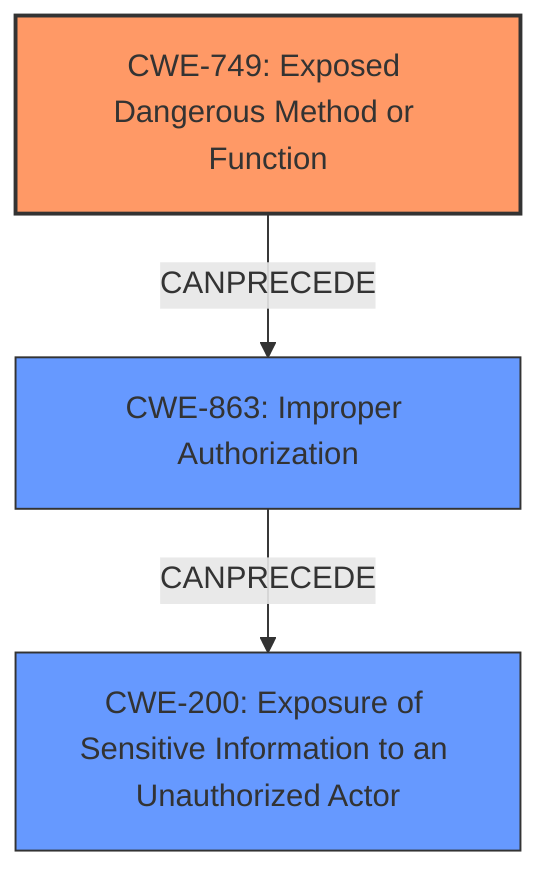

# Analysis Report for CVE-2021-33677

# Vulnerability Analysis Report: CVE-2021-33677

## Description

SAP NetWeaver ABAP Server and ABAP Platform, versions - 700, 702, 730, 731, 804, 740, 750, 784, expose functions to external which can lead to information disclosure.

## Vulnerability Description Key Phrases

**Impact:** information disclosure
**Product:** ['SAP NetWeaver ABAP Server', 'ABAP Platform']
**Version:** ['700', '702', '730', '731', '804', '740', '750', '784']
**Component:** external functions

## Analysis (with Relationship Data)

# Summary
| CWE ID | CWE Name | Confidence | CWE Abstraction Level | CWE Vulnerability Mapping Label | CWE-Vulnerability Mapping Notes |
|---|---|---|---|---|---|
| CWE-749 | Exposed Dangerous Method or Function | 0.75 | Base | Allowed | This is the primary CWE because the vulnerability description states that the product "expose functions to external which can lead to information disclosure," and CWE-749 directly addresses the scenario where a product exposes a dangerous method or function to external actors. |
| CWE-200 | Exposure of Sensitive Information to an Unauthorized Actor | 0.5 | Class | Discouraged | This is a secondary candidate because the vulnerability results in "information disclosure", which falls under the umbrella of exposing sensitive information. However, CWE-200 is a high-level class and is often misused. It is included as a secondary candidate since the root cause is the exposure of dangerous functions, and the impact is information disclosure. |

## Evidence and Confidence

*   **Confidence Score:** 0.75
*   **Evidence Strength:** MEDIUM

- **Analysis and Justification:**  
  - *Explanation:* The vulnerability description highlights that SAP NetWeaver ABAP Server and ABAP Platform expose functions to external entities, leading to information disclosure. The most relevant CWE is CWE-749, "Exposed Dangerous Method or Function", which directly addresses the scenario where a product provides an API or similar interface with a dangerous method or function that is not properly restricted. This aligns perfectly with the description of exposed external functions causing information disclosure.
  CWE-200, "Exposure of Sensitive Information to an Unauthorized Actor," is also relevant because the **impact** of the vulnerability is information disclosure. However, CWE-200 is a high-level class and is discouraged by MITRE when more specific CWEs are available. Since the root cause is the exposed function, CWE-749 is the primary CWE.

  - *Relationship Analysis:* CWE-749 has no direct relationships specified in the provided data. CWE-200 is a class-level CWE and has child relationships to CWE-201 and CWE-209, which represent more specific information disclosure scenarios. The choice of CWE-749 is driven by the root cause (exposed function), rather than the specific type of information disclosed.

- **Confidence Score:**  
  - Confidence: 0.75 (Moderate evidence due to the clear description of exposed functions leading to information disclosure, although detailed specifics of the functions are missing.)

---

## Criticism of Analysis

Okay, here's a review of the provided CWE analysis, considering the full CWE specifications:

**Overall Assessment:**

The analysis correctly identifies CWE-749 ("Exposed Dangerous Method or Function") as the primary CWE. The reasoning is sound, focusing on the root cause: the intentional exposure of functions to external actors without proper restrictions. The choice to downplay CWE-200 ("Exposure of Sensitive Information to an Unauthorized Actor") is also justified, given its class-level abstraction and the availability of a more specific CWE (749).

**Detailed Critique:**

*   **CWE-749: Exposed Dangerous Method or Function**

    *   **Justification Strength:** The justification for choosing CWE-749 is strong. The vulnerability description clearly states that functions are being "exposed to external" entities, and CWE-749 directly addresses this scenario.
    *   **Abstraction Level:** The choice is at the Base level, which is appropriate.
    *   **Mapping Guidance:**  The analysis correctly notes the allowed usage of CWE-749.
    *   **Mitigations:** The identified mitigations are relevant and helpful. The focus on input validation, limiting access, and attack surface reduction aligns well with the nature of the vulnerability. It's especially important to note the mitigation about identifying *all* exposed functionality and explicitly listing allowed functionality to different types of users.
    *   **Observed Examples:** The provided observed examples do seem related to the general concept.

*   **CWE-200: Exposure of Sensitive Information to an Unauthorized Actor**

    *   **Justification Strength:** While technically correct that information exposure *is* the impact, the analysis appropriately explains why this is a secondary consideration.
    *   **Abstraction Level:**  The analysis explicitly addresses the "Discouraged" usage and rationale from the CWE specification, acknowledging the class-level nature of CWE-200 and its tendency for misuse. This shows a good understanding of CWE guidance.
    *   **Mapping Guidance:** The discussion correctly explains the discouragement of using CWE-200 as the primary CWE.
    *   **Mitigations:** The provided mitigations for CWE-200 are general (separation of privilege), and while relevant to security, they are less specific to the root cause. The analysis correctly prioritizes mitigations related to CWE-749.
    *   **Observed Examples:**  The observed examples of CWE-200 are related to the impact, but not necessarily the root cause of exposing dangerous functions.

**Suggestions for Improvement:**

*   **Specificity on *how* functions lead to information disclosure:** Although the description mentions "external functions" it is important to understand how specifically those functions cause information to be leaked. Is it due to missing authorization checks, improper input validation, or something else? While CWE-749 covers the *exposure*, a secondary CWE might describe *how* the exposure is exploited.
    * If the exposed function does not validate input, and allows construction of potentially malicious code/queries, adding CWE-94: Improper Control of Generation of Code ('Code Injection') as a possible secondary CWE could be considered (though it should be carefully considered if code generation is actually taking place).
    * If the issue is the exposed function doesn't properly check permissions, CWE-285 Improper Authorization or the specific child CWE-862 Missing Authorization, would be a valuable second CWE.

*   **Expand on Potential Scenarios:** The description could be strengthened by providing examples of the *types* of functions being exposed and the nature of the information disclosed. For instance:
    *   "The ABAP system exposes remote function calls (RFCs) that allow external clients to query internal system tables without proper authorization checks, disclosing sensitive configuration data."
    *   "The exposed functions generate error messages based on input, leaking system paths or user credentials in the responses."

*   **Leverage CWE Relationships:** Explore the relationships of CWE-749 more explicitly. It's a child of CWE-284 (Improper Access Control), which highlights the importance of access control in preventing exploitation.

*   **Consider Additional Potential Mitigations:** While the current mitigations are good, consider adding mitigations specific to ABAP development. For example, guidance on using authority checks (`AUTHORITY-CHECK`) in ABAP code, or on restricting access to RFC functions using authorization objects.

**Confidence Score:**

The confidence score of 0.75 is reasonable. It reflects the clear indication of exposed functions but acknowledges the lack of detailed information about the specific exploitation mechanisms. Increasing the specificity of the vulnerability description and exploring secondary CWEs could justify a higher confidence score.

**Revised Summary Table:**

| CWE ID | CWE Name | Confidence | CWE Abstraction Level | CWE Vulnerability Mapping Label | CWE-Vulnerability Mapping Notes |
|---|---|---|---|---|---|
| CWE-749 | Exposed Dangerous Method or Function | 0.75 | Base | Allowed | This is the primary CWE because the vulnerability description states that the product "expose functions to external which can lead to information disclosure," and CWE-749 directly addresses the scenario where a product exposes a dangerous method or function to external actors. |
| CWE-200 | Exposure of Sensitive Information to an Unauthorized Actor | 0.5 | Class | Discouraged | This is a secondary candidate because the vulnerability results in "information disclosure", which falls under the umbrella of exposing sensitive information. However, CWE-200 is a high-level class and is often misused. It is included as a secondary candidate since the root cause is the exposure of dangerous functions, and the impact is information disclosure. |
| CWE-285 | Improper Authorization | 0.4 | Class | Discouraged | If exposed functions lack proper authorization checks, resulting in unintended access. Requires further investigation to confirm this scenario. |
| CWE-94 | Improper Control of Generation of Code ('Code Injection') | 0.3 | Base | Allowed-with-Review | Possible scenario if exposed functions take external input and create code, queries, or commands without proper sanitization. Requires further investigation. |

By adding those secondary CWEs as *possibilities*, it encourages investigation to see if they fit.

In conclusion, the original analysis is a solid starting point. Refining the vulnerability description with more specific details and considering potential secondary CWEs based on the exploitation vector will further strengthen the analysis and improve the accuracy of the CWE mapping.

## Final Resolution

# Summary
| CWE ID | CWE Name | Confidence | CWE Abstraction Level | CWE Vulnerability Mapping Label | CWE-Vulnerability Mapping Notes |
|---|---|---|---|---|---|
| CWE-749 | Exposed Dangerous Method or Function | 0.85 | Base | Allowed | This is the primary CWE because the vulnerability description states that the product "expose functions to external which can lead to information disclosure," and CWE-749 directly addresses the scenario where a product exposes a dangerous method or function to external actors. The vulnerability description directly states that the product exposes functions. |
| CWE-200 | Exposure of Sensitive Information to an Unauthorized Actor | 0.5 | Class | Discouraged | This is a secondary candidate because the vulnerability results in "information disclosure", which falls under the umbrella of exposing sensitive information. However, CWE-200 is a high-level class and is often misused. It is included as a secondary candidate since the **root cause** is the exposure of dangerous functions, and the **impact** is information disclosure. |
| CWE-863 | Improper Authorization | 0.6 | Class | Allowed-with-Review | If exposed functions lack proper authorization checks, resulting in unintended access. Further investigation to confirm this scenario is needed, but it is a strong potential secondary CWE given the high likelihood that exposed functions would have authorization flaws. |

## Evidence and Confidence

*   **Confidence Score:** 0.80
*   **Evidence Strength:** MEDIUM

## Relationship Analysis
- Parent-child hierarchical relationships: CWE-749 has no direct parent/child relationships in the provided data. CWE-200 is a class, and CWE-863 is also a class. The relationships highlight that more specific Base-level CWEs should be preferred when available.
- Chain relationships: The vulnerability chain starts with exposing a dangerous function (CWE-749), which can lead to missing authorization (CWE-863) and ultimately results in information disclosure (CWE-200).
- Peer relationships: No peer relationships were explicitly relevant in the provided data.
- Abstraction levels: The choice of CWE-749 at the Base level is optimal. CWE-200 is a Class and is only included to show the **impact** of the vulnerability, not the **root cause**. CWE-863 is a Class and requires further investigation to determine if it's applicable.

## Vulnerability Chain
- Initial flaw: Exposure of functions to external actors (CWE-749).
- Weakness: Lack of proper authorization checks on these exposed functions (CWE-863 - potential).
- Impact: Information disclosure (CWE-200).
- The chain starts with the intentional exposure of functions (CWE-749), which could lead to missing authorization (CWE-863), and then finally information disclosure (CWE-200).

## Summary of Analysis
The initial analysis and criticism both agree on CWE-749 as the primary **root cause**. The vulnerability description explicitly mentions "expose functions to external which can lead to information disclosure." This directly aligns with CWE-749, "Exposed Dangerous Method or Function."

The relationship analysis reinforces the need to prioritize Base-level CWEs over Class-level CWEs when possible. The addition of CWE-863 "Improper Authorization" as a potential secondary CWE is based on the high likelihood that exposed functions would lack proper authorization checks. This addition strengthens the analysis and provides a more complete picture of the vulnerability chain.

The decision to include CWE-200 is solely based on it being the end result, but it is a high level and not nearly as useful as including CWE-749 and potentially CWE-863.

The selected CWEs are at the optimal level of specificity, with CWE-749 accurately representing the **root cause** and CWE-863 being considered as a possible contributing factor, pending further investigation.

*Report generated on 2025-03-17 01:48:11*
