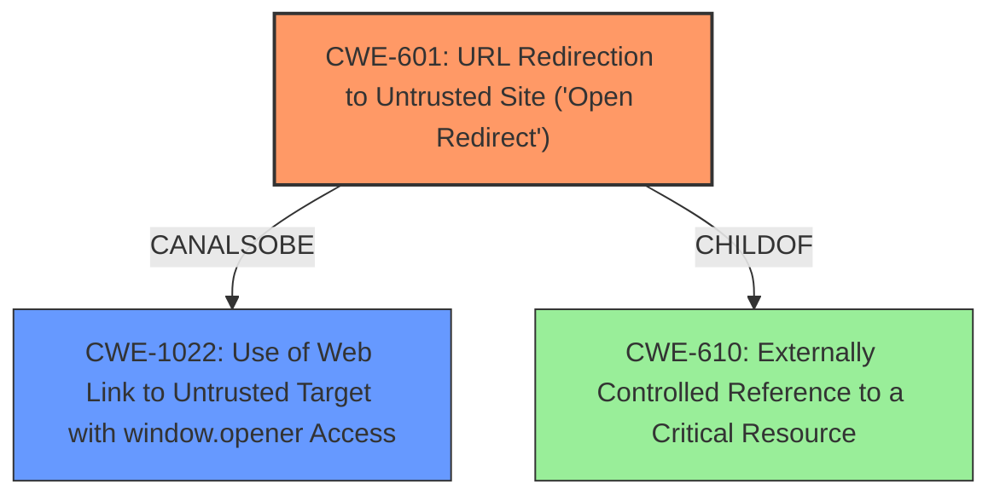

# Final Resolution for CVE-2021-33697

# Summary
| CWE ID | CWE Name | Confidence | CWE Abstraction Level | CWE Vulnerability Mapping Label | CWE-Vulnerability Mapping Notes |
|---|---|---|---|---|---|
| CWE-601 | URL Redirection to Untrusted Site ('Open Redirect') | 0.95 | Base | Allowed | Primary CWE |
| CWE-1022 | Use of Web Link to Untrusted Target with window.opener Access | 0.75 | Variant | Allowed | Secondary Candidate |
| CWE-610 | Externally Controlled Reference to a Critical Resource | 0.5 | Class | Discouraged | Potential Parent of CWE-601 |

## Evidence and Confidence

*   **Confidence Score:** 0.85
*   **Evidence Strength:** HIGH

## Relationship Analysis
The primary weakness is **CWE-601 URL Redirection to Untrusted Site ('Open Redirect')** which is a Base level CWE. The vulnerability description clearly indicates an unauthenticated attacker can redirect users to a malicious site. The secondary weakness is **CWE-1022 Use of Web Link to Untrusted Target with window.opener Access** which is a Variant level CWE, and is a potential consequence of reverse tabnabbing given the context. Finally, **CWE-610 Externally Controlled Reference to a Critical Resource** is considered as a potential parent to CWE-601 because the URL that is being redirected to is externally controlled. However, it is a Class level CWE and thus less specific than CWE-601.

## Vulnerability Chain
The vulnerability chain begins with an **unauthenticated attacker** (**ROOTCAUSE**) being able to inject a malicious URL into the application. This is then used by the application to **redirect users** (**WEAKNESS: CWE-601**) to the attacker's malicious site. If the application uses `target="_blank"` or similar mechanism that exposes the `window.opener` object, the attacker could leverage reverse tabnabbing (**WEAKNESS: CWE-1022**). The end result is that users are redirected to a malicious site where they could be subject to phishing attacks or have their credentials stolen.

## Summary of Analysis
The initial analysis was correct in identifying **CWE-601** as the primary weakness. The vulnerability description explicitly mentions the redirection to a malicious site which directly corresponds to the description of **CWE-601**.
> Under certain conditions, SAP BusinessObjects Business Intelligence Platform (SAPUI5), versions - 420, 430, can allow an unauthenticated attacker to **redirect users to a malicious site** due to Reverse Tabnabbing vulnerabilities.

The analysis also appropriately identified **CWE-1022** as a secondary candidate due to the mention of "Reverse Tabnabbing." The criticism was helpful in pointing out the importance of explicitly discussing mitigations and considering all relationships. Mitigations for **CWE-601** include input validation (whitelisting allowed URLs) and using an intermediate disclaimer page. Mitigations for **CWE-1022** include using `rel="noopener noreferrer"` on links with `target="_blank"`, resetting the opener via javascript, and avoiding the use of "_blank" targets altogether.

The retriever results included several other CWEs which were not chosen:
*   CWE-306: Missing Authentication for Critical Function: While the vulnerability description mentions an unauthenticated attacker, this is more about the lack of authorization to control the redirection target rather than a missing authentication mechanism. The core issue is the open redirect, not the missing authentication.
*   CWE-525: Use of Web Browser Cache Containing Sensitive Information: This is not relevant to the vulnerability description.
*   CWE-79: Improper Neutralization of Input During Web Page Generation ('Cross-site Scripting'): This is not relevant as the vulnerability is redirection, not XSS.
*   CWE-352: Cross-Site Request Forgery (CSRF): This is not directly relevant. CSRF involves tricking a user into performing an action, while this vulnerability is about directly redirecting the user.
*   CWE-287: Improper Authentication: As mentioned above, the core issue is not the lack of authentication, but the open redirect itself.
*   CWE-200: Exposure of Sensitive Information to an Unauthorized Actor: This is not directly relevant. The vulnerability is about redirection, not information exposure.
*   CWE-20: Improper Input Validation: While improper input validation is present, **CWE-601** is more specific and accurately describes the vulnerability.
*   CWE-285: Improper Authorization: Similar to **CWE-306**, the lack of authorization is a contributing factor, but **CWE-601** captures the essence of the vulnerability (open redirect) more accurately.

**CWE-610** was added as a potential parent of **CWE-601** to acknowledge that the URL being redirected to is externally controlled. However, **CWE-601** is more specific and therefore more appropriate as the primary **WEAKNESS**.

The final classification reflects the optimal level of specificity based on the available evidence and relationship analysis. **CWE-601** is the primary issue, with **CWE-1022** as a secondary concern due to the possibility of reverse tabnabbing. The confidence score has been increased to 0.85 to reflect the inclusion of the mitigations and considering other CWEs.