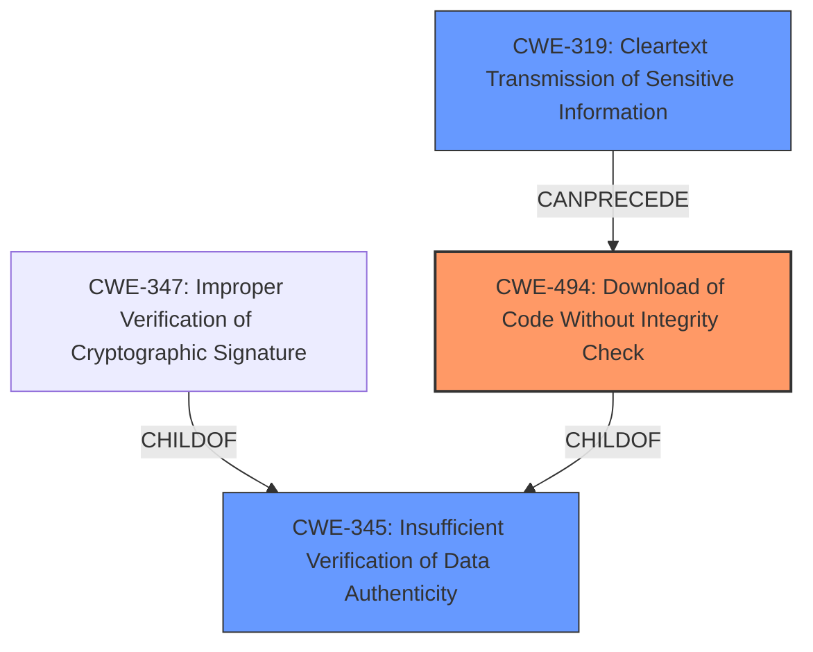

# Final Resolution for CVE-2021-33879

# Summary
| CWE ID | CWE Name | Confidence | CWE Abstraction Level | CWE Vulnerability Mapping Label | CWE-Vulnerability Mapping Notes |
|---|---|---|---|---|---|
| CWE-494 | Download of Code Without Integrity Check | 0.95 | Base | Allowed | Primary CWE. The software downloads executable code without verifying its integrity. |
| CWE-319 | Cleartext Transmission of Sensitive Information | 0.75 | Base | Allowed | Secondary CWE. Updates are downloaded over HTTP, which is an insecure channel. |
| CWE-345 | Insufficient Verification of Data Authenticity | 0.60 | Class | Discouraged | Secondary CWE. The product does not sufficiently verify the origin or authenticity of data, in a way that causes it to accept invalid data. |

## Evidence and Confidence

*   **Confidence Score:** 0.90
*   **Evidence Strength:** HIGH

## Relationship Analysis
The primary relationship is the hierarchical structure, where CWE-345 is a Class and a parent of more specific Base CWEs like CWE-347. The decision to favor CWE-494 was due to its direct applicability to the **lack of integrity check**. The chain relationship involves CWE-319 potentially leading to CWE-494, as cleartext transmission facilitates the **modification of the update package**.

## Vulnerability Chain
The vulnerability chain starts with the **cleartext transmission** (CWE-319) allowing a MITM attacker to intercept and modify the update XML. This leads to the **download of malicious code without proper integrity checks** (CWE-494) because the MD5 hash is insufficient. The final impact is the execution of arbitrary code on the victim's machine. CWE-345 represents the **overall lack of sufficient verification**, but CWE-494 is more specific to the **downloaded code**.

## Summary of Analysis
The initial analysis and criticism both converge on the primary **weakness** being the **lack of integrity check during the download of updates**. The decision to select CWE-494 as the primary CWE is strongly supported by the vulnerability description and the explicit mention of this issue in the CVE details. The criticism strengthens this by suggesting more specific mitigations derived from CWE specifications.

The graph relationships further influenced the decision. While CWE-345 is relevant as a parent class, CWE-494 offers the optimal level of specificity as it directly addresses the **downloaded code**. The chain relationship clarifies how CWE-319 enables the exploitation of CWE-494.

The selected CWEs are at the optimal level of specificity. CWE-494 is a Base CWE and accurately reflects the **root cause**. CWE-319 is a contributing factor, and CWE-345 provides a broader context of **insufficient verification**. The evidence, relationship analysis, and mapping guidance all support this classification.