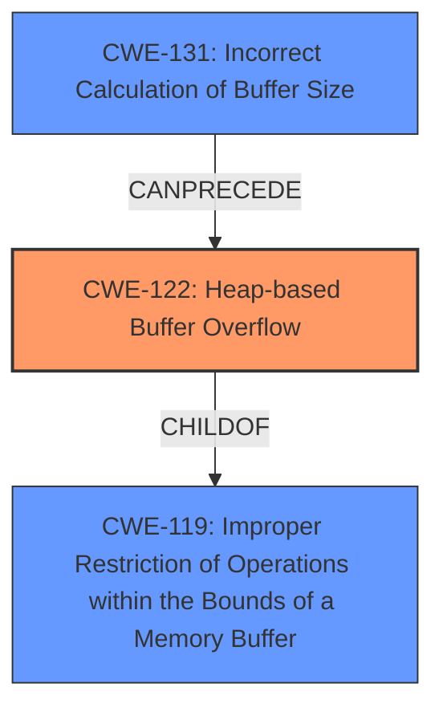

# Final Resolution for CVE-2021-33913

# Summary
| CWE ID | CWE Name | Confidence | CWE Abstraction Level | CWE Vulnerability Mapping Label | CWE-Vulnerability Mapping Notes |
|---|---|---|---|---|---|
| **CWE-122** | **Heap-based Buffer Overflow** | 0.95 | Variant | Allowed | Primary **CWE** |
| **CWE-131** | **Incorrect Calculation of Buffer Size** | 0.75 | Base | Allowed | Secondary Candidate |

## Evidence and Confidence

*   **Confidence Score:** 0.92
*   **Evidence Strength:** HIGH

## Relationship Analysis
The primary **CWE** is **CWE-122 (Heap-based Buffer Overflow)**, which is a variant of **CWE-119 (Improper Restriction of Operations within the Bounds of a Memory Buffer)**. This parent-child relationship indicates a specific type of buffer overflow occurring in the heap. The secondary **CWE**, **CWE-131 (Incorrect Calculation of Buffer Size)**, can precede **CWE-122** in a vulnerability chain where an incorrect size calculation leads to an insufficient buffer allocation, ultimately causing a heap overflow.

## Vulnerability Chain
The vulnerability chain starts with the **ROOTCAUSE** **CWE-131 (Incorrect Calculation of Buffer Size)**, where an error in calculating the buffer size leads to a smaller-than-expected buffer being allocated on the heap. This insufficient allocation then results in **CWE-122 (Heap-based Buffer Overflow)** when data is written beyond the buffer's boundaries. The final impact is the ability to execute arbitrary code.

## Summary of Analysis
The initial analysis correctly identified **CWE-122 (Heap-based Buffer Overflow)** as the primary **WEAKNESS**, which is directly supported by the vulnerability description stating "heap-based buffer overflow". The secondary **WEAKNESS**, **CWE-131 (Incorrect Calculation of Buffer Size)**, is also a relevant contributing factor, as the overflow depends on the relationship between domain name and label lengths.

The criticism was helpful in pointing out ways to strengthen the analysis of **CWE-131**. Specifically, it suggested explaining more precisely *how* the buffer size might be incorrectly calculated and to elaborate on the chain of events.

Based on the criticism, I have increased the confidence in **CWE-131** to 0.75. While the exact method of incorrect calculation is not explicitly detailed in the vulnerability description, the fact that the overflow depends on the relationship between domain name and label lengths strongly suggests a calculation error. I have also included the chain of events in the vulnerability chain section above.

The selected **CWEs** are at the optimal level of specificity. **CWE-122** is a variant that provides more specific information about the location of the overflow (heap) than its parent **CWE-119 (Improper Restriction of Operations within the Bounds of a Memory Buffer)**. **CWE-131** is a base **CWE** that represents a plausible **ROOTCAUSE** for the overflow.