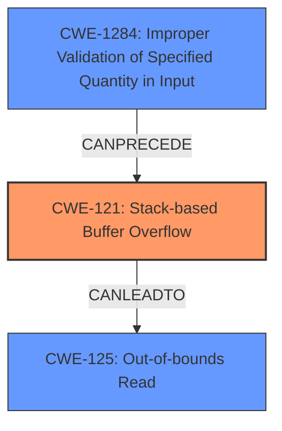

# Final Resolution for CVE-2021-33945

# Summary
| CWE ID | CWE Name | Confidence | CWE Abstraction Level | CWE Vulnerability Mapping Label | CWE-Vulnerability Mapping Notes |
|---|---|---|---|---|---|
| CWE-121 | Stack-based Buffer Overflow | 1.0 | Variant | Primary | Allowed |
| CWE-1284 | Improper Validation of Specified Quantity in Input | 0.6 | Base | Secondary | Allowed |
| CWE-125 | Out-of-bounds Read | 0.4 | Base | Secondary | Allowed |

## Evidence and Confidence

*   **Confidence Score:** 0.9
*   **Evidence Strength:** HIGH

## Relationship Analysis
The primary relationship influencing the decision is the chain: improper input validation leading to a stack buffer overflow, potentially resulting in an out-of-bounds read. CWE-1284 (Improper Validation of Specified Quantity in Input) can **CANPRECEDE** CWE-121 (**Stack-based Buffer Overflow**). CWE-121 can then lead to CWE-125 (**Out-of-bounds Read**). The abstraction levels were considered to ensure the most specific CWEs were chosen, favoring Variant and Base levels over Class or Pillar.

## Vulnerability Chain
The vulnerability chain starts with the lack of input validation on the length of lines in `/etc/wpa_supplicant.conf` (**ROOTCAUSE**: CWE-1284). This allows excessively long lines to be processed, leading to a **WEAKNESS**: stack buffer overflow when `strncpy` is used without proper bounds checking (CWE-121). As a consequence of the overflow, an **WEAKNESS**: out-of-bounds read (CWE-125) may occur if the overflow overwrites data used as an index or pointer. The final **IMPACT** is a denial of service (DoS) due to the crash or unpredictable behavior caused by the overflow and potential out-of-bounds read.

## Summary of Analysis
The initial analysis correctly identified CWE-121 as the primary **WEAKNESS** given the vulnerability description explicitly stating a stack buffer overflow. The criticism correctly pointed out the missing link regarding input validation. The evidence for CWE-121 is strong: "RICOH Printer series SP products ... were discovered to contain a stack buffer overflow in the file /etc/wpa_supplicant.conf." The inclusion of CWE-1284 as a secondary **ROOTCAUSE** addresses the criticism by recognizing the lack of input validation on the length of the lines in the configuration file, which enables the overflow. CWE-125 is retained as a secondary **WEAKNESS** with lower confidence, as it's a potential consequence of the overflow. The graph relationships influenced the decision by highlighting the chain of events from improper input validation to stack buffer overflow to potential out-of-bounds read. The selected CWEs are at the optimal level of specificity, with CWE-121 being a Variant and CWE-1284 and CWE-125 being Base.